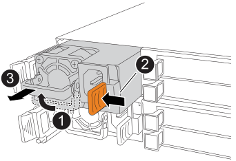
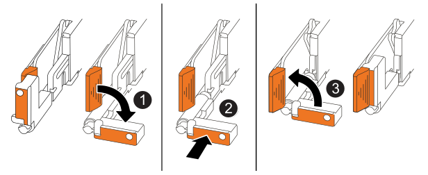

= Passaggio 1: Rimuovere il controller
:allow-uri-read: 

.A proposito di questa attività
* Installare il controller sostitutivo entro 60 minuti dalla rimozione del controller guasto per mantenere un raffreddamento adeguato per il sistema storage.
+

CAUTION: Per evitare il surriscaldamento, non lasciare vuoto il bay del controller per più di 60 minuti.

* È necessario mettere offline il controller difettoso prima di scollegare qualsiasi cavo.
* È possibile attivare i LED di localizzazione (blu) del sistema storage (sulla parte anteriore del sistema storage e su entrambi i controller) per facilitare l'individuazione fisica del sistema storage. Utilizzando SANtricity System Manager, selezionare *Hardware* > *Controllers and components*, selezionare la scheda *Controller shelf* e dal menu contestuale selezionare *Turn on locator light*.

== Passaggio 1: Rimuovere il controller

Verificare che tutti i dati presenti nella cache siano stati scritti sulle unità, scollegare tutti i cavi dal controller difettoso e quindi rimuovere il controller difettoso dallo chassis.

.Fasi
. Sul controller difettoso, assicurarsi che il LED NV Caching Active (verde) sia spento.
+
Quando il LED NV Caching Active (verde) è spento, tutti i dati presenti nella cache sono stati scritti sulle unità ed è possibile rimuovere in sicurezza il controller difettoso.

+

NOTE: Se il LED NV Caching Active (verde) è acceso, i dati memorizzati nella cache vengono scritti sulle unità. Devi attendere che il processo sia completato e che il LED NV Caching Active si spenga. Tuttavia, se il LED rimane acceso per più di cinque minuti, contatta https://mysupport.netapp.com/site/global/dashboard["Supporto NetApp"] prima di continuare con questa procedura.

+
Il LED NV Caching Active (verde) si trova accanto all'icona NV sul controller.

+
image::../media/drw_g_nvmem_led_ieops-1839.svg[Posizione del LED di stato NV]

+
[cols="1,4"]
|===

 a| 
image::../media/icon_round_1.png[Callout numero 1]
 a| 
Icona NV e LED NV Caching Active sul controller

|===

. Indossare un braccialetto ESD o adottare altre precauzioni antistatiche.
. Etichetta ciascun cavo collegato al controller guasto.
. Scollegare il cavo di alimentazione dall'alimentatore sul controller guasto.
+

NOTE: L'alimentatore (PSU) non ha un interruttore di alimentazione.

. Scollega tutti i cavi dal controller difettoso.
. Rimuovere il controller danneggiato:
+
L'illustrazione seguente mostra il funzionamento delle maniglie del controller (dal lato sinistro del controller) durante la rimozione di un controller:

+
image::../media/drw_g_and_t_handles_remove_ieops-1837.svg[operazione della maniglia del controller per rimuovere un controller]

+
[cols="1,4"]
|===

 a| 
image::../media/icon_round_1.png[Callout numero 1]
 a| 
Alle due estremità del controller, spingere verso l'esterno le linguette di bloccaggio verticali per riportare le impugnature in posizione orizzontale.

 a| 
image::../media/icon_round_2.png[Callout numero 2]
 a| 
** Tirare le maniglie verso di sé per sganciare il controller dal midplane.
+
Mentre tiri, le maniglie si estendono dal controller e poi senti una certa resistenza, continua a tirare.

** Fai scorrere il controller fuori dallo chassis sostenendone la parte inferiore e posizionalo su una superficie di lavoro piana e antistatica.

 a| 
image::../media/icon_round_3.png[Callout numero 3]
 a| 
Se necessario, ruotare le maniglie in posizione verticale (accanto alle linguette) per spostarle da parte.

|===
. Aprire il coperchio del controller ruotando la vite a testa zigrinata in senso antiorario per allentarla, quindi aprire il coperchio.

== Passaggio 2: Spostare l'alimentatore

Spostare l'alimentatore (PSU) sul controller di ricambio.

.Fasi
. Rimuovere l'alimentatore dal controller difettoso:
+
Assicurati che la maniglia del controller sul lato sinistro sia in posizione verticale per poter accedere al PSU.

+

+
[cols="1,4"]
|===

 a| 
image::../media/icon_round_1.png[Callout numero 1]
 a| 
Ruotare la maniglia dell'alimentatore verso l'alto, fino alla posizione orizzontale, e quindi afferrarla.

 a| 
image::../media/icon_round_2.png[Callout numero 2]
 a| 
Con il pollice, premi la linguetta di bloccaggio arancione per sganciare la PSU dal controller.

 a| 
image::../media/icon_round_3.png[Callout numero 3]
 a| 
Estrai l'alimentatore dal controller mentre con l'altra mano ne sostieni il peso.

CAUTION: L'alimentatore è corto. Utilizzare sempre entrambe le mani per sostenerlo quando lo si rimuove dal controller, in modo che non si stacchi improvvisamente dal controller e possa causare lesioni.

|===
. Inserire l'alimentatore nel controller di ricambio:
+
.. Utilizzando entrambe le mani, supporta e allinea i bordi dell'alimentatore con l'apertura nel controller.
.. Inserisci delicatamente l'alimentatore nel controller finché la linguetta di bloccaggio arancione non scatta in posizione.
+
L'alimentatore deve innestarsi correttamente nel connettore interno e nel meccanismo di bloccaggio. Ripeti questo passaggio se senti che l'alimentatore non è inserito correttamente.

+

NOTE: Per evitare di danneggiare il connettore interno, non esercitare una forza eccessiva quando si inserisce l'alimentatore nel controller.

.. Ruotare la maniglia verso il basso, in modo che sia fuori dal percorso delle normali operazioni.

== Passaggio 3: Spostare le ventole

Spostare le ventole sul controller di ricambio.

.Fasi
. Rimuovere una delle ventole dal controller difettoso:
+
image::../media/drw_g_fan_replace_ieops-1903.svg[Sostituzione ventola]

+
[cols="1,4"]
|===

 a| 
image::../media/icon_round_1.png[Callout numero 1]
| Tenere entrambi i lati della ventola nei punti di contatto blu. 

 a| 
image::../media/icon_round_2.png[Callout numero 2]
| Tirare la ventola verso l'alto e estrarla dalla sua sede. 
|===
. Inserire la ventola nel controller di ricambio allineandola all'interno delle guide, quindi spingere verso il basso finché il connettore della ventola non è completamente inserito nella presa.
. Ripeti questi passaggi per le ventole rimanenti.

== Passaggio 4: Spostare la batteria NV

Spostare la batteria NV sul controller di ricambio.

.Fasi
. Rimuovere la batteria NV dal controller difettoso:
+
image::../media/drw_g_nv_battery_replace_ieops-1864.svg[Sostituire la batteria NV]

+
[cols="1,4"]
|===

 a| 
image::../media/icon_round_1.png[Callout numero 1]
 a| 
Sollevare la batteria NV ed estrarla dal suo alloggiamento.

 a| 
image::../media/icon_round_2.png[Callout numero 2]
 a| 
Rimuovere il cablaggio dal suo fermo.

 a| 
image::../media/icon_round_3.png[Callout numero 3]
 a| 
.. Spingi e tieni premuta la linguetta sul connettore.
.. Tirare il connettore verso l'alto ed estrarlo dalla presa.
+
Mentre tiri verso l'alto, fai oscillare delicatamente il connettore da un'estremità all'altra (nel senso della lunghezza) per sganciarlo.

|===
. Installare la batteria NV nel controller di ricambio:
+
.. Inserisci il connettore del cablaggio nella sua presa.
.. Instradare i cavi lungo il lato dell'alimentatore, nel suo alloggiamento e poi attraverso il canale davanti al vano batteria NV.
.. Inserire la batteria NV nell'apposito vano.
+
La batteria NV deve essere alloggiata a filo nel suo vano.

== Passaggio 5: Spostare i DIMM di sistema

Spostare i DIMM sul controller sostitutivo.

Se hai dei DIMM blanks, non è necessario spostarli, il controller di ricambio dovrebbe arrivare con essi già installati.

.Fasi
. Rimuovere uno dei DIMM dal controller guasto:
+
image::../media/drw_g_dimm_ieops-1873.svg[Sostituzione DIMM]

+
[cols="1,4"]
|===

 a| 
image::../media/icon_round_1.png[Callout numero 1]
 a| 
Numerazione e posizioni degli slot DIMM.

NOTE: A seconda del modello del sistema storage, saranno presenti due o quattro DIMM.

 a| 
image::../media/icon_round_2.png[Callout numero 1]
 a| 
** Nota l'orientamento del DIMM nello slot in modo da poter inserire il DIMM nel controller di ricambio con l'orientamento corretto.
** Espellere il DIMM spingendo lentamente verso l'esterno le due linguette di espulsione presenti alle estremità dello slot DIMM.

IMPORTANT: Afferrare con cura il DIMM dagli angoli o dai bordi per evitare di esercitare pressione sui componenti del circuito stampato del DIMM.

 a| 
image::../media/icon_round_3.png[Callout numero 3]
 a| 
Sollevare il DIMM ed estrarlo dallo slot.

Le linguette di espulsione rimangono in posizione aperta.

|===
. Installare il DIMM nel controller di ricambio:
+
.. Assicurarsi che le linguette di espulsione dei DIMM sul connettore siano in posizione aperta.
.. Tenere il DIMM per gli angoli e inserirlo perfettamente nello slot.
+
L'incavo nella parte inferiore del DIMM, tra i pin, deve allinearsi con la linguetta nello slot.

+
Se inserito correttamente, il DIMM entra facilmente ma si fissa saldamente nello slot. In caso contrario, reinserire il DIMM.

.. Verificare visivamente che il DIMM sia allineato correttamente e completamente inserito nello slot.
.. Premere con cautela, ma con decisione, sul bordo superiore del DIMM finché le linguette di espulsione non si incastrano nelle tacche presenti alle due estremità del DIMM.

. Ripeti questi passaggi per i restanti DIMM.

== Passaggio 6: Spostare i moduli I/O

Spostare i moduli I/O e gli eventuali moduli di copertura I/O sul controller sostitutivo.

.Fasi
. Rimuovere uno dei moduli I/O dal controller difettoso:
+
Assicurati di tenere traccia di quale slot conteneva il modulo I/O.

+
Se si rimuove il modulo I/O nello slot 4, assicurarsi che la maniglia del controller sul lato destro sia in posizione verticale per consentire l'accesso al modulo I/O.

+
image::../media/drw_g_io_module_replace_ieops-1900.svg[Rimuovi modulo I/O]

+
[cols="1,4"]
|===

 a| 
image::../media/icon_round_1.png[Callout numero 1]
 a| 
Ruotare la vite a testa zigrinata del modulo I/O in senso antiorario per allentare.

 a| 
image::../media/icon_round_2.png[Callout numero 2]
 a| 
Estrarre il modulo I/O dal controller utilizzando la linguetta dell'etichetta della porta a sinistra e la vite a testa zigrinata a destra.

|===
. Installare il modulo I/O nel controller di ricambio:
+
.. Allinea il modulo I/O con i bordi dello slot.
.. Spingere delicatamente il modulo I/O fino in fondo nello slot, assicurandosi che sia correttamente inserito nel connettore.
+
È possibile utilizzare la linguetta a sinistra e la vite a testa zigrinata a destra per inserire il modulo I/O.

.. Ruotare la vite a testa zigrinata in senso orario per stringere.

. Ripeti questi passaggi per spostare i moduli I/O rimanenti e gli eventuali moduli di soppressione I/O sul controller sostitutivo.

== Passaggio 7: Installare il controller

Installare il controller sostitutivo nello chassis, ricollegare il suo cavo di alimentazione e tutti i suoi cavi.

.A proposito di questa attività
L'illustrazione seguente mostra il funzionamento delle maniglie del controller (dal lato sinistro di un controller) durante la reinstallazione del controller e può essere utilizzata come riferimento per le fasi di reinstallazione del controller.

[cols="1,4"]
|===

 a| 
image::../media/icon_round_1.png[Callout numero 1]
 a| 
Se hai ruotato le manopole del controller in posizione verticale (vicino alle linguette) per spostarle di lato durante la manutenzione del controller, ruotale in posizione orizzontale.

 a| 
image::../media/icon_round_2.png[Callout numero 2]
 a| 
Spingere le maniglie per reinserire il controller nello chassis.

 a| 
image::../media/icon_round_3.png[Callout numero 3]
 a| 
Ruotare le maniglie in posizione verticale e bloccarle in posizione con le linguette di bloccaggio.

|===
.Fasi
. Chiudere il coperchio del controller e ruotare la vite a testa zigrinata in senso orario fino a serrarla.
. Inserire il controller nello chassis:
+
.. Allineare la parte posteriore del controller con l'apertura nel chassis e spingere delicatamente ma con decisione sulle maniglie finché il controller non incontra il midplane e non è completamente inserito.
+

NOTE: Non esercitare una forza eccessiva durante l'inserimento del controller nel chassis; potrebbe danneggiare i connettori.

.. Ruotare le manopole del controller verso l'alto e bloccarle in posizione con le linguette.

. Ricollega il cavo di alimentazione all'alimentatore e fissa il cavo di alimentazione con il fermacavo del cavo di alimentazione.
+
Una volta ripristinata l'alimentazione all'alimentatore, il LED di stato dovrebbe essere verde.

. Ricollega tutti i cavi al controller.
+

NOTE: Il ricollegamento dei cavi deve essere effettuato prima di mettere il controller online. Ciò è particolarmente importante per i collegamenti dei cavi di mirroring, poiché garantiscono la piena ridondanza del sistema e vengono utilizzati per il mirroring della cache e il trasferimento I/O.

