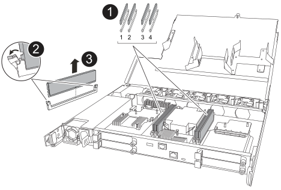

= 
:allow-uri-read: 

.Fasi
. Se non si è già collegati a terra, mettere a terra l'utente.
. Individua il DIMM difettoso.
+

NOTE: Consultare la  https://hwu.netapp.com["Netapp Hardware Universe"] o la mappa FRU sulla copertura del controller per le esatte posizioni dei DIMM.

. Rimuovere il DIMM difettoso:
+

+
[cols="1,4"]
|===

 a| 
image::../media/icon_round_1.png[Callout numero 1]
 a| 
Numerazione e posizioni degli slot DIMM.

NOTE: A seconda del modello del sistema storage, saranno presenti due o quattro DIMM.

 a| 
image::../media/icon_round_2.png[Callout numero 2]
 a| 
** Nota l'orientamento del DIMM nello slot in modo da poter inserire il DIMM sostitutivo utilizzando lo stesso orientamento.
** Espellere il modulo DIMM difettoso spingendo lentamente verso l'esterno le due linguette di espulsione del DIMM situate a entrambe le estremità dello slot DIMM.

IMPORTANT: Afferrare con cura il DIMM dagli angoli o dai bordi per evitare di esercitare pressione sui componenti del circuito stampato del DIMM.

 a| 
image::../media/icon_round_3.png[Callout numero 3]
 a| 
Sollevare il DIMM ed estrarlo dallo slot.

Le linguette di espulsione rimangono in posizione aperta.

|===
. Disimballare il DIMM sostitutivo e posizionarlo su una superficie piana e antistatica vicino al sistema storage.
+
Conserva il materiale di imballaggio da utilizzare quando restituisci il DIMM difettoso.

. Installare il DIMM sostitutivo:
+
.. Assicurarsi che le linguette di espulsione dei DIMM sul connettore siano in posizione aperta.
.. Tenere il DIMM per gli angoli e inserirlo perfettamente nello slot.
+
L'incavo nella parte inferiore del DIMM, tra i pin, deve allinearsi con la linguetta nello slot.

+
Se inserito correttamente, il DIMM entra facilmente ma si fissa saldamente nello slot. Reinserisci il DIMM se ritieni che non sia inserito correttamente. Non forzare mai un DIMM in uno slot.

.. Verificare visivamente che il DIMM sia allineato correttamente e completamente inserito nello slot.
.. Premere con cautela, ma con decisione, sul bordo superiore del DIMM finché le linguette di espulsione non si incastrano nelle tacche presenti alle due estremità del DIMM.

