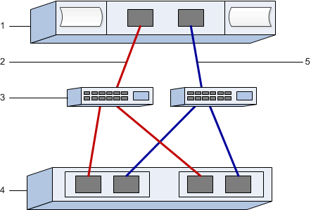

= Registra la tua configurazione SRP su InfiniBand in e-Series - Linux
:allow-uri-read: 
:icons: font
:imagesdir: ../media/

[role="lead"]
È possibile generare e stampare un PDF di questa pagina, quindi utilizzare il seguente foglio di lavoro per registrare le informazioni di configurazione dello storage SRP su InfiniBand. Queste informazioni sono necessarie per eseguire le attività di provisioning.

== Identificatori host

NOTE: I GUID iniziatori vengono determinati nell'attività, xref:srp-ib-determine-host-port-guids-task.adoc[Determinare i GUID della porta host ed effettuare le impostazioni consigliate].

|===
| N. didascalia | Connessioni porta host (iniziatore) | GUID 

 a| 
1
 a| 
Host
 a| 
_non applicabile_

 a| 
3
 a| 
Switch
 a| 
_non applicabile_

 a| 
4
 a| 
Destinazione (storage array)
 a| 
_non applicabile_

 a| 
2
 a| 
Porta host 1 allo switch IB 1 (percorso "A")
 a| 

 a| 
5
 a| 
Porta host 2 allo switch IB 2 (percorso "B")
 a| 

|===

== Configurazione consigliata

Le configurazioni consigliate sono costituite da due porte initiator e quattro porte di destinazione.

== Nome host di mapping

NOTE: Il nome host del mapping viene creato durante il flusso di lavoro.

|===

 a| 
Nome host di mapping
 a| 

 a| 
Tipo di sistema operativo host
 a| 

|===