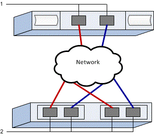

= Eseguire attività specifiche di NVMe su RoCE in E-Series - VMware
:allow-uri-read: 
:icons: font
:imagesdir: ../media/

[role="lead"]
Per il protocollo NVMe su RoCE, configuri gli switch e determini gli identificatori delle porte host.

== Passaggio 1: Registra la tua configurazione

È possibile generare e stampare un PDF di questa pagina, quindi utilizzare il seguente foglio di lavoro per registrare le informazioni di configurazione dello storage specifiche del protocollo. Queste informazioni sono necessarie per eseguire le attività di provisioning.

=== Configurazione consigliata

Le configurazioni consigliate sono costituite da due porte iniziatore e quattro porte di destinazione con una o più VLAN.

=== Identificatori host

|===
| N. didascalia | Connessioni alla porta host | NQN iniziatore software 

 a| 
1
 a| 
Host (iniziatore) 1
 a| 

 a| 
1
 a| 
Host (iniziatore) 2
 a| 

|===

=== Identificatori di destinazione

|===
| N. didascalia | Connessioni delle porte dell'array | NQN di destinazione 

 a| 
2
 a| 
Porta 1 del controller dell'array (target)
 a| 

 a| 
2
 a| 
Porta 2 del controller dell'array (target)
 a| 

 a| 
2
 a| 
Porta 3 del controller dell'array (target)
 a| 

 a| 
2
 a| 
Porta 4 del controller dell'array (target)
 a| 

|===

=== Host di mappatura

|===

 a| 
Nome host di mapping
 a| 

 a| 
Tipo di sistema operativo host
 a| 

|===

=== Configurazione consigliata

Questo può variare a seconda dell'array. EF300, EF600 e EF50 avranno 2 porte initiator con un massimo di 4 porte target con 1 o più VLAN. EF80 avrà 2 porte initiator con un massimo di 6 porte target con 1 o più VLAN.

== Passaggio 2: Configurare gli switch NVMe/RoCE

Gli switch vengono configurati in base alle raccomandazioni del vendor per NVMe su RoCE. Questi consigli possono includere sia direttive di configurazione che aggiornamenti del codice.

.Informazioni su questo
Questa procedura descrive i passaggi generali per la configurazione degli switch per NVMe su RoCE. Per istruzioni specifiche, consultare la documentazione del fornitore dello switch.

Prima di iniziare, assicurati di avere quanto segue:

* Due reti separate per alta disponibilità. Assicurati di isolare il traffico NVMe su RoCE in segmenti di rete separati.

.Fasi
Consultare la documentazione del fornitore dello switch.

== Passaggio 3: Configurare networking - NVMe/RoCE, VMware

È possibile configurare la rete NVMe over RoCE in diversi modi, a seconda delle esigenze di archiviazione dati. Consultate il vostro amministratore di rete per consigli sulla scelta della configurazione più adatta al vostro ambiente.

.A proposito di questa attività
Questa procedura descrive i passaggi generali per la configurazione della rete per NVMe su RoCE. Per istruzioni specifiche, consultare la documentazione del produttore dello switch.

Prima di iniziare, assicurati di avere quanto segue:

* Switch configurato per Lossless Ethernet per NVMe su RDMA.

.A proposito di questa attività
Durante la pianificazione della rete NVMe su RoCE, ricorda che la guida VMware Configuration Maximums indica che il numero massimo di porte initiator RDMA NVMe supportate per server è 2. Devi considerare questo requisito per evitare di configurare troppi percorsi.

Per garantire una buona configurazione multipath, utilizzare più segmenti di rete per la rete NVMe su RoCE. Posizionare almeno una porta lato host e almeno una porta da ciascun storage controller su un segmento di rete, e un gruppo identico di porte lato host e lato array su un altro segmento di rete. Ove possibile, utilizzare più switch Ethernet per fornire ulteriore ridondanza.

.Fasi
Consultare la documentazione del fornitore dello switch.

== Passaggio 4: Configurare il networking lato array - NVMe/RoCE, VMware

Si utilizza l'interfaccia SANtricity System Manager per configurare la rete NVMe su RoCE sul lato array.

.A proposito di questa attività
Questa procedura descrive come accedere alla configurazione della porta NVMe over RoCE dalla pagina *Controllers & components* in SANtricity System Manager. È inoltre possibile accedere alla configurazione dalla pagina *Configure NVMe over RoCE ports* all'interno di SANtricity System Manager.

Prima di iniziare, assicurati di avere quanto segue:

* L'indirizzo IP o il nome di dominio di uno dei controller degli array di storage.
* Password per la GUI di System Manager, oppure Role-Based Access Control (RBAC) o LDAP e un servizio di directory sono configurati per l'accesso di sicurezza appropriato all'array di storage. Vedere la guida in linea di SANtricity System Manager per ulteriori informazioni su link:https://docs.netapp.com/us-en/e-series-santricity/um-certificates/overview-access-management-um.html["Gestione degli accessi"^].

.Fasi
. Dal tuo browser, inserisci il seguente URL: https://<DomainNameOrIPAddress>[]
+
`IPAddress` è l'indirizzo di uno dei controller degli array di storage.

+
La prima volta che si apre Gestore di sistema di SANtricity su un array non configurato, viene visualizzato il prompt Set Administrator Password (Imposta password amministratore). La gestione degli accessi basata sui ruoli configura quattro ruoli locali: amministrazione, supporto, sicurezza e monitoraggio. Gli ultimi tre ruoli hanno password casuali che non possono essere indovinate. Dopo aver impostato una password per il ruolo di amministratore, è possibile modificare tutte le password utilizzando le credenziali di amministratore. Per ulteriori informazioni sui quattro ruoli utente locali, consultare la guida in linea di Gestione di sistema SANtricity.

. Immettere la password di System Manager per il ruolo di amministratore nei campi Set Administrator Password (Imposta password amministratore) e Confirm Password (Conferma password), quindi fare clic su *Set Password* (Imposta password).
+
L'installazione guidata viene avviata se non sono configurati pool, gruppi di volumi, carichi di lavoro o notifiche.

. Chiudere l'installazione guidata.
+
La procedura guidata verrà utilizzata in seguito per completare ulteriori attività di installazione.

. Seleziona *Hardware* > *Controllers and components*.
. Fai clic sul controller con le porte NVMe over RoCE che desideri configurare.
+
Viene visualizzato il menu di scelta rapida del controller.

. Selezionare *Configure NVMe over RoCE ports* (Configura NVMe su porte RoCE).
+
La finestra di dialogo Configura NVMe su porte RoCE si apre.

. Nell'elenco a discesa, selezionare la porta che si desidera configurare, quindi fare clic su *Avanti*.
. Selezionare le impostazioni della porta di configurazione, quindi fare clic su *Avanti*.
+
Per visualizzare tutte le impostazioni della porta, fare clic sul collegamento *Mostra altre impostazioni della porta* a destra della finestra di dialogo.

+
|===
| Impostazione della porta | Descrizione 

 a| 
Velocità della porta ethernet configurata
 a| 
Seleziona la velocità desiderata. Le opzioni visualizzate nel menu a tendina dipendono dalla velocità massima che la tua rete può supportare (ad esempio, 200 Gb/s).

 a| 
Attiva IPv4 / attiva IPv6
 a| 
Selezionare una o entrambe le opzioni per abilitare il supporto per le reti IPv4 e IPv6.

 a| 
Dimensione MTU (disponibile facendo clic su Mostra altre impostazioni della porta.)
 a| 
Se necessario, inserire una nuova dimensione in byte per l'unità di trasmissione massima (MTU).

La dimensione predefinita della Maximum Transmission Unit (MTU) è di 4200 byte per frame. È necessario inserire un valore compreso tra 1500 e 9000.

|===
+
Se si seleziona *Enable IPv4* (attiva IPv4), dopo aver fatto clic su *Next* (Avanti) viene visualizzata una finestra di dialogo per la selezione delle impostazioni IPv4. Se si seleziona *Enable IPv6* (attiva IPv6*), dopo aver fatto clic su *Next* (Avanti) viene visualizzata una finestra di dialogo per la selezione delle impostazioni IPv6. Se sono state selezionate entrambe le opzioni, viene visualizzata prima la finestra di dialogo per le impostazioni IPv4, quindi dopo aver fatto clic su *Avanti*, viene visualizzata la finestra di dialogo per le impostazioni IPv6.

+
Configurare le impostazioni IPv4 e/o IPv6, automaticamente o manualmente. Per visualizzare tutte le impostazioni delle porte, fare clic sul collegamento *Mostra altre impostazioni* a destra della finestra di dialogo.

+
|===
| Impostazione della porta | Descrizione 

 a| 
Ottenere automaticamente la configurazione
 a| 
Selezionare questa opzione per ottenere la configurazione automaticamente.

 a| 
Specificare manualmente la configurazione statica
 a| 
Selezionare questa opzione, quindi inserire un indirizzo statico nei campi. Per IPv4, includere la subnet mask di rete e il gateway. Per IPv6, includere l'indirizzo IP instradabile e l'indirizzo IP del router.

|===
. Fare clic su *fine*.
. Chiudere System Manager.

== Passaggio 5: Configurare la rete lato host—NVMe su RoCE, VMware

La configurazione della rete NVMe over RoCE sul lato host consente all'initiator dell'adattatore di storage VMware NVMe over RDMA di stabilire una sessione con l'array.

.A proposito di questa attività
Questa configurazione consente una rete senza perdite utilizzando Differentiated Services Code Point (DSCP) basato su Priority Flow Control (PFC).

.Fasi
. Identificare gli adattatori di rete RDMA e registrare la vmnic uplink associata.
+
Per ulteriori informazioni, vedere link:https://techdocs.broadcom.com/us/en/vmware-cis/vsphere/vsphere/9-0/vsphere-storage/about-vmware-nvme-storage/configuring-nvme-over-rdma-roce-v2-on-esxi/view-rdma-network-adapters.html["Visualizza gli adattatori di rete RDMA"^].

. Configura il binding della porta VMkernel per l'adattatore RDMA utilizzando uno vSphere standard switch.
+
Per ulteriori informazioni, vedere link:https://techdocs.broadcom.com/us/en/vmware-cis/vsphere/vsphere/9-0/vsphere-storage/about-vmware-nvme-storage/configuring-nvme-over-rdma-roce-v2-on-esxi/configure-vmkernel-binding-for-the-rdma-adapter.html["Configura il binding VMkernel per l'adattatore RDMA"^].

. Aggiungi l'adattatore software NVMe over RDMA.
+
Per ulteriori informazioni, vedere link:https://techdocs.broadcom.com/us/en/vmware-cis/vsphere/vsphere/9-0/vsphere-storage/about-vmware-nvme-storage/configuring-nvme-over-rdma-roce-v2-on-esxi/add-software-nvme-over-rdma-or-nvme-over-tcp-adapters.html["Aggiungi adattatori software NVMe over RDMA o NVMe over TCP"^].

. Aggiungi controller NVMe per NVMe over RDMA.
+
Per ulteriori informazioni, vedere link:https://techdocs.broadcom.com/us/en/vmware-cis/vsphere/vsphere/9-0/vsphere-storage/about-vmware-nvme-storage/configuring-nvme-over-rdma-roce-v2-on-esxi/add-controller-for-nvme-over-fabrics.html["Aggiungi controller per NVMe over Fabrics"^].

. Configurare Ethernet lossless per NVMe su RDMA.
+
Configuri una rete lossless utilizzando il Priority Flow Control (PFC) basato su Differentiated Services Code Point (DSCP).

+
Per utilizzare questa opzione, consultare quanto segue:

+
** link:https://techdocs.broadcom.com/us/en/vmware-cis/vsphere/vsphere/9-0/vsphere-storage/about-vmware-nvme-storage/requirements-for-vmware-nvme-storage.html#GUID-B764140D-BCF3-4C99-8169-E5B058757518-en["Configurazione di Lossless Ethernet per NVMe su RDMA"^].

== Passaggio 6: Verifica delle connessioni di rete IP - ​NVMe over RoCE, VMware

Verificare le connessioni di rete IP (Internet Protocol) utilizzando i test ping per assicurarsi che host e array siano in grado di comunicare.

.Fasi
. Sul host, il seguente comando:
+
[listing]
----
vmkping <NVMe over RoCE_target_IP_address\>
----
+
In questo esempio, l'indirizzo IP di destinazione NVMe over RoCE è 192.6.21.231.

+
[listing]
----
vmkping -d 192.6.21.231
PING 192.6.21.231 (192.6.21.231): 56 data bytes
64 bytes from 192.6.21.231: icmp_seq=0 ttl=64 time=0.902 ms
64 bytes from 192.6.21.231: icmp_seq=1 ttl=64 time=0.406 ms
64 bytes from 192.6.21.231: icmp_seq=2 ttl=64 time=0.855 ms
--- 192.6.21.231 ping statistics ---
3 packets transmitted, 3 packets received, 0% packet loss
round-trip min/avg/max = 0.406/0.721/0.902 ms
----
. Eseguire un comando  `vmkping` da ciascun indirizzo initiator dell'host (l'indirizzo IP della porta Ethernet dell'host utilizzata per NVMe over RoCE) verso ciascuna porta NVMe over RoCE del controller. Eseguire questa operazione da ciascun server host nella configurazione, modificando gli indirizzi IP se necessario.
+

NOTE: Se il comando non riesce con il messaggio `sendto() failed (Message too long)`, verificare la dimensione MTU per le interfacce Ethernet sul server host, storage controller e sulle porte dello switch.

. Tornare alla procedura di configurazione NVMe over RoCE per completare il rilevamento della destinazione.

