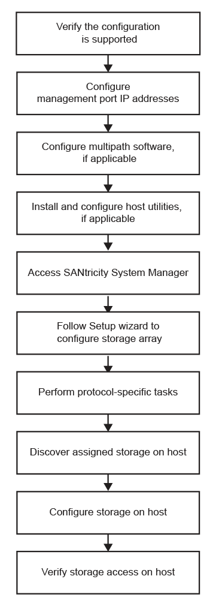

= Comprendere il workflow VMware
:allow-uri-read: 
:icons: font
:imagesdir: ../media/

[role="lead"]
Questo flusso di lavoro guida l'utente attraverso il "metodo rapido" per la configurazione dello storage array e del gestore di sistema SANtricity in modo da rendere lo storage disponibile per un host VMware.

