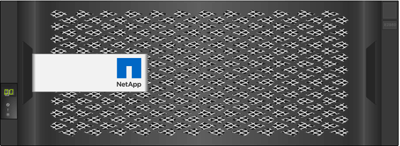

= Panoramica dell'hardware e-Series
:allow-uri-read: 
:icons: font
:imagesdir: ../media/

[role="lead"]
Gli storage array e-Series sono disponibili in diverse configurazioni e modelli.

Uno storage array include shelf, controller, dischi, software e firmware. L'array può essere installato in un rack o cabinet, con hardware personalizzabile per uno o due controller, in uno shelf da 12, 24 o 60 dischi. È possibile collegare lo storage array a UNA SAN da diversi tipi di interfaccia e a diversi sistemi operativi host.

Gli array e-Series sono disponibili nei seguenti modelli:

* Serie E2800 -- ibrido entry-level
* Serie EF280 -- all flash entry-level
* Serie EF300 -- all flash entry-level, all NVMe
* Serie E5700 -- ibrido midrange
* Serie EF570 -- all flash midrange
* Serie EF600 -- midrange all flash, all NVMe

NOTE: Tutte le porte USB sono disattivate su E2800, EF280, E5700, EF570, EF600, E EF300.

== Modelli E2800

[cols="35h,~"]
|===
| Componente | Specifica 

 a| 
Dimensioni rack:
 a| 
* 2U12 (2 unità rack; 12 unità)
* 2U24 (2 unità rack; 24 unità)
+
image::../media/e2800_2u_front.gif[e2800 2u anteriore]

* 4U60 (4 unità rack; 60 unità)
+

 a| 
Dischi:
 a| 
Supporta i seguenti tipi di dischi:

* NL-SAS da 3.5" (fino a 180)
* SSD SAS da 2.5" (fino a 120)
* HDD SAS da 2.5" (fino a 180)

 a| 
Interfacce:
 a| 
Disponibile con le seguenti interfacce:

* SAS 12 GB
* ISCSI da 10 GB o 25 GB
* Fibre Channel da 16 GB o 32 GB

|===

== Modelli EF280

[cols="35h,~"]
|===
| Componente | Specifica 

 a| 
Dimensioni rack:
 a| 
2U24 (2 unità rack; 24 unità)image:../media/ef570_front.gif[""]

 a| 
Dischi:
 a| 
Supporta fino a 96 unità SSD da 2.5"

 a| 
Interfacce:
 a| 
Disponibile con le seguenti interfacce:

* SAS 12 GB
* ISCSI da 10 GB o 25 GB
* Fibre Channel da 16 GB o 32 GB

|===

== Modelli EF300

[cols="35h,~"]
|===
| Componente | Specifica 

 a| 
Dimensioni rack:
 a| 
2U24 (2 unità rack; 24 unità)image:../media/ef570_front.gif[""]

 a| 
Dischi e HICS:
 a| 
Supporta i seguenti dischi con una singola scheda di interfaccia host (HIC) per controller:

* Unità SSD NVMe: Fino a 24 unità SSD NVMe nello shelf del controller.
* Unità NL-SAS con shelf di espansione: Qualsiasi combinazione di shelf DE212C e DE460C non deve superare un totale di 240 slot per unità NL-SAS e 4 shelf di espansione, a meno che non si utilizzino solo shelf DE212C, sono consentiti 8 shelf DE212C. Ad esempio, 4 shelf DE460C o 8 shelf DE212C o 2 shelf DE460C più 2 shelf DE212.
* Unità SSD SAS con shelf di espansione: Qualsiasi combinazione di shelf DE212C, DE224C e DE460C non deve superare un totale di 96 slot per unità SSD SAS e 4 shelf di espansione, a meno che non vengano utilizzati solo shelf DE212C, sono consentiti 8 shelf DE212C. Ad esempio, 1 shelf DE460C più 1 shelf DE224C più 1 shelf DE212C o 4 shelf DE224C o 8 shelf DE212C.

NOTE: Il sistema EF300 supporta configurazioni di shelf di espansione senza dischi nel vassoio di base Quando si utilizza questa configurazione, assicurarsi che le unità siano inserite nello shelf di espansione e collegate correttamente al vassoio di base prima di accendere il sistema.

 a| 
Interfacce:
 a| 
Disponibile con le seguenti interfacce:

* 25 GB iSCSI
* 32 GB NVMe/Fibre Channel
* SCSI/Fibre Channel da 32 GB
* ISER/IB da 100 GB
* 100 GB SRP/IB
* 100 GB NVMe/IB
* 100 GB NVMe/RoCE

|===

== Modelli E5700

[cols="35h,~"]
|===
| Componente | Specifica 

 a| 
Dimensioni rack:
 a| 
* 2U24 (2 unità rack; 24 unità)
+
image::../media/e2800_2u_front.gif[e2800 2u anteriore]

* 4U60 (4 unità rack; 60 unità)
+

 a| 
Dischi:
 a| 
Supporta fino a 480 dei seguenti tipi di dischi:

* Dischi NL-SAS da 3.5"
* Unità SSD SAS da 2.5"
* Unità HDD SAS da 2.5"

 a| 
Interfacce:
 a| 
Disponibile con le seguenti interfacce:

* SAS 12 GB
* ISCSI da 10 GB o 25 GB
* Fibre Channel da 16 GB o 32 GB
* 32 GB NVMe/Fibre Channel
* ISER/IB da 100 GB
* 100 GB SRP/IB
* 100 GB NVMe/IB
* 100 GB NVMe/RoCE

|===

== Modelli EF570

[cols="35h,~"]
|===
| Componente | Specifica 

 a| 
Dimensioni rack:
 a| 
2U24 (2 unità rack; 24 unità)image:../media/ef570_front.gif[""]

 a| 
Dischi:
 a| 
Supporta fino a 120 unità SSD da 2.5"

 a| 
Interfacce:
 a| 
Disponibile con le seguenti interfacce:

* SAS 12 GB
* ISCSI da 10 GB o 25 GB
* Fibre Channel da 16 GB o 32 GB
* 32 GB NVMe/Fibre Channel
* ISER/IB da 100 GB
* 100 GB SRP/IB
* 100 GB NVMe/IB
* 100 GB NVMe/RoCE

|===

== Modelli EF600

[cols="35h,~"]
|===
| Componente | Specifica 

 a| 
Dimensioni rack:
 a| 
2U24 (2 unità rack; 24 unità)image:../media/ef570_front.gif[""]

 a| 
Dischi e HICS:
 a| 
Supporta i seguenti dischi con una singola scheda di interfaccia host (HIC) per controller:

* Unità SSD NVMe: Fino a 24 unità SSD NVMe nello shelf del controller.
* Unità NL-SAS con shelf di espansione: Qualsiasi combinazione di shelf DE212C e DE460C non deve superare un totale di 420 slot per unità NL-SAS e 7 shelf di espansione, a meno che non si utilizzino solo shelf DE212C, sono consentiti 8 shelf DE212C. Ad esempio, 7 shelf DE460C o 8 shelf DE212C o 5 shelf DE460C più 2 shelf DE212.
* Unità SSD SAS con shelf di espansione: Qualsiasi combinazione di shelf DE212C, DE224C e DE460C non deve superare un totale di 96 slot per unità SSD SAS e 7 shelf di espansione, a meno che non vengano utilizzati solo shelf DE212C, sono consentiti 8 shelf DE212C. Ad esempio, 1 shelf DE460C più 1 shelf DE224C più 1 shelf DE212C o 4 shelf DE224C o 8 shelf DE212C

NOTE: Il sistema EF600 supporta configurazioni di shelf di espansione senza dischi nel vassoio di base Quando si utilizza questa configurazione, assicurarsi che le unità siano inserite nello shelf di espansione e collegate correttamente al vassoio di base prima di accendere il sistema.

 a| 
Interfacce:
 a| 
Disponibile con le seguenti interfacce:

* 25 GB iSCSI
* 32 GB NVMe/Fibre Channel
* SCSI/Fibre Channel da 32 GB
* ISER/IB da 100 GB
* 100 GB SRP/IB
* 100 GB NVMe/IB
* 100 GB NVMe/RoCE
* ISER/IB da 200 GB
* 200 GB NVMe/IB
* 200 GB NVMe/RoCE

|===