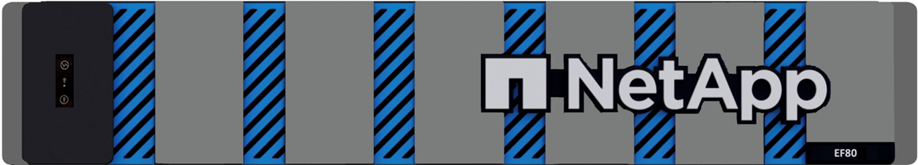

= Ulteriori informazioni sull'hardware e-Series
:allow-uri-read: 
:icons: font
:imagesdir: ../media/

[role="lead"]
Gli storage array e-Series sono disponibili in diverse configurazioni e modelli.

Uno storage array include shelf, controller, dischi, software e firmware. L'array può essere installato in un rack o cabinet, con hardware personalizzabile per uno o due controller, in uno shelf da 12, 24 o 60 dischi. È possibile collegare lo storage array a UNA SAN da diversi tipi di interfaccia e a diversi sistemi operativi host.

Di seguito sono riportati alcuni dei modelli di array E-Series disponibili. Per un elenco completo dei modelli di array E-Series e delle relative specifiche dell'hardware, consultare la NetApp Hardware Universe a  https://hwu.netapp.com["NetApp Hardware Universe"^].

* Serie EF50 -- entry-level all flash, all NVMe
* Serie EF80 -- fascia media all flash, all NVMe
* Serie E4000 -- ibrido entry-level
* Serie EF600 -- midrange all flash, all NVMe
* Serie EF300 -- all flash entry-level, all NVMe
* Serie EF300C -- all flash entry-level, all NVMe
* Serie EF600C -- midrange all flash, all NVMe
* Serie E2800 -- ibrido entry-level
* Serie EF280 -- all flash entry-level
* Serie E5700 -- ibrido midrange
* Serie EF570 -- all flash midrange

NOTE: Per SANtricity OS 11.80GA o versioni successive, tutte le porte USB sono disabilitate mentre SANtricity OS è in esecuzione.

[role="tabbed-block"]
====
.Modelli EF50
--
Dimensioni dei rack::
+
--
* 2U24 (2 unità rack; 24 unità)
+
image::../media/ef50_2u_front.png[EF50 2U]

--
Dischi::
+
--
* Supporta unità SSD NVMe con le seguenti capacità:
+
** 3,8 TB
** 7,6 TB
** 15,3 TB
** 30 TB
** 60 TB

* Supporta fino a 24 unità SSD NVMe nello shelf del controller.
* Supporto per una o due schede di interfaccia verso gli host per controller.
* Supporto per schede e cavi di interconnessione tra controller per la comunicazione tra controller duali.
+

NOTE: È fondamentale collegare correttamente i cavi di mirroring durante la configurazione del sistema EF50. Per ulteriori informazioni, vedere  https://docs.netapp.com/us-en/e-series/install-hw-ef50-ef80/install-cable.html#step-1-cable-the-inter-controller-mirroring-connections["Collegare i cavi di mirroring tra i controller - EF50 e EF80"].

--
Interfacce::
+
--
Disponibile con le seguenti interfacce:

* 64Gb NVMe / Fibre Channel
* 64Gb Fibre Channel

--

--
.Modelli EF80
--
Dimensioni dei rack::
+
--
* 2U24 (2 unità rack; 24 unità)
+

--
Dischi::
+
--
* Supporta unità SSD NVMe con le seguenti capacità:
+
** 3,8 TB
** 7,6 TB
** 15,3 TB
** 30 TB
** 60 TB

* Supporta fino a 24 unità SSD NVMe nello shelf del controller.
* Supporto per una, due o tre schede di interfaccia verso gli host per storage controller.
* Supporto per schede e cavi di interconnessione tra controller per la comunicazione tra controller duali.
+

NOTE: È fondamentale collegare correttamente i cavi di mirroring durante la configurazione del sistema EF80. Per ulteriori informazioni, vedere  https://docs.netapp.com/us-en/e-series/install-hw-ef50-ef80/install-cable.html#step-1-cable-the-inter-controller-mirroring-connections["Collegare i cavi di mirroring tra i controller - EF50 e EF80"].

--
Interfacce::
+
--
Disponibile con le seguenti interfacce:

* 200 GB NVMe/RoCE
* 64Gb NVMe / Fibre Channel
* 200 GB NVMe/IB
* 64Gb Fibre Channel

--

--
.Modelli E4000
--
Dimensioni dei rack::
+
--
* 2U12 (2 unità rack; 12 unità)
+
image::../media/e4000_2u_front.png[E4000 2U]

* 4U60 (4 unità rack; 60 unità)
+
image::../media/e4000_4u_front.png[E4000 4U]

--
Dischi::
+
--
Supporta i seguenti tipi di dischi:

* NL-SAS da 3.5" (fino a 300)
* SSD SAS da 2.5" (fino a 120)

--
Interfacce::
+
--
Disponibile con le seguenti interfacce:

* SAS 12 GB
* 1Gb o 10Gb Base-T iSCSI
* ISCSI da 1GB Gbit, 10Gb Gbit o 25GB Gbit
* FC da 8GB GB, 16GB GB o 32GB GB

--

--
.Modelli EF600
--
Dimensioni dei rack::
+
--
2U24 (2 unità rack; 24 unità)

image:../media/ef570_front.gif["EF600 2U"]

--
Dischi::
+
--
* Unità SSD NVMe: Fino a 24 unità SSD NVMe nello shelf del controller.
* Unità NL-SAS con shelf di espansione: Qualsiasi combinazione di shelf DE212C e DE460C non deve superare un totale di 420 slot per unità NL-SAS e 7 shelf di espansione, a meno che non si utilizzino solo shelf DE212C, sono consentiti 8 shelf DE212C. Ad esempio, 7 shelf DE460C o 8 shelf DE212C o 5 shelf DE460C più 2 shelf DE212.
* Unità SSD SAS con shelf di espansione: Qualsiasi combinazione di shelf DE212C, DE224C e DE460C non deve superare un totale di 96 slot per unità SSD SAS e 7 shelf di espansione, a meno che non vengano utilizzati solo shelf DE212C, sono consentiti 8 shelf DE212C. Ad esempio, 1 shelf DE460C più 1 shelf DE224C più 1 shelf DE212C o 4 shelf DE224C o 8 shelf DE212C.
* Supporto di due schede di interfaccia host per controller.
+
** In alternativa, supporto per una scheda di interfaccia host 200GB IB per controller.

* Supporto per una scheda di espansione SAS opzionale, per il collegamento degli shelf di espansione SAS.
+
** L'espansione SAS è supportata solo nelle configurazioni con una scheda di interfaccia host per controller.

NOTE: Per SANtricity OS 11,80GA e versioni successive, EF600 supporta le configurazioni di shelf di espansione senza dischi nello slot di base Quando si utilizza questa configurazione, assicurarsi che le unità siano inserite nello shelf di espansione e collegate correttamente al vassoio di base prima di accendere il sistema.

--
Interfacce::
+
--
Disponibile con le seguenti interfacce:

* 25 GB iSCSI
* 32 GB NVMe/Fibre Channel
* SCSI/Fibre Channel da 32 GB
* ISER/IB da 100 GB
* 100 GB SRP/IB
* 100 GB NVMe/IB
* 100 GB NVMe/RoCE
* ISER/IB da 200 GB
* 200 GB NVMe/IB
* 200 GB NVMe/RoCE

--

--
.Modelli EF600C
--
Dimensioni dei rack::
+
--
2U24 (2 unità rack; 24 unità)

image:../media/ef570_front.gif["EF600 2U"]

--
Dischi::
+
--
* Supporto di dischi SSD NVMe di capacità da 30TB TB o 60TB TB.
+
** Compatibile con l'utilizzo di Dynamic Disk Pool solo senza supporto RAID legacy.

* Unità SSD NVMe: Fino a 24 unità SSD NVMe nello shelf del controller.
* Supporto di due schede di interfaccia host per controller.
+
** In alternativa, supporto per una scheda di interfaccia host 200GB IB per controller.
** Nessun supporto per le configurazioni shelf di espansione.

* Un singolo pool di dischi viene creato automaticamente se non ci sono abbastanza dischi non assegnati durante l'avvio del sistema.

--
Interfacce::
+
--
Disponibile con le seguenti interfacce:

* 25 GB iSCSI
* 32 GB NVMe/Fibre Channel
* SCSI/Fibre Channel da 32 GB
* ISER/IB da 100 GB
* 100 GB SRP/IB
* 100 GB NVMe/IB
* 100 GB NVMe/RoCE
* ISER/IB da 200 GB
* 200 GB NVMe/IB
* 200 GB NVMe/RoCE

--

--
.Modelli EF300
--
Dimensioni dei rack::
+
--
2U24 (2 unità rack; 24 unità)

image:../media/ef570_front.gif["EF300 2U"]

--
Dischi::
+
--
* Unità SSD NVMe: Fino a 24 unità SSD NVMe nello shelf del controller.
* Unità NL-SAS con shelf di espansione: Qualsiasi combinazione di shelf DE212C e DE460C non deve superare un totale di 240 slot per unità NL-SAS e 4 shelf di espansione, a meno che non si utilizzino solo shelf DE212C, sono consentiti 8 shelf DE212C. Ad esempio, 4 shelf DE460C o 8 shelf DE212C o 2 shelf DE460C più 2 shelf DE212.
* Unità SSD SAS con shelf di espansione: Qualsiasi combinazione di shelf DE212C, DE224C e DE460C non deve superare un totale di 96 slot per unità SSD SAS e 4 shelf di espansione, a meno che non vengano utilizzati solo shelf DE212C, sono consentiti 8 shelf DE212C. Ad esempio, 1 shelf DE460C più 1 shelf DE224C più 1 shelf DE212C o 4 shelf DE224C o 8 shelf DE212C.
* Supporto per una scheda di espansione SAS opzionale, per il collegamento degli shelf di espansione SAS.
* Supporto di una scheda di interfaccia host per controller.

NOTE: Per SANtricity OS 11,80GA e versioni successive, EF300 supporta le configurazioni di shelf di espansione senza dischi nello slot di base Quando si utilizza questa configurazione, assicurarsi che le unità siano inserite nello shelf di espansione e collegate correttamente al vassoio di base prima di accendere il sistema.

--
Interfacce::
+
--
Disponibile con le seguenti interfacce:

* 25 GB iSCSI
* 32 GB NVMe/Fibre Channel
* SCSI/Fibre Channel da 32 GB
* ISER/IB da 100 GB
* 100 GB SRP/IB
* 100 GB NVMe/IB
* 100 GB NVMe/RoCE

--

--
.Modelli EF300C
--
Dimensioni dei rack::
+
--
2U24 (2 unità rack; 24 unità)

image:../media/ef570_front.gif["EF300 2U"]

--
Dischi::
+
--
* Supporto di dischi SSD NVMe di capacità da 30TB TB o 60TB TB.
+
** Compatibile con l'utilizzo di Dynamic Disk Pool solo senza supporto RAID legacy.

* Unità SSD NVMe: Fino a 24 unità SSD NVMe nello shelf del controller.
+
** Nessun supporto per le configurazioni shelf di espansione.

* Supporto di una scheda di interfaccia host per controller.
* Un singolo pool di dischi viene creato automaticamente se non ci sono abbastanza dischi non assegnati durante l'avvio del sistema.

--
Interfacce::
+
--
Disponibile con le seguenti interfacce:

* 25 GB iSCSI
* 32 GB NVMe/Fibre Channel
* SCSI/Fibre Channel da 32 GB
* ISER/IB da 100 GB
* 100 GB SRP/IB
* 100 GB NVMe/IB
* 100 GB NVMe/RoCE

--

--
.Modelli E2800
--
Dimensioni dei rack::
+
--
* 2U12 (2 unità rack; 12 unità)
* 2U24 (2 unità rack; 24 unità)
+
image::../media/e2800_2u_front.gif[E2800 2U]

* 4U60 (4 unità rack; 60 unità)
+
image::../media/e2860_front.gif[E2800 4U]

--
Dischi::
+
--
Supporta i seguenti tipi di dischi:

* NL-SAS da 3.5" (fino a 180)
* SSD SAS da 2.5" (fino a 120)
* HDD SAS da 2.5" (fino a 180)

--
Interfacce::
+
--
Disponibile con le seguenti interfacce:

* SAS 12 GB
* ISCSI da 10 GB o 25 GB
* Fibre Channel da 16 GB o 32 GB

--

--
.Modelli EF280
--
Dimensioni dei rack::
+
--
2U24 (2 unità rack; 24 unità)

image:../media/ef570_front.gif["EF280 2U"]

--
Dischi::
+
--
Supporta fino a 96 unità SSD da 2.5"

--
Interfacce::
+
--
Disponibile con le seguenti interfacce:

* SAS 12 GB
* ISCSI da 10 GB o 25 GB
* Fibre Channel da 16 GB o 32 GB

--

--
.Modelli E5700
--
Dimensioni dei rack::
+
--
* 2U24 (2 unità rack; 24 unità)
+
image::../media/e2800_2u_front.gif[E5700 2U]

* 4U60 (4 unità rack; 60 unità)
+
image::../media/e2860_front.gif[E5700 4U]

--
Dischi::
+
--
Supporta fino a 480 dei seguenti tipi di dischi:

* Dischi NL-SAS da 3.5"
* Unità SSD SAS da 2.5"
* Unità HDD SAS da 2.5"

--
Interfacce::
+
--
Disponibile con le seguenti interfacce:

* SAS 12 GB
* ISCSI da 10 GB o 25 GB
* Fibre Channel da 16 GB o 32 GB
* 32 GB NVMe/Fibre Channel
* ISER/IB da 100 GB
* 100 GB SRP/IB
* 100 GB NVMe/IB
* 100 GB NVMe/RoCE

--

--
.Modelli EF570
--
Dimensioni dei rack::
+
--
2U24 (2 unità rack; 24 unità)

image:../media/ef570_front.gif["EF570 2U"]

--
Dischi::
+
--
Supporta fino a 120 unità SSD da 2.5"

--
Interfacce::
+
--
Disponibile con le seguenti interfacce:

* SAS 12 GB
* ISCSI da 10 GB o 25 GB
* Fibre Channel da 16 GB o 32 GB
* 32 GB NVMe/Fibre Channel
* ISER/IB da 100 GB
* 100 GB SRP/IB
* 100 GB NVMe/IB
* 100 GB NVMe/RoCE

--

--
====