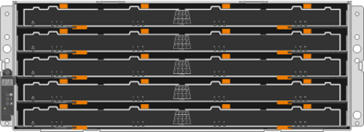

= Tipi di shelf e-Series
:allow-uri-read: 
:icons: font
:imagesdir: ../media/

[role="lead"]
I sistemi e-Series sono disponibili in una vasta gamma di formati di shelf.

|===
| Tipo di shelf | Illustrazione 

 a| 
* DE212C:*

* 2u12 (2 unità rack; 12 unità)
* HDD da 3.5" e/o SSD da 2.5" (con adattatore)
* Solo controller E2800

 a| 
image:../media/e2812_front.gif[""]

 a| 
* DE224C:*

* 2u24 (2 unità rack; 24 unità)
* HDD da 2.5" e/o SSD da 2.5"
* Controller E2800, EF280, E5700 e EF570

 a| 
image:../media/e2824_front.gif[""]

 a| 
* DE460C:*

* 4u60 (4 unità rack; 60 unità)
* Dischi da 3.5" e 2.5" (NL-SAS, SAS e SSD)
* Controller E2800 ed E5700

 a| 

 a| 
* NE224:*

* 2u24 (2 unità rack; 24 unità)
* Unità SSD NVMe da 2.5"
* Controller EF300 e EF600

 a| 
image:../media/ne224.gif[""]

|===