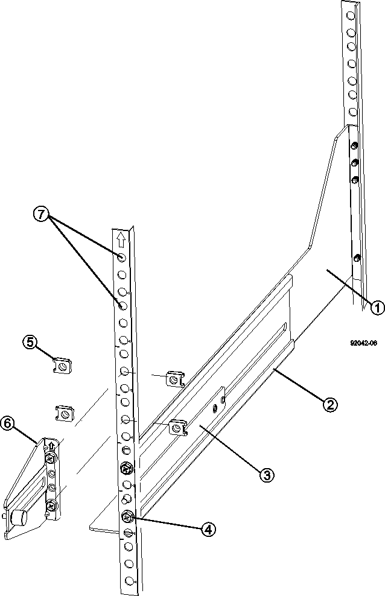

= Installazione completa del cabinet per 3040 40U (serie e)
:allow-uri-read: 
:icons: font
:imagesdir: ../media/

[role="lead"]
Dopo aver spostato il cabinet, abbassare i piedini di livellamento e il piedino di stabilità, reinstallare i componenti rimossi, installare gli altri componenti necessari e collegare il cabinet all'alimentazione.

== Fase 1: Abbassare i piedini di livellamento e il piedino di stabilità

È possibile stabilizzare il cabinet regolando i relativi piedini. I piedini di livellamento sostengono l'armadio dalle rotelle. Il piedino di stabilità impedisce al cabinet di cadere dopo che è stato collocato nella sua posizione permanente.

.Fasi
. Abbassare i piedini di livellamento per sostenere l'armadio dalle rotelle.
+
I piedini di livellamento si trovano vicino a ciascun angolo inferiore del cabinet.

. Assicurarsi che l'armadio sia il più possibile in piano.
+
La figura seguente fornisce una vista ravvicinata del piede di stabilità e dei piedini di livellamento.

+
image::../media/83000_08.gif[Piedini di livellamento e stabilità]

+
|===

 a| 
1.
 a| 
Piedini di livellamento

 a| 
2.
 a| 
Piede di stabilità

|===

== Fase 2: Reinstallazione dei vassoi

Dopo aver spostato il cabinet, è possibile reinstallare i vassoi nelle posizioni originali.

CAUTION: _Non_ installare i seguenti vassoi nella parte superiore del cabinet sopra la testa. Una volta popolati, ciascuno di questi vassoi pesa oltre 100 kg (220 lb). Se installati nella parte superiore del cabinet, questi vassoi creano un cabinet pesante che può facilmente sbilanciarsi: E2660, E2660, E2760, E5460, E5560, E i vassoi del disco controller E5660, nonché il vassoio del disco DE6600

.Fasi
. Reinstallare tutti i vassoi nella posizione originale nel cabinet.
+

CAUTION: *Rischio di lesioni fisiche* -- un vassoio vuoto pesa circa 56.7 kg (125 lb). Sono necessarie tre persone per spostare in sicurezza un vassoio vuoto Se il vassoio contiene dei componenti, è necessario un sollevamento meccanico per spostare il vassoio in modo sicuro

. Reinstallare tutti i componenti nelle posizioni originali nei vassoi.
+
Per evitare conflitti di indirizzi e perdita di accesso ai dati, sostituire tutti i componenti nello stesso vassoio e nella stessa posizione nel vassoio

. Reinstallare tutti i cavi nelle posizioni originali nei vassoi.
. Instradare i cavi di interfaccia verso il cabinet.
. Instradare i cavi di alimentazione principale dal cabinet alle due fonti di alimentazione esterne. _Non_ collegare i cavi di alimentazione.

== Fase 3: Installare gli spool dei cavi e le fascette

Dopo aver reinstallato i vassoi, installare gli spool dei cavi e le fascette. Gli spool dei cavi e le fascette sono adatti alla lunghezza e all'instradamento dei cavi in eccesso per i controller e i vassoi.

.Fase
. Installare gli steli dei cavi e le fascette avvolti lungo entrambi i lati delle prese di distribuzione dell'alimentazione verticali.
+
image::../media/83003_01_dwg_3040_cable_spools.gif[Legatura e bobina del cavo]

+
|===

 a| 
1.
 a| 
Ubicazione della fascetta

 a| 
2.
 a| 
Spola del cavo

|===

== Fase 4: Installare vassoi aggiuntivi

Se necessario, è possibile installare vassoi aggiuntivi. Per garantire il corretto flusso d'aria, è necessario coprire le posizioni inutilizzate dei vassoi.

.Fasi
. Se si dispone di vassoi aggiuntivi che devono essere installati, installare la bulloneria di montaggio per questi vassoi.
. Se la parte anteriore del cabinet non è completamente piena di vassoi, utilizzare i kit del pannello anteriore per coprire gli spazi vuoti sopra o sotto i vassoi installati.
+
La copertura degli spazi vuoti è necessaria per mantenere il corretto flusso d'aria attraverso l'armadio.

. Accendere i vassoi.

== Fase 5: Installare guide di montaggio aggiuntive

Se si installano i vassoi del disco controller o i vassoi del disco forniti separatamente (non già installati nel cabinet), potrebbe essere necessario installare ulteriori guide di montaggio nel cabinet.

.Fasi
. Determinare la posizione delle guide di montaggio.
+
** *Sopra un vassoio esistente* -- posizionare le guide di montaggio immediatamente sopra il vassoio superiore nel cabinet.
** *Sotto un vassoio esistente* -- posizionare le guide di montaggio con spazio sufficiente per sostenere il vassoio da installare:
+
*** 8.9 cm (3.5") Per vassoi di dischi o controller 2U
*** 17.8 cm Per vassoi di dischi o controller 4U

. Utilizzare i contrassegni di misurazione sui supporti verticali anteriori destro e sinistro per fissare le guide di montaggio nella stessa posizione su ciascun lato dell'armadio.
+

+
|===

 a| 
1.
 a| 
Guida regolabile anteriore

 a| 
2.
 a| 
Guida regolabile posteriore

 a| 
3.
 a| 
Piastra di regolazione e viti

 a| 
4.
 a| 
Viti M5×10 mm per montaggio su guida

 a| 
5.
 a| 
Dadi di fissaggio

 a| 
6.
 a| 
Staffa di fissaggio posteriore

 a| 
7.
 a| 
Supporto verticale

|===
+

NOTE: I dadi a clip e la staffa di fissaggio posteriore non vengono utilizzati quando le guide sono installate in un cabinet 3040.

. Posizionare la guida regolabile posteriore sul supporto verticale.
. Sulla guida regolabile posteriore, allineare i fori delle guide regolabili davanti ai fori del supporto verticale.
. Fissare due viti M5×10 mm.
+
.. Fissare le viti attraverso la guida di supporto verticale e la guida regolabile posteriore.
.. Serrare le viti.

. Posizionare la guida regolabile anteriore sul supporto verticale.
. Sulla guida regolabile anteriore, allineare i fori delle guide regolabili davanti ai fori del supporto verticale.
. Fissare due viti M5×10 mm.
+
.. Inserire una vite attraverso la guida di supporto verticale e il foro inferiore della guida regolabile anteriore.
.. Inserire una vite nella guida di supporto verticale e al centro dei tre fori superiori nella guida regolabile anteriore.
.. Serrare le viti.

+

NOTE: I due fori per le viti rimanenti vengono utilizzati per montare il vassoio

. Ripetere i passaggi da 3 a 8 per fissare la seconda guida sull'altro lato del cabinet.
. Installare ciascun vassoio attenendosi alle istruzioni di installazione applicabili.
. Scegliere una delle seguenti opzioni:
+
** Se tutte le posizioni dei vassoi sono piene, accendergli.
** Se non tutte le posizioni dei vassoi sono piene, utilizzare i kit del pannello anteriore per coprire gli spazi vuoti sopra o sotto i vassoi installati.

== Fase 6: Collegare il cabinet all'alimentazione

Per completare l'installazione del cabinet, accendere i componenti del cabinet.

.A proposito di questa attività
Mentre i vassoi eseguono la procedura di accensione, i LED sulla parte anteriore e posteriore dei vassoi lampeggiano. A seconda della configurazione, il completamento della procedura di accensione può richiedere alcuni minuti.

.Fasi
. Spegnere tutti i componenti del cabinet.
. Portare tutti e 12 gli interruttori automatici in posizione Off (giù).
. Collegare ciascuno dei sei connettori NEMA L6-30 (Stati Uniti e Canada) o i sei connettori IEC 60309 (in tutto il mondo, ad eccezione di Stati Uniti e Canada) a una presa elettrica disponibile.
+

NOTE: È necessario collegare ciascuna PDU a una fonte di alimentazione indipendente all'esterno dell'armadio.

. Portare tutti e 12 gli interruttori automatici nella posizione ON (su).
+
image::../media/83002_05_dwg_3040_cabinet_pdus.gif[Interruttori automatici e prese elettriche]

+
|===

 a| 
1.
 a| 
Interruttori automatici

 a| 
2.
 a| 
Prese elettriche

 a| 
3.
 a| 
Scatole di alimentazione

|===
. Accendere tutti i vassoi delle unità del cabinet.
+

NOTE: Attendere 60 secondi dopo aver acceso i vassoi delle unità prima di accendere i vassoi delle unità del controller.

. Dopo aver acceso i vassoi delle unità, attendere 60 secondi, quindi accendere tutti i vassoi dei dischi del controller nel cabinet.

.Risultato
L'installazione del cabinet è completata. È possibile riprendere le normali operazioni.
