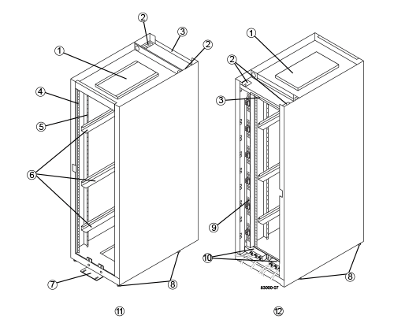

= Specifiche del cabinet per il cabinet 3040 40U (serie e)
:allow-uri-read: 
:icons: font
:imagesdir: ../media/

[role="lead"]
Il cabinet modello 3040 40U presenta le seguenti caratteristiche standard:

* Una porta posteriore che può essere bloccata e bloccata
* Le guide di supporto EIA (Electronic Industry Association) standard forniscono fori di montaggio per l'installazione dei dispositivi in un sistema standard da 48.3 cm (19") ampio cabinet
* Quattro rotelle a rulli e quattro piedini regolabili posizionati sotto l'armadietto per spostare l'armadio e quindi livellarlo nella posizione finale
* Un piede di stabilità che stabilizza l'armadio dopo averlo installato nella sua posizione permanente
* Aperture di accesso per i cavi di interfaccia
* Due unità di distribuzione dell'alimentazione CA (PDU) che forniscono una connessione di alimentazione integrata e capacità di gestione dell'alimentazione

Le seguenti figure mostrano una vista frontale (sinistra) e una vista posteriore (destra) dell'armadio.

|===

 a| 
1.
 a| 
Coperchio di ventilazione

 a| 
2.
 a| 
Aperture di accesso ai cavi di interfaccia

 a| 
3.
 a| 
Piastra posteriore

 a| 
4.
 a| 
Guide di supporto EIA

 a| 
5.
 a| 
Guide di supporto verticali

 a| 
6.
 a| 
Guide di montaggio per cabinet

 a| 
7.
 a| 
Piede di stabilità

 a| 
8.
 a| 
Piedini regolabili

 a| 
9.
 a| 
Unità di distribuzione dell'alimentazione (una di due)

 a| 
10.
 a| 
Scatole di alimentazione CA

 a| 
11.
 a| 
Parte anteriore del cabinet

 a| 
12.
 a| 
Parte posteriore del cabinet

|===

CAUTION: *Rischio di lesioni fisiche* -- se la metà inferiore del cabinet è vuota, non installare i componenti nella metà superiore del cabinet. Se la metà superiore del cabinet è troppo pesante per la metà inferiore, il cabinet potrebbe cadere e causare lesioni personali. Installare sempre un componente nella posizione più bassa disponibile nell'armadio.

CAUTION: *Rischio di lesioni fisiche* -- spostare solo un armadio popolato con un carrello elevatore a forche o con un adeguato aiuto da parte di altre persone. Spingere sempre il cabinet dalla parte anteriore per evitare che cada. Un cabinet completamente popolato può pesare più di 909 kg (2000 lb). Il cabinet è difficile da spostare, anche su una superficie piana. Se è necessario spostare il cabinet lungo una superficie inclinata, rimuovere i componenti dalla metà superiore del cabinet e assicurarsi di disporre di un aiuto adeguato.

NOTE: Non è possibile installare shelf di controller E2860 o E5760 o uno shelf di dischi DE460C in un cabinet 3040 40U.

NOTE: Se un cabinet 3040 è completamente popolato con i vassoi DE6600, pesa più di 1250.1 kg (2756 lb).

== Requisiti di alimentazione e dissipazione del calore

L'armadio include le seguenti specifiche per l'alimentazione e la dissipazione del calore.

=== Potenza nominale

L'armadio 3040 40U ha una potenza nominale di 200 V CA - 240 V CA a 50 Hz - 60 Hz e funziona fino a ±10% di tale intervallo.

=== Unità di distribuzione dell'alimentazione (PDU)

L'armadio include due unità di distribuzione dell'alimentazione CA (PDU) identiche, ciascuna PDU fornisce fino a 72A di alimentazione utilizzabile. Le PDU sono montate verticalmente sul retro dell'armadio e ciascuna PDU include sei power bank 12 A. Ciascun power bank contiene quattro prese di alimentazione IEC 60320-C19 e un interruttore automatico da 15 A. Ogni PDU ha un totale di 24 prese e 6 interruttori automatici.

Ciascuna delle due PDU è dotata di tre scatole di alimentazione, situate nella parte inferiore dell'armadio. Ciascuna scatola di alimentazione fornisce l'alimentazione a otto delle prese di corrente, come indicato di seguito:

* La scatola di ingresso dell'alimentazione 1, dotata di cavo di alimentazione C1, alimenta le otto prese inferiori
* La scatola di ingresso dell'alimentazione 2, dotata di cavo di alimentazione C2, alimenta le otto prese centrali
* La scatola di ingresso alimentazione 3, dotata di cavo di alimentazione C3, alimenta le otto prese superiori

Le scatole di alimentazione sono contrassegnate con C1, C2 e C3, dove i cavi di alimentazione si collegano ai moduli.

=== Calcolo dell'alimentazione e calcolo del calore per l'armadio

|===
| Componente | KVA | Watt | BTU/HR 

 a| 
PDU cabinet (72A PDU)
 a| 
14.4
 a| 
14400
 a| 
49176

 a| 
Cabinet PDU/banco 12A (72A PDU)
 a| 
2.40*
 a| 
2400*
 a| 
8196*

 a| 
Tray di dischi controller E2612
 a| 
0.437
 a| 
433
 a| 
1476

 a| 
Tray di dischi controller E2624
 a| 
0.487
 a| 
482
 a| 
1644

 a| 
Tray di dischi controller E2660
 a| 
1.128
 a| 
1117
 a| 
3810

 a| 
E2712 tray di dischi controller
 a| 
0.516
 a| 
511
 a| 
1744

 a| 
Vassoio del disco controller E2724
 a| 
0.561
 a| 
555
 a| 
1894

 a| 
Tray di dischi controller E2760
 a| 
1.205
 a| 
1193
 a| 
4072

 a| 
Tray di dischi controller E5412
 a| 
0.558
 a| 
552
 a| 
1883

 a| 
Tray di dischi controller E5424 e flash array EF540
 a| 
0.607
 a| 
601
 a| 
2051

 a| 
Tray di dischi controller E5460
 a| 
1.254
 a| 
1242
 a| 
4237

 a| 
Tray di dischi controller E5512
 a| 
0.587
 a| 
581
 a| 
1982

 a| 
Tray di dischi controller E5524 e flash array EF550
 a| 
0.637
 a| 
630
 a| 
2150

 a| 
Tray di dischi controller E5560
 a| 
1.285
 a| 
1272
 a| 
4342

 a| 
Tray di dischi controller E5612
 a| 
0.625
 a| 
619
 a| 
2111

 a| 
Tray di dischi controller E5624 e flash array EF560
 a| 
0.675
 a| 
668
 a| 
2279

 a| 
Tray di dischi controller E5660
 a| 
1.325
 a| 
1312
 a| 
4477

 a| 
Vassoio del disco DE1600
 a| 
0.325
 a| 
322
 a| 
1099

 a| 
Vassoio del disco DE5600
 a| 
0.375
 a| 
371
 a| 
1267

 a| 
Vassoio del disco DE6600
 a| 
0.1.011
 a| 
1001
 a| 
3415

|===

== Numero massimo di vassoi

Il numero massimo di vassoi che è possibile installare in un cabinet 3040 40U dipende dall'altezza di ciascun vassoio nelle unità rack (U).

=== Altezze dei vassoi nelle unità rack (U)

Ogni unità rack è di 4.45 cm (1.75 pollici). Ad esempio, è possibile installare fino a dieci vassoi 4U, fino a venti vassoi 2U o una combinazione di vassoi 2U e 4U, fino a 40U.

|===
| Vassoio | Unità rack (U) 

 a| 
Tray di dischi controller E2x12 o E2x24
 a| 
2U

 a| 
Tray di dischi controller E2x60
 a| 
4U

 a| 
Tray di dischi controller E5x12 o E5x24
 a| 
2U

 a| 
Tray di dischi controller E5x60
 a| 
4U

 a| 
Flash Array EF5x0
 a| 
2U

 a| 
Vassoio del disco DE1600
 a| 
2U

 a| 
Vassoio del disco DE5600
 a| 
2U

 a| 
Vassoio del disco DE6600
 a| 
4U

|===