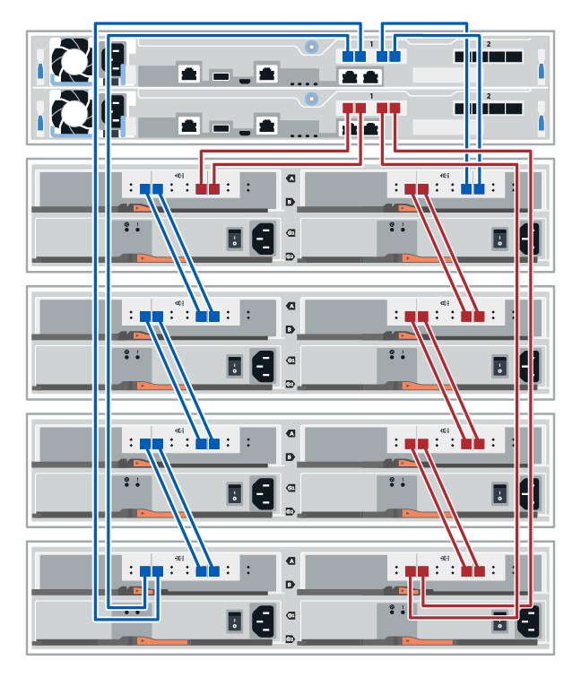

= Cablaggio dello shelf di dischi
:allow-uri-read: 
:icons: font
:imagesdir: ../media/

[role="lead"]
È necessario collegare ciascun controller nello shelf di controller a un modulo i/o (IOM) in uno shelf di dischi.

Questa procedura si applica agli shelf di dischi IOM12 e IOM12B.

NOTE: I moduli IOM12B sono supportati solo da SANtricity OS 11.70.2 in poi. Assicurarsi che il firmware del controller sia stato aggiornato prima di installare o eseguire l'aggiornamento a IOM12B.

NOTE: Questa procedura si applica a sostituzioni o sostituzioni IOM di shelf simili. Ciò significa che è possibile sostituire solo un modulo IOM12 con un altro modulo IOM12 o un modulo IOM12B con un altro modulo IOM12B. (Lo shelf può avere due moduli IOM12 o due moduli IOM12B).

Se si sta cablando uno shelf di controller meno recente a DE212C, DE224C o DE460, vedere https://mysupport.netapp.com/ecm/ecm_download_file/ECMLP2859057["Aggiunta di shelf di dischi IOM a uno shelf di controller E27XX, E56XX o EF560 esistente"^].

== Cablaggio E2800 ed E5700

Le seguenti informazioni si applicano al cablaggio di E2800, E2800, EF280, E5700, EF5700B, Oppure EF570 su uno shelf di dischi DE212C, DE224C o DE460.

[role="tabbed-block"]
====
.shelf da 12 dischi o 24 dischi
--
È possibile collegare lo shelf del controller a uno o più shelf da 12 o 24 dischi.

L'immagine seguente mostra una rappresentazione dello shelf del controller e degli shelf di dischi. Per individuare le porte sul modello in uso, vedere https://hwu.netapp.com/Controller/Index?platformTypeId=2357027["Hardware Universe"^].

image::../media/12_24_cabling.png[Uno shelf di controller e shelf da 12 o 24 dischi]

--
.shelf da 60 dischi
--
È possibile collegare lo shelf del controller a uno o più shelf da 60 dischi.

L'immagine seguente mostra una rappresentazione dello shelf del controller e degli shelf di dischi. Per individuare le porte sul modello in uso, vedere https://hwu.netapp.com/Controller/Index?platformTypeId=2357027["Hardware Universe"^].

image::../media/60_cabling.png[Uno shelf di controller e 60 shelf di dischi]

--
====

== Cablaggio EF300 ed EF600

Le seguenti informazioni si applicano al cablaggio di uno shelf di controller EF300 o EF600 su uno shelf di dischi DE212C, DE224C o DE460.

.Prima di iniziare
Prima di collegare un dispositivo EF300 o EF600, assicurarsi che il firmware sia aggiornato alla versione più recente. Per aggiornare il firmware, seguire le istruzioni in link:../upgrade-santricity/index.html["Aggiornamento del sistema operativo SANtricity"^].

[role="tabbed-block"]
====
.shelf da 12 dischi o 24 dischi
--
È possibile collegare lo shelf del controller a uno o più shelf da 12 o 24 dischi.

L'immagine seguente mostra una rappresentazione dello shelf del controller e degli shelf di dischi. Per individuare le porte sul modello in uso, vedere https://hwu.netapp.com/Controller/Index?platformTypeId=2357027["Hardware Universe"^].

--
.shelf da 60 dischi
--
È possibile collegare lo shelf del controller a uno o più shelf da 60 dischi.

L'immagine seguente mostra una rappresentazione dello shelf del controller e degli shelf di dischi. Per individuare le porte sul modello in uso, vedere https://hwu.netapp.com/Controller/Index?platformTypeId=2357027["Hardware Universe"^].

image::../media/ef_to_de460c.png[Uno shelf di controller e 60 shelf di dischi]

--
====

== Cablaggio E4000

Le seguenti informazioni si applicano al cablaggio di uno shelf di controller E4000 a uno shelf di dischi DE212C, DE224C o DE460.

[role="tabbed-block"]
====
.shelf da 12 dischi
--
È possibile collegare lo shelf del controller a uno o più shelf da 12 dischi.

image::../media/e4012_cabling.png[Uno shelf di controller e uno shelf da 12 dischi]

--
.shelf da 60 dischi
--
È possibile collegare lo shelf del controller a uno o più shelf da 60 dischi.

image::../media/e4060_cabling.png[Uno shelf di controller e 60 shelf di dischi]

--
====