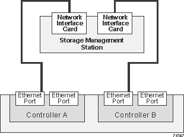

= Cablaggio Ethernet per una stazione di gestione
:allow-uri-read: 
:icons: font
:imagesdir: ../media/

[role="lead"]
È possibile collegare il sistema storage a una rete Ethernet per la gestione out-of-band degli array di storage. È necessario utilizzare cavi Ethernet per tutte le connessioni di gestione degli array di storage.

== Topologia diretta

Una topologia diretta collega il controller direttamente a una rete Ethernet.

È necessario collegare la porta di gestione 1 su ciascun controller per la gestione out-of-band e lasciare la porta 2 disponibile per l'accesso allo storage array da parte del supporto tecnico.

.Connessioni per la gestione diretta dello storage

== Topologia del fabric

Una topologia fabric utilizza uno switch per collegare il controller a una rete Ethernet.

È necessario collegare la porta di gestione 1 su ciascun controller per la gestione out-of-band e lasciare la porta 2 disponibile per l'accesso allo storage array da parte del supporto tecnico.

.Connessioni per la gestione dello storage fabric
image::../media/74110.gif[74110]
