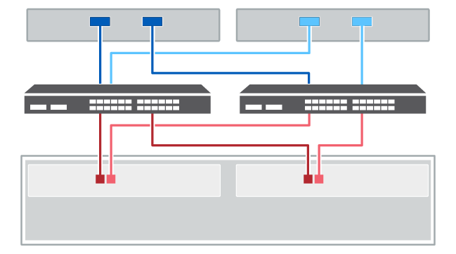

= Cablaggio host
:allow-uri-read: 
:icons: font
:imagesdir: ../media/

[role="lead"]
È possibile collegare un host direttamente a un controller (topologia direct-attached) o utilizzare switch (topologia switch) per collegare un host a un controller.

== Cablaggio per una topologia a collegamento diretto

Una topologia direct-attached connette gli adattatori host direttamente ai controller del sistema storage.

La figura seguente mostra un esempio di connessione. Per garantire le massime prestazioni, utilizzare tutte le porte dell'adattatore host disponibili.

.Due host e due controller
image::../media/topology_host_direct_generic_web_low.png[Cablaggio di due host e due controller]

*(1)* _collegare ciascuna porta dell'adattatore host direttamente alle porte host dei controller._

NOTE: Per E4000, eseguire il collegamento alle porte host e0a e e0b.

== Cablaggio per una topologia di switch

Una topologia di switch utilizza gli switch per connettere gli host ai controller del sistema storage. Lo switch deve supportare il tipo di connessione utilizzato tra l'host e il controller.

La figura seguente mostra un esempio di connessione. Per gli switch che offrono funzionalità di provisioning, è necessario isolare ogni coppia di iniziatori e di destinazione.

.Due host e due switch

*(1)* _collegare ogni adattatore host direttamente allo switch._

*(2)* _collegare ogni switch direttamente alle porte host dei controller. Per garantire le massime prestazioni, utilizzare tutte le porte dell'adattatore host disponibili._

NOTE: Per E4000, eseguire il collegamento alle porte host e0a e e0b.
