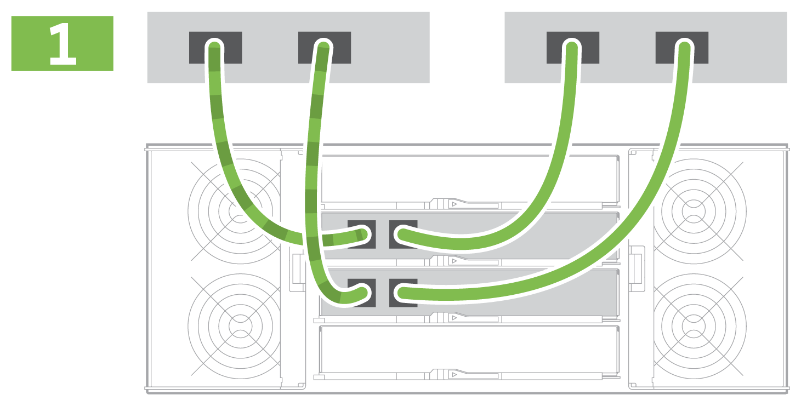
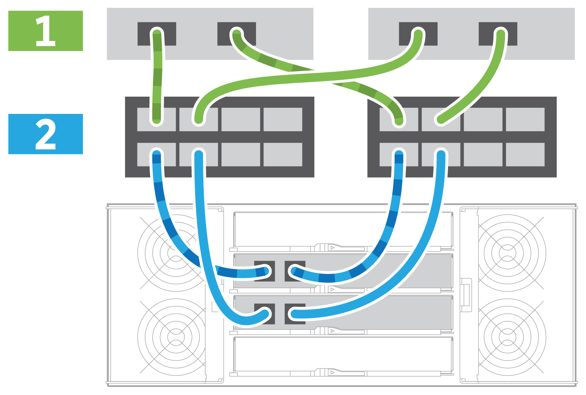

= Configurazione e setup completi del sistema storage: E2860, E5760 e DE460
:allow-uri-read: 
:icons: font
:imagesdir: ../media/

[role="lead"]
Scopri come collegare i controller alla rete e completare la configurazione e la configurazione del sistema storage.

== Fase 1: Collegare via cavo gli host dati

Collegare il sistema in base alla topologia di rete.

NOTE: Se si utilizza AIX®, è necessario installare il driver multipath e-Series sull'host prima di collegarlo all'array.

=== Opzione 1: Topologia a collegamento diretto

Nell'esempio seguente viene illustrato il collegamento dei cavi agli host di dati utilizzando una topologia a collegamento diretto.

|===

 a| 

 a| 
. Collegare ciascun adattatore host direttamente alle porte host dei controller.

|===

=== Opzione 2: Topologia del fabric

Nell'esempio seguente viene illustrato il collegamento degli host di dati mediante una topologia fabric.

|===

 a| 

 a| 
. Collegare ciascun adattatore host direttamente allo switch.
. Collegare ogni switch direttamente alle porte host dei controller.

|===

== Fase 2: Connessione e configurazione della connessione di gestione

È possibile configurare le porte di gestione del controller utilizzando un server DHCP o un indirizzo IP statico.

=== Opzione 1: Server DHCP

Scopri come configurare le porte di gestione con un server DHCP.

.Prima di iniziare
* Configurare il server DHCP per associare un indirizzo IP, una subnet mask e un indirizzo gateway come lease permanente per ciascun controller.
* Ottenere gli indirizzi IP assegnati per la connessione al sistema di storage dall'amministratore di rete.

.Fasi
. Collegare un cavo Ethernet alla porta di gestione di ciascun controller e l'altra estremità alla rete.
+
|===

 a| 
image:../media/cable_ethernet_inst-hw-e2800-e5700.png["Cavi Ethernet"]
 a| 
Cavi Ethernet (se ordinati)

|===
+
Le seguenti figure mostrano esempi della posizione della porta di gestione del controller:

+
|===

 a| 
image:../media/e2800_mgmt_ports.png["Porte di gestione E2800"]

Porta di gestione P1 del controller E2800
 a| 
image:../media/e5700_mgmt_ports.png["Porte di gestione E5700"]

Porta di gestione P1 del controller E5700

|===
. Aprire un browser e connettersi al sistema di storage utilizzando uno degli indirizzi IP del controller forniti dall'amministratore di rete.

=== Opzione 2: Indirizzo IP statico

Informazioni su come configurare manualmente le porte di gestione immettendo l'indirizzo IP e la subnet mask.

.Prima di iniziare
* Richiedere all'amministratore di rete l'indirizzo IP, la subnet mask, l'indirizzo del gateway e le informazioni sul server DNS e NTP dei controller.
* Assicurarsi che il portatile in uso non riceva la configurazione di rete da un server DHCP.

.Fasi
. Utilizzando un cavo Ethernet, collegare la porta di gestione Del controller A alla porta Ethernet di un laptop.
+
|===

 a| 
image:../media/cable_ethernet_inst-hw-e2800-e5700.png["Cavi Ethernet"]
 a| 
Cavi Ethernet (se ordinati)

|===
+
Le seguenti figure mostrano esempi della posizione della porta di gestione del controller:

+
|===

 a| 
image:../media/e2800_mgmt_ports.png["Porte di gestione E2800"]

Porta di gestione P1 del controller E2800
 a| 
image:../media/e5700_mgmt_ports.png["Porte di gestione E5700"]

Porta di gestione P1 del controller E5700

|===
. Aprire un browser e utilizzare l'indirizzo IP predefinito (169.254.128.101) per stabilire una connessione al controller. Il controller restituisce un certificato autofirmato. Il browser informa che la connessione non è sicura.
+

NOTE: Per le piattaforme che eseguono SANtricity 11,60 e versioni successive, la subnet mask predefinita è 255.255.0.0.

. Seguire le istruzioni del browser per procedere e avviare Gestione di sistema di SANtricity.
+

NOTE: Se non si riesce a stabilire una connessione, verificare di non ricevere la configurazione di rete da un server DHCP.

. Impostare la password di accesso del sistema di storage.
. Utilizzare le impostazioni di rete fornite dall'amministratore di rete nella procedura guidata *Configura impostazioni di rete* per configurare le impostazioni di rete del controller A, quindi selezionare *fine*.
+

NOTE: Poiché l'indirizzo IP viene ripristinato, System Manager perde la connessione al controller.

. Scollegare il laptop dal sistema storage e collegare la porta di gestione del controller A alla rete.
. Aprire un browser su un computer connesso alla rete e immettere l'indirizzo IP appena configurato del controller A.
+

NOTE: Se si perde la connessione al controller A, è possibile collegare un cavo ethernet al controller B per ristabilire la connessione al controller A attraverso il controller B (169.254.128.102).

. Accedere utilizzando la password impostata in precedenza.
+
Viene visualizzata la procedura guidata Configure Network Settings (Configura impostazioni di rete).

. Utilizzare le impostazioni di rete fornite dall'amministratore di rete nella procedura guidata *Configura impostazioni di rete* per configurare le impostazioni di rete del controller B, quindi selezionare *fine*.
. Collegare il controller B alla rete.
. Convalidare le impostazioni di rete del controller B inserendo l'indirizzo IP appena configurato del controller B in un browser.
+

NOTE: Se si perde la connessione al controller B, è possibile utilizzare la connessione precedentemente convalidata al controller A per ristabilire la connessione al controller B attraverso il controller A.

== Fase 3: Configurare e gestire il sistema storage

Dopo aver installato l'hardware, utilizzare il software SANtricity per configurare e gestire il sistema di storage.

.Prima di iniziare
* Configurare le porte di gestione.
* Verificare e registrare la password e gli indirizzi IP.

.Fasi
. Utilizza il software SANtricity per configurare e gestire gli array di storage.
. Nella configurazione di rete più semplice, collegare il controller a un browser Web e utilizzare Gestione di sistema di SANtricity per gestire un singolo array di storage della serie E2800 o E5700.

|===

 a| 
image:../media/management_s_g2285tation_inst-hw-e2800-e5700_g2285.png["Accedere a System Manager per configurare le porte di gestione"]
 a| 
Per accedere a System Manager, utilizzare gli stessi indirizzi IP utilizzati per configurare le porte di gestione.

|===