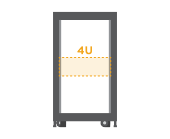

= Preparazione per l'installazione
:allow-uri-read: 
:icons: font
:imagesdir: ../media/

[role="lead"]
Scopri come preparare l'installazione del tuo sistema storage E2860, E5760 o DE460.

.Fasi
. Creare un account e registrare l'hardware all'indirizzo http://mysupport.netapp.com/["Supporto NetApp"^].
. Assicurarsi che nella confezione ricevuta siano presenti i seguenti elementi.
+
|===

 a| 
image:../media/trafford_overview.png["Shelf con dischi installati e pannello frontale"]
 a| 
Shelf, pannello frontale e hardware per il montaggio in rack

 a| 
image:../media/handles_counted.png["Maniglie dei ripiani"]
 a| 
4 maniglie per scaffali

|===
+
La seguente tabella identifica i tipi di cavi che potrebbero essere ricevuti. Se si riceve un cavo non elencato nella tabella, vedere https://hwu.netapp.com/["Hardware Universe"^] individuare il cavo e identificarne l'utilizzo.

+
|===
| Tipo di connettore | Tipo di cavo | Utilizzare 

 a| 
image:../media/cable_ethernet_inst-hw-e2800-e5700.png["Cavi Ethernet"]
 a| 
Cavi Ethernet

(se ordinato)
 a| 
Connessione di gestione

 a| 
image:../media/cable_io_inst-hw-e2800-e5700.png["Cavi i/O."]
 a| 
Cavi i/O.

(se ordinato)
 a| 
Cablaggio degli host di dati

 a| 
image:../media/cable_power_inst-hw-e2800-e5700.png["Cavi di alimentazione"]
 a| 
Cavi di alimentazione

x2 per shelf

(se ordinato)
 a| 
Accensione del sistema storage

 a| 
image:../media/sas_cable.png["Cavi SAS"]
 a| 
Cavi SAS (inclusi solo con gli shelf di dischi)
 a| 
Cablaggio degli shelf

|===
. Assicurarsi di fornire i seguenti elementi.
+
|===

 a| 
image:../media/screwdriver_inst-hw-e2800-e5700.png["Cacciavite Phillips n. 2"]
 a| 
Cacciavite Phillips n. 2

 a| 
image:../media/flashlight_inst-hw-e2800-e5700.png["Torcia"]
 a| 
Torcia

 a| 
image:../media/wrist_strap_inst-hw-e2800-e5700.png["Braccialetto ESD"]
 a| 
Braccialetto ESD

 a| 

 a| 
Spazio rack 4U: Uno standard da 19" Rack da 48.30 cm per rack 4U delle seguenti dimensioni.

*Profondità*: 38.25" (97.16 cm)

*Larghezza*: 17.66" (44.86 cm)

*Altezza*: 6.87" (17.46 cm)

*Peso massimo*: 113 kg (250 lb)

 a| 

 a| 
Un browser supportato per il software di gestione:

** Google Chrome (versione 89 e successive)
** Microsoft Edge (versione 90 e successive)
** Mozilla Firefox (versione 80 e successive)
** Safari (versione 14 e successive)

|===

