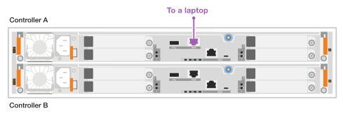

= Configurazione completa del sistema storage - EF50 e EF80
:allow-uri-read: 
:icons: font
:imagesdir: ../media/

[role="lead"]
Dopo aver acceso il sistema storage EF50 o EF80, completi la configurazione del sistema collegando i cavi e configurando la porta di gestione su ciascun controller per la gestione out-of-band del sistema storage, configurando il tuo sistema storage e poi verificando che il protocollo del modulo I/O host sia corretto.

== Passaggio 1: Collegare e configurare le porte di gestione

Collega la porta di gestione su ciascun controller e poi configura le porte utilizzando un server DHCP o un indirizzo IP statico.

[role="tabbed-block"]
====
.Opzione 1: Server DHCP
--
Collegare i cavi e quindi configurare le porte di gestione utilizzando un server DHCP.

.Prima di iniziare
* Ottenere gli indirizzi IP assegnati per la connessione al sistema di storage dall'amministratore di rete.
* Annota l'indirizzo MAC riportato sul lato di ciascun controller. Utilizzi l'indirizzo MAC per identificare quale indirizzo IP è assegnato a ciascun controller.
* Configurare il server DHCP per associare un indirizzo IP, una subnet mask e un indirizzo gateway come lease permanente per ciascun controller.

.Fasi
. Utilizzando cavi Ethernet, collega la porta di gestione di ciascun controller alla tua rete.
+
*Cavi RJ-45 1000BASE-T*

+
image::../media/oie_cable_rj45.png[Cavi RJ-45]

+
image:../media/drw_ef50-ef80_wrench_to_network_ieops-2613.svg["Cablaggio della porta di gestione del controller ef50 and ef80 alla rete"]

. Aprire un browser e connettersi al sistema di storage utilizzando uno degli indirizzi IP del controller forniti dall'amministratore di rete.

--
.Opzione 2: Indirizzo IP statico
--
Collegare il cavo e quindi configurare manualmente le porte di gestione inserendo l'indirizzo IP e la subnet mask.

.Prima di iniziare
* Richiedere all'amministratore di rete l'indirizzo IP, la subnet mask, l'indirizzo del gateway e le informazioni sul server DNS e NTP dei controller.
* Assicurarsi che il portatile in uso non riceva la configurazione di rete da un server DHCP.

.Fasi
. Utilizzando un cavo Ethernet, collegare la porta di gestione Del controller A alla porta Ethernet di un laptop.
+
*Cavi RJ-45 1000BASE-T*

+
image::../media/oie_cable_rj45.png[Cavi RJ-45]

+

. Apri un browser e utilizza l'indirizzo IP predefinito (169.254.128.101) per stabilire una connessione al controller.
+
Il controller invia un certificato autofirmato. Il browser ti informa che la connessione non è sicura.

. Seguire le istruzioni del browser per procedere e avviare Gestione di sistema di SANtricity.
+
Se non si riesce a stabilire una connessione, verificare di non ricevere la configurazione di rete da un server DHCP.

. Impostare la password di accesso del sistema di storage.
. Utilizzare le impostazioni di rete fornite dall'amministratore di rete nella procedura guidata *Configura impostazioni di rete* per configurare le impostazioni di rete del controller A, quindi selezionare *fine*.
+

NOTE: Poiché l'indirizzo IP viene ripristinato, System Manager perde la connessione al controller.

. Scollega il cavo Ethernet dal tuo laptop (lasciandolo collegato al controller A) e collegalo alla rete.
. Aprire un browser su un computer connesso alla rete e immettere l'indirizzo IP appena configurato del controller A.
+

NOTE: Se si perde la connessione al controller A, è possibile collegare un cavo Ethernet al controller B per ristabilire la connessione al controller A tramite il controller B (169.254.128.102).

. Accedi utilizzando la password che hai impostato in precedenza. La procedura guidata *Configura impostazioni di rete* viene visualizzata.
. Utilizzare le impostazioni di rete fornite dall'amministratore di rete nella procedura guidata *Configura impostazioni di rete* per configurare le impostazioni di rete del controller B, quindi selezionare *fine*.
. Collegare il controller B alla rete.
+
Entrambe le porte di gestione del controller sono ora connesse alla rete:

+
image:../media/drw_ef50-ef80_wrench_to_network_ieops-2613.svg["Cablaggio della porta di gestione del controller ef50 and ef80 alla rete"]

. Convalidare le impostazioni di rete del controller B inserendo l'indirizzo IP appena configurato del controller B in un browser.
+

NOTE: Se si perde la connessione al controller B, è possibile utilizzare la connessione precedentemente convalidata al controller A per ristabilire la connessione al controller B attraverso il controller A.

--
====

== Passaggio 2: Configura il tuo sistema storage

Utilizza SANtricity System Manager per configurare e gestire il tuo sistema storage.

.Prima di iniziare
* È necessario aver cablato e configurato le porte di gestione alla rete.
* Verifica e annota la tua password e gli indirizzi IP configurati.

.Fasi
. Accedere a SANtricity System Manager utilizzando gli indirizzi IP configurati.
. Utilizza SANtricity System Manager per gestire il tuo sistema storage.
+
È possibile consultare la guida in linea inclusa con SANtricity System Manager.

== Passaggio 3: Verificare che il protocollo del modulo I/O host sia corretto

Il sistema storage viene fornito con un protocollo predefinito sui moduli I/O host. Se il protocollo predefinito non è il protocollo desiderato, è possibile modificarlo.

.Fasi
. Verifica il protocollo predefinito utilizzato sui moduli I/O host nel tuo sistema storage, utilizzando SANtricity System Manager.
+
.. Seleziona *Settings* > *System*.
.. Nella sezione *Impostazioni aggiuntive*, fare clic su *Modifica protocollo I/O host* per aprire quella pagina.
.. Visualizza il protocollo I/O host predefinito utilizzato sui moduli I/O host nel tuo sistema storage, visualizzato nel campo *Host I/O Protocol*.

. Il passaggio successivo dipende dal fatto che il protocollo predefinito sia quello che desideri o meno:
+
[cols="1,2"]
|===
| Se... | Poi... 

 a| 
Il protocollo predefinito è il protocollo che desideri
 a| 
Non è richiesta alcuna azione.

 a| 
Il protocollo predefinito non è il protocollo che desideri
 a| 
È necessario modificarlo utilizzando la procedura link:../maintenance-ef50-ef80/io-module-change-protocol.html["Modificare il protocollo host"^].

NOTE: La modifica del protocollo della porta host comporta la preparazione per il cambio di protocollo, l'arresto delle operazioni di I/O dell'host, la modifica del protocollo e quindi la configurazione dell'host per l'utilizzo del nuovo protocollo.

|===

