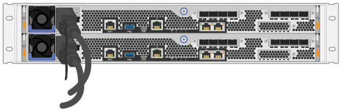

= Alimentare gli shelf dei controller
:allow-uri-read: 
:icons: font
:imagesdir: ../media/

[role="lead"]
Scopri come collegare i cavi di alimentazione e alimentare gli shelf di dischi.

.Prima di iniziare
Assicurarsi di effettuare le seguenti operazioni:

* Installare l'hardware.
* Adottare precauzioni antistatiche.

.Fasi
. Collegare i cavi di alimentazione, uno a ciascun controller (EF600 mostrato di seguito).
+
|===

 a| 
image:../media/power_cable_inst-hw-ef600.png["Cavi di alimentazione"]
 a| 
*Cavi di alimentazione*

|===
+
|===

 a| 

|===
. Collegare i due cavi di alimentazione, uno per ciascun controller, a due unità di distribuzione dell'alimentazione (PDU) separate nell'armadio o nel rack.
+

CAUTION: L'accesso a un contenitore di controller EF300 o EF600 dallo shelf può essere bloccato da PDU di terze parti. Non utilizzare prese di corrente direttamente dietro il contenitore del controller.

. Attendere cinque minuti per avviare il controller prima di completare la configurazione e la configurazione del sistema di storage.

.Risultato
Il controller si avvia automaticamente. I LED lampeggiano e le ventole iniziano a indicare che il controller è in fase di accensione.

NOTE: Le ventole sono molto rumorose quando si accende per la prima volta.
