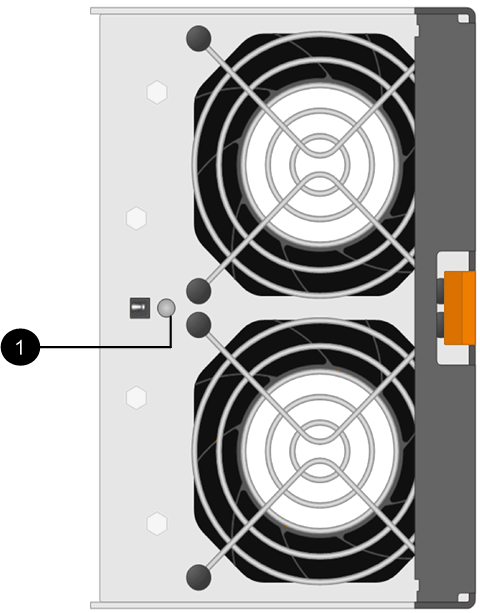

= Sostituire il filtro a carboni attivi della ventola - E2800 (60 unità)
:allow-uri-read: 
:experimental: 
:icons: font
:imagesdir: ../media/

[role="lead"]
È possibile sostituire un contenitore di ventole in un array E2800 con uno shelf da 60 dischi, che include i seguenti tipi di shelf:

* Shelf di controller E2860
* Shelf di dischi DE460C

.A proposito di questa attività
Ogni shelf di controller da 60 dischi o shelf di dischi include due contenitori per ventole. In caso di guasto di un contenitore della ventola, sostituirlo il prima possibile per garantire che il ripiano sia adeguatamente raffreddato.

CAUTION: *Possibili danni all'apparecchiatura* -- se si esegue questa procedura con l'alimentazione accesa, è necessario completarla entro 30 minuti per evitare il rischio di surriscaldamento dell'apparecchiatura.

.Prima di iniziare
* Esaminare i requisiti del filtro a carboni attivi della ventola in link:canisters-overview-supertask-concept.html["Requisiti per la sostituzione del contenitore"].
* Esaminare i dettagli nel Recovery Guru per confermare che si è verificato un problema con il filtro a carboni attivi della ventola e selezionare *ricontrollare* dal Recovery Guru per assicurarsi che non sia necessario risolvere prima altri elementi.
* Controllare che il LED di attenzione ambra sul filtro della ventola sia acceso, a indicare che la ventola è guasta. Contattare il supporto tecnico per assistenza se entrambi i contenitori delle ventole nello shelf hanno i LED di attenzione color ambra accesi.
* Assicurarsi di disporre di quanto segue:
+
** Un filtro della ventola di ricambio (ventola) supportato per il modello di shelf del controller o del disco.
** Un braccialetto antistatico o sono state adottate altre precauzioni antistatiche.

== Fase 1: Preparazione alla sostituzione del filtro a carboni attivi della ventola

Preparare la sostituzione di un contenitore di ventole in uno shelf di controller da 60 dischi o in uno shelf di dischi raccogliendo i dati di supporto relativi allo storage array e individuando il componente guasto.

.Fasi
. Raccogliere i dati di supporto per lo storage array utilizzando Gestione di sistema di SANtricity.
+
.. Selezionare menu:Support[Support Center > Diagnostics] (supporto tecnico > Diagnostica).
.. Selezionare *Collect Support Data*.
.. Fare clic su *Collect*.
+
Il file viene salvato nella cartella Download del browser con il nome *support-data.7z*.

. Da Gestore di sistema di SANtricity, determinare quale filtro a carboni attivi della ventola si è guastato.
+
.. Selezionare *hardware*.
.. Osservare l'icona della ventola image:../media/sam1130_ss_hardware_fan_icon_maint-e2800.gif["Icona ventola"]a destra degli elenchi a discesa *ripiano* per determinare quale ripiano presenta il filtro della ventola guasto.
+
In caso di guasto di un componente, questa icona è rossa.

.. Quando trovi lo shelf con un'icona rossa, seleziona *Mostra retro dello shelf*.
.. Selezionare il filtro a carboni attivi della ventola o l'icona rossa della ventola.
.. Nella scheda *ventole*, controllare gli stati dei contenitori delle ventole per determinare quale filtro a carboni attivi deve essere sostituito.
+
Un componente con stato *Failed* deve essere sostituito.

+

NOTE: Se il secondo contenitore della ventola nello shelf non ha lo stato *ottimale*, non tentare di sostituire a caldo il contenitore della ventola guasto. Contattare invece il supporto tecnico per assistenza.

+
È inoltre possibile trovare informazioni sul contenitore della ventola guasto nell'area Details (Dettagli) del Recovery Guru oppure consultare il registro eventi in Support (supporto) e Filter by Component Type (filtro per tipo di componente).

. Dal retro dello storage array, osservare i LED di attenzione per individuare il contenitore della ventola da rimuovere.
+
È necessario sostituire il filtro a carboni attivi della ventola con il LED attenzione acceso.

+

+
*(1)* _LED attenzione_. Se questo LED viene visualizzato come *giallo fisso*, significa che la ventola è guasta.

== Fase 2: Rimuovere il filtro a carboni attivi della ventola guasto e installarne uno nuovo

Rimuovere un contenitore della ventola guasto in modo da poterlo sostituire con uno nuovo.

CAUTION: Se non si spegne l'alimentazione dello storage array, assicurarsi di rimuovere e sostituire il contenitore della ventola entro 30 minuti per evitare il surriscaldamento del sistema.

.Fasi
. Disimballare il nuovo contenitore della ventola e posizionarlo su una superficie piana vicino allo scaffale.
+
Conservare tutto il materiale di imballaggio da utilizzare quando si restituisce la ventola guasta.

. Premere la linguetta arancione per rilasciare la maniglia del filtro a carboni attivi della ventola.
+
image::../media/28_dwg_e2860_de460c_single_fan_canister_with_orange_tab_callout_maint-e2800.gif[]

+
*(1)* _linguetta che si preme per rilasciare la maniglia del filtro della ventola_

. Utilizzare la maniglia del filtro a carboni attivi per estrarre il filtro a carboni attivi dal ripiano.
+
image::../media/28_dwg_e2860_de460c_fan_canister_handle_with_callout_maint-e2800.gif[Maniglia di estrazione del filtro della ventola]

+
*(1)* _maniglia per estrarre il contenitore della ventola_

. Far scorrere completamente il contenitore della ventola di ricambio nello scaffale, quindi spostare la maniglia del contenitore della ventola fino a quando non si blocca con la linguetta arancione.

== Fase 3: Sostituzione completa del filtro a carboni attivi della ventola

Verificare che il nuovo filtro a carboni attivi della ventola funzioni correttamente, raccogliere i dati di supporto e riprendere le normali operazioni.

.Fasi
. Controllare il LED di attenzione ambra sul nuovo filtro a carboni attivi della ventola.
+

NOTE: Dopo aver sostituito il filtro a carboni attivi della ventola, il LED attenzione rimane acceso (ambra fisso) mentre il firmware verifica che il filtro a carboni attivi della ventola sia stato installato correttamente. Il LED si spegne al termine del processo.

. Dal guru del ripristino in Gestione sistema di SANtricity, selezionare *ricontrollare* per assicurarsi che il problema sia stato risolto.
. Se viene ancora segnalato un guasto al filtro a carboni attivi della ventola, ripetere le operazioni descritte in <<Fase 2: Rimuovere il filtro a carboni attivi della ventola guasto e installarne uno nuovo>>. Se il problema persiste, contattare il supporto tecnico.
. Rimuovere la protezione antistatica.
. Raccogliere i dati di supporto per lo storage array utilizzando Gestione di sistema di SANtricity.
+
.. Selezionare menu:Support[Support Center > Diagnostics] (supporto tecnico > Diagnostica).
.. Selezionare *Collect Support Data*.
.. Fare clic su *Collect*.
+
Il file viene salvato nella cartella Download del browser con il nome *support-data.7z*.

. Restituire la parte guasta a NetApp, come descritto nelle istruzioni RMA fornite con il kit.

.Quali sono le prossime novità?
La sostituzione del filtro a carboni attivi della ventola è completata. È possibile riprendere le normali operazioni.
