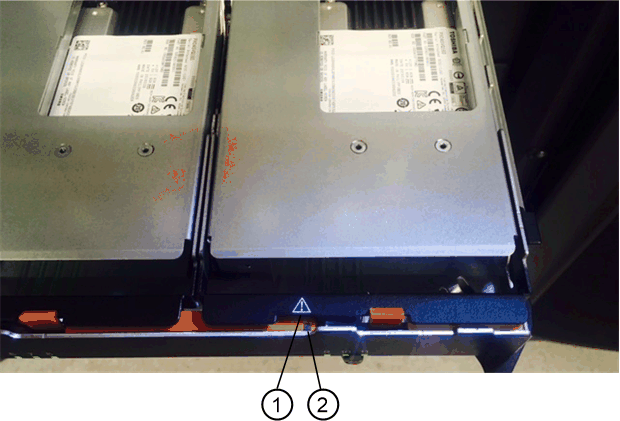

= Sostituzione di un'unità: E2800 (shelf da 60 dischi)
:allow-uri-read: 
:icons: font
:imagesdir: ../media/

[role="lead"]
È possibile sostituire un disco in un E2800 con uno shelf da 60 dischi.

.A proposito di questa attività
Il guru del ripristino in Gestione di sistema di SANtricity monitora i dischi nell'array di storage e può notificare un guasto imminente del disco o un guasto effettivo del disco. In caso di guasto di un disco, il LED di attenzione di colore ambra si accende. È possibile sostituire a caldo un disco guasto mentre lo storage array sta ricevendo le operazioni di i/O.

Questa procedura si applica agli shelf di unità DCM, DCM2 e DCM3.

.Prima di iniziare
* Esaminare i requisiti di gestione dei dischi in link:drives-overview-supertask-concept.html["Requisiti per la sostituzione del disco E2800"].
* Assicurarsi di disporre di quanto segue:
+
** Un'unità sostitutiva supportata da NetApp per lo shelf di controller o lo shelf di dischi.
** Un braccialetto antistatico o sono state adottate altre precauzioni antistatiche.
** Stazione di gestione con un browser che può accedere a Gestione di sistema SANtricity per il controller. Per aprire l'interfaccia di System Manager, puntare il browser sul nome di dominio o sull'indirizzo IP del controller.

== Fase 1: Preparazione alla sostituzione del disco

Preparare la sostituzione di un disco controllando il guru del ripristino in Gestore di sistema di SANtricity e completando i passaggi necessari. Quindi, individuare il componente guasto.

.Fasi
. Se il guru del ripristino in Gestione sistema di SANtricity ha notificato un _imminente guasto al disco_, ma il disco non è ancora guasto, seguire le istruzioni nel guru del ripristino per eseguire il guasto al disco.
. Se necessario, utilizzare Gestione di sistema di SANtricity per verificare di disporre di un'unità sostitutiva adatta.
+
.. Selezionare *hardware*.
.. Selezionare il disco guasto sul grafico dello shelf.
.. Fare clic sull'unità per visualizzarne il menu di scelta rapida, quindi selezionare *Visualizza impostazioni*.
.. Verificare che l'unità sostitutiva abbia una capacità uguale o superiore a quella dell'unità che si sta sostituendo e che disponga delle funzioni previste.
+
Ad esempio, non tentare di sostituire un disco rigido (HDD) con un disco a stato solido (SSD). Allo stesso modo, se si sta sostituendo un disco sicuro, assicurarsi che anche il disco sostitutivo sia sicuro.

. Se necessario, utilizzare Gestore di sistema di SANtricity per individuare il disco all'interno dello storage array.
+
.. Se lo shelf è dotato di una cornice, rimuovetela per vedere i LED.
.. Dal menu di scelta rapida del disco, selezionare *attiva indicatore di posizione*.
+
Il LED di attenzione del cassetto dell'unità (ambra) lampeggia per consentire l'apertura del cassetto dell'unità corretto e identificare l'unità da sostituire.

+
image::../media/2860_dwg_attn_led_on_drawer_maint-e2800.gif[LED attenzione sul cassetto dell'unità E2800]

+
*(1)* _LED attenzione_

.. Sganciare il cassetto dell'unità tirando entrambe le leve.
.. Utilizzando le leve estese, estrarre con cautela il cassetto dell'unità fino a quando non si arresta.
.. Controllare la parte superiore del cassetto dell'unità per individuare il LED di attenzione davanti a ciascun disco.
+
image::../media/2860_dwg_amber_on_drive_maint-e2800.gif[LED attenzione sul cassetto dell'unità E2800]

*(1)* _LED attenzione acceso per l'unità in alto a destra_

I LED attenzione cassetto unità si trovano sul lato sinistro davanti a ciascun disco, con un'icona di attenzione sulla maniglia del disco appena dietro il LED.

*(1)* _icona attenzione_

*(2)* _LED attenzione_

== Fase 2: Rimuovere il disco guasto

Rimuovere un disco guasto per sostituirlo con uno nuovo.

.Fasi
. Disimballare l'unità sostitutiva e conservarla su una superficie piana e priva di elettricità statica vicino allo shelf.
+
Conservare tutti i materiali di imballaggio per la prossima volta che sarà necessario restituire un disco.

. Rilasciare le leve del cassetto dell'unità dal centro del cassetto dell'unità appropriato, tirandole verso i lati del cassetto.
. Tirare con cautela le leve del cassetto dell'unità esteso per estrarre il cassetto dell'unità fino alla sua estensione completa senza rimuoverlo dal contenitore.
. Tirare delicatamente indietro il dispositivo di chiusura arancione che si trova davanti all'unità che si desidera rimuovere.
+
La maniglia della camma sulle molle di azionamento si apre parzialmente e l'unità viene rilasciata dal cassetto.

+
image::../media/trafford_drive_rel_button_maint-e2800.gif[Fermo di rilascio arancione sul cassetto dell'unità]

+
*(1)* _dispositivo di chiusura arancione_

. Aprire la maniglia della camma ed estrarre leggermente l'unità.
. Attendere 60 secondi.
. Utilizzare la maniglia della camma per sollevare l'unità dallo scaffale.
+
image::../media/92_dwg_de6600_install_or_remove_drive_maint-e2800.gif[Utilizzare la maniglia della camma per sollevare l'unità dal ripiano]

. Posizionare l'unità su una superficie antistatica e imbottita, lontano dai campi magnetici.
. Attendere 60 secondi affinché il software riconosca che l'unità è stata rimossa.
+

NOTE: Se si rimuove accidentalmente un disco attivo, attendere almeno 60 secondi, quindi reinstallarlo. Per la procedura di ripristino, fare riferimento al software di gestione dello storage.

== Fase 3: Installare un nuovo disco

Installare un nuovo disco per sostituire quello guasto.

CAUTION: Installare l'unità sostitutiva il prima possibile dopo aver rimosso l'unità guasta. In caso contrario, l'apparecchiatura potrebbe surriscaldarsi.

CAUTION: *Possibile perdita di accesso ai dati* -- quando si reinserisce il cassetto del disco nel contenitore, non chiudere mai il cassetto. Spingere lentamente il cassetto per evitare di strattonare il cassetto e danneggiare lo storage array.

.Fasi
. Sollevare la maniglia della camma sul nuovo disco in verticale.
. Allineare i due pulsanti rialzati su ciascun lato del supporto dell'unità con lo spazio corrispondente nel canale dell'unità sul cassetto dell'unità.
+
image::../media/28_dwg_e2860_de460c_drive_cru_maint-e2800.gif[Il pulsante sollevato sul supporto dell'unità deve corrispondere al canale dell'unità sul cassetto dell'unità]

+
*(1)* _pulsante sollevato sul lato destro del supporto del disco_

. Abbassare l'unità, quindi ruotare la maniglia della camma verso il basso fino a quando non scatta in posizione sotto il dispositivo di chiusura arancione.
. Spingere con cautela il cassetto dell'unità all'interno del contenitore. Spingere lentamente il cassetto per evitare di strattonare il cassetto e danneggiare lo storage array.
. Chiudere il cassetto dell'unità spingendo entrambe le leve verso il centro.
+
Il LED di attività verde per l'unità sostituita nella parte anteriore del cassetto si accende quando l'unità è inserita correttamente.

+
A seconda della configurazione, il controller potrebbe ricostruire automaticamente i dati nel nuovo disco. Se lo shelf utilizza dischi hot spare, il controller potrebbe dover eseguire una ricostruzione completa sull'hot spare prima di poter copiare i dati sull'unità sostituita. Questo processo di ricostruzione aumenta il tempo necessario per completare questa procedura.

== Fase 4: Sostituzione completa del disco

Verificare che il nuovo disco funzioni correttamente.

.Fasi
. Controllare il LED di alimentazione e il LED di attenzione sull'unità sostituita. (Quando si inserisce un disco per la prima volta, il LED attenzione potrebbe essere acceso. Tuttavia, il LED dovrebbe spegnersi entro un minuto.
+
** Il LED di alimentazione è acceso o lampeggia e il LED attenzione è spento: Indica che il nuovo disco funziona correttamente.
** LED di alimentazione spento: Indica che l'unità potrebbe non essere installata correttamente. Rimuovere l'unità, attendere 60 secondi, quindi reinstallarla.
** LED attenzione acceso: Indica che il nuovo disco potrebbe essere difettoso. Sostituirlo con un altro disco nuovo.

. Se il guru del ripristino in Gestione sistema di SANtricity continua a mostrare un problema, selezionare *ricontrollare* per assicurarsi che il problema sia stato risolto.
. Se il Recovery Guru indica che la ricostruzione del disco non è stata avviata automaticamente, avviare la ricostruzione manualmente, come segue:
+

NOTE: Eseguire questa operazione solo se richiesto dal supporto tecnico o dal Recovery Guru.

+
.. Selezionare *hardware*.
.. Fare clic sull'unità sostituita.
.. Dal menu di scelta rapida del disco, selezionare *Reconstruct* (ricostruzione).
.. Confermare che si desidera eseguire questa operazione.
+
Al termine della ricostruzione del disco, il gruppo di volumi si trova in uno stato ottimale.

. Se necessario, reinstallare il pannello.
. Restituire la parte guasta a NetApp, come descritto nelle istruzioni RMA fornite con il kit.

.Quali sono le prossime novità?
La sostituzione del disco è completata. È possibile riprendere le normali operazioni.
