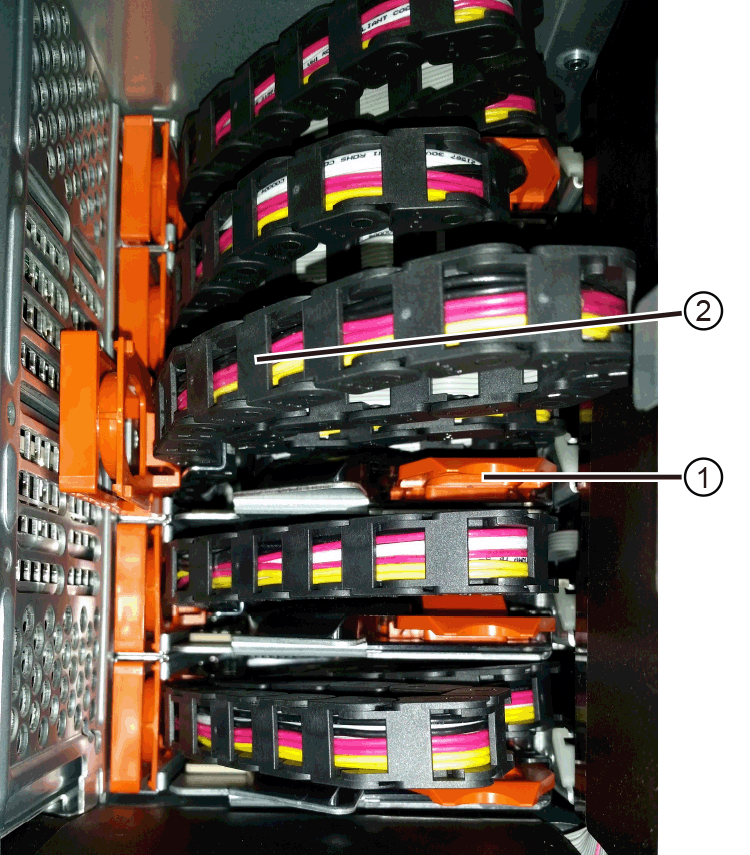

= Sostituire il cassetto del disco in E2800 (shelf da 60 dischi)
:allow-uri-read: 
:experimental: 
:icons: font
:imagesdir: ../media/

[role="lead"]
È possibile sostituire un cassetto dischi in uno shelf di controller E2860 o in uno shelf di dischi DE460C.

.A proposito di questa attività
La procedura per sostituire un cassetto del disco guasto in uno shelf di controller E2860 o in uno shelf di dischi DE460C dipende dalla protezione dei volumi nel cassetto dalla protezione contro la perdita di cassetto. Se tutti i volumi nel cassetto si trovano in pool di dischi o gruppi di volumi con protezione perdita cassetto, è possibile eseguire questa procedura online. In caso contrario, è necessario interrompere tutte le attività di i/o dell'host e spegnere lo shelf prima di sostituire il cassetto dell'unità.

.Prima di iniziare
* Esaminare i requisiti del cassetto del disco in link:drives-overview-supertask-concept.html["Requisiti per la sostituzione del disco E2800"].
* Assicurarsi che lo shelf di dischi soddisfi tutte le seguenti condizioni:
+
** Lo shelf di dischi non può essere troppo freddo.
** Entrambe le ventole devono essere installate e avere uno stato ottimale.
** Tutti i componenti dello shelf dei dischi devono essere in posizione.
** I volumi nel cassetto del disco non possono essere degradati.
+

CAUTION: *Possibile perdita di accesso ai dati* -- se un volume si trova già in uno stato degradato e si rimuovono le unità dal cassetto, il volume potrebbe non funzionare.

* Assicurarsi di disporre di quanto segue:
+
** Un cassetto dell'unità sostitutivo.
** Un braccialetto antistatico o sono state adottate altre precauzioni antistatiche.
** Una torcia.
** Un indicatore permanente per annotare la posizione esatta di ciascuna unità durante la rimozione dell'unità dal cassetto.
** Accesso all'interfaccia a riga di comando (CLI) dello storage array. Se non si dispone dell'accesso alla CLI, è possibile effettuare una delle seguenti operazioni:
+
*** *Per Gestore di sistema SANtricity (versione 11.60 e successive)* -- Scarica il pacchetto CLI (file zip) da Gestore di sistema. Accedere al menu:Impostazioni[sistema > componenti aggiuntivi > interfaccia riga di comando]. È quindi possibile eseguire i comandi CLI da un prompt del sistema operativo, ad esempio il prompt di DOS C:.
*** *Per Gestione storage SANtricity/finestra di gestione aziendale (EMW)* -- seguire le istruzioni nella guida rapida per scaricare e installare il software. È possibile eseguire i comandi CLI da EMW selezionando menu:Tools[Execute script] (Strumenti[Esegui script]).

NOTE: Per informazioni su come sostituire uno shelf di espansione e-Series DE460c, consulta la https://kb.netapp.com/on-prem/E-Series/Hardware-KBs/How_to_replace_an_E_Series_DE460c_controller_expansion_shelf["Knowledge base NetApp"^] .

== Fase 1: Preparazione alla sostituzione del cassetto dell'unità

Determinare se è possibile eseguire la procedura di sostituzione mentre lo shelf del disco è online o se è necessario interrompere l'attività di i/o dell'host e spegnere uno degli shelf accesi.

Se si sostituisce un cassetto in uno shelf con protezione perdita cassetto, non è necessario interrompere l'attività di i/o dell'host e spegnere uno degli shelf.

.Fasi
. Determinare se lo shelf di dischi è acceso.
+
** Se l'alimentazione è spenta, non è necessario eseguire il comando CLI. Passare a. <<Fase 2: Rimuovere le catene di cavi>>.
** Se l'alimentazione è accesa, passare alla fase successiva.

. Accedere alla CLI, quindi immettere il seguente comando:
+
[listing]
----
SMcli <ctlr_IP1\> -p "array_password" -c "set tray [trayID] drawer [drawerID]
serviceAllowedIndicator=on;"
----
+
dove:

+
** `<ctlr_IP1>` è l'identificatore del controller.
**  `array_password` è la password per lo storage array. È necessario racchiudere il valore per `array_password` tra virgolette doppie ("").
** `[trayID]` è l'identificativo dello shelf di dischi che contiene il cassetto che si desidera sostituire. I valori dell'ID dello shelf del disco vanno da 0 a 99. È necessario racchiudere il valore per `trayID` tra parentesi quadre.
** `[drawerID]` è l'identificativo del cassetto dell'unità che si desidera sostituire. I valori dell'ID cassetto sono da 1 (cassetto superiore) a 5 (cassetto inferiore). È necessario racchiudere il valore per `drawerID` tra parentesi quadre.
+
Questo comando consente di rimuovere il cassetto più in alto nello shelf 10:

+
[listing]
----
SMcli <ctlr_IP1\> -p "safety-1" -c "set tray [10] drawer [1]
serviceAllowedIndicator=forceOnWarning;"
----
. Determinare se è necessario interrompere l'attività di i/o dell'host, come segue:
+
** Se il comando ha esito positivo, non è necessario interrompere l'attività di i/o dell'host. Tutti i dischi nel cassetto sono in pool o gruppi di volumi con protezione perdita cassetto. Passare a. <<Fase 2: Rimuovere le catene di cavi>>.
+

CAUTION: *Possibili danni ai dischi* -- attendere 60 secondi dopo il completamento del comando prima di aprire il cassetto del disco. L'attesa di 60 secondi consente lo spin down dei dischi, evitando possibili danni all'hardware.

** Se viene visualizzato un avviso che indica che non è stato possibile completare questo comando, è necessario interrompere l'attività di i/o dell'host prima di rimuovere il cassetto. L'avviso viene visualizzato perché uno o più dischi nel cassetto interessato sono in pool o gruppi di volumi senza protezione perdita cassetto. Per evitare la perdita di dati, è necessario completare i passaggi successivi per interrompere l'attività di i/o dell'host e spegnere lo shelf di dischi e lo shelf di controller.

. Assicurarsi che non si verifichino operazioni di i/o tra lo storage array e tutti gli host connessi. Ad esempio, è possibile eseguire le seguenti operazioni:
+
** Arrestare tutti i processi che coinvolgono le LUN mappate dallo storage agli host.
** Assicurarsi che nessuna applicazione stia scrivendo dati su tutte le LUN mappate dallo storage agli host.
** Smontare tutti i file system associati ai volumi sull'array.
+

NOTE: I passaggi esatti per interrompere le operazioni di i/o dell'host dipendono dal sistema operativo dell'host e dalla configurazione, che esulano dall'ambito di queste istruzioni. Se non si è sicuri di come interrompere le operazioni di i/o host nell'ambiente, è consigliabile arrestare l'host.

. Se l'array di storage partecipa a una relazione di mirroring, interrompere tutte le operazioni di i/o dell'host sull'array di storage secondario.
+

CAUTION: *Possibile perdita di dati* -- se si continua questa procedura mentre si verificano le operazioni di i/o, l'applicazione host potrebbe perdere i dati perché lo storage array non sarà accessibile.

. Attendere che i dati presenti nella memoria cache vengano scritti sui dischi.
+
Il LED verde cache Active (cache attiva) sul retro di ciascun controller è acceso quando i dati memorizzati nella cache devono essere scritti sui dischi. Attendere che il LED si spenga.

+
image::../media/28_dwg_2800_controller_attn_led_maint-e2800.gif[LED cache attiva sul controller E2800]

+
*(1)* _LED cache attiva_

. Dalla home page di Gestione sistema SANtricity, selezionare *Visualizza operazioni in corso*.
. Attendere il completamento di tutte le operazioni prima di passare alla fase successiva.
. Spegnere gli shelf seguendo una delle seguenti procedure:
+
** _Se si sostituisce un cassetto in uno shelf *con* protezione perdita cassetto_: NON è necessario spegnere nessuno degli shelf. È possibile eseguire la procedura di sostituzione mentre il cassetto dell'unità è in linea, poiché il comando Set Drawer Service Action Allowed Indicator CLI è stato completato correttamente.
** _Se stai sostituendo un cassetto in uno shelf *controller* *senza* protezione perdita cassetto_:
+
... Spegnere entrambi gli interruttori di alimentazione sullo shelf del controller.
... Attendere che tutti i LED sullo shelf del controller si oscuri.

** _Se si sostituisce un cassetto in uno shelf di dischi *espansione* *senza* protezione perdita cassetto_:
+
... Spegnere entrambi gli interruttori di alimentazione sullo shelf del controller.
... Attendere che tutti i LED sullo shelf del controller si oscuri.
... Spegnere entrambi gli interruttori di alimentazione sullo shelf di dischi.
... Attendere due minuti per interrompere l'attività del disco.

== Fase 2: Rimuovere le catene di cavi

Rimuovere entrambe le catene per cavi in modo da poter rimuovere e sostituire un cassetto del disco guasto.

.A proposito di questa attività
Ciascun cassetto dispone di catene di cavi destra e sinistra. Le catene per cavi sinistra e destra consentono ai cassetti di scorrere verso l'interno e verso l'esterno.

Le estremità metalliche delle catene per cavi scorrono nelle corrispondenti guide verticali e orizzontali all'interno del contenitore, come indicato di seguito:

* Le guide verticali di destra e di sinistra collegano la catena di cavi alla scheda centrale del contenitore.
* Le guide orizzontali sinistra e destra collegano la catena di cavi al singolo cassetto.

CAUTION: *Possibili danni all'hardware* -- se il vassoio dell'unità è acceso, la catena di cavi viene eccitata fino a quando entrambe le estremità non vengono scollegate. Per evitare di mettere in corto circuito l'apparecchiatura, evitare che il connettore della catena di cavi scollegato tocchi il telaio metallico se l'altra estremità della catena di cavi è ancora collegata.

.Fasi
. Assicurarsi che lo shelf di dischi e lo shelf del controller non abbiano più attività i/o e siano spenti oppure che sia stato emesso il `Set Drawer Attention Indicator` Comando CLI.
. Dalla parte posteriore dello shelf del disco, rimuovere il contenitore della ventola di destra:
+
.. Premere la linguetta arancione per rilasciare la maniglia del filtro a carboni attivi della ventola.
+
La figura mostra la maniglia del filtro a carboni attivi della ventola estesa e rilasciata dalla linguetta arancione a sinistra.

+
image::../media/28_dwg_e2860_de460c_fan_canister_handle_with_callout_maint-e2800.gif[Maniglia del filtro della ventola]

+
*(1)* _maniglia del filtro della ventola_

.. Utilizzando la maniglia, estrarre il contenitore della ventola dal vassoio dell'unità e metterlo da parte.
.. Se il vassoio è acceso, assicurarsi che la ventola sinistra sia alla massima velocità.
+

CAUTION: *Possibili danni all'apparecchiatura dovuti al surriscaldamento* -- se il vassoio è acceso, non rimuovere entrambe le ventole contemporaneamente. In caso contrario, l'apparecchiatura potrebbe surriscaldarsi.

. Determinare la catena di cavi da scollegare:
+
** Se l'alimentazione è accesa, il LED di attenzione di colore ambra sulla parte anteriore del cassetto indica la catena di cavi da scollegare.
** Se l'alimentazione è spenta, è necessario determinare manualmente quale delle cinque catene di cavi scollegare. La figura mostra il lato destro dello shelf del disco con il contenitore della ventola rimosso. Una volta rimosso il contenitore della ventola, è possibile vedere le cinque catene di cavi e i connettori verticali e orizzontali per ciascun cassetto.
+
La catena di cavi superiore è collegata al cassetto dell'unità 1. La catena dei cavi inferiore è collegata al cassetto dell'unità 5. Vengono fornite le didascalie per il cassetto unità 1.

+
image::../media/trafford_cable_rail_1_maint-e2800.gif[Catena portacavi e connettori per il cassetto di azionamento]

+
*(1)* _catena di cavi_

+
*(2)* _connettore verticale (collegato alla scheda intermedia)_

+
*(3)* _connettore orizzontale (collegato al cassetto)_

. Per un facile accesso, spostare la catena di cavi sul lato destro verso sinistra con un dito.
. Scollegare una delle catene di cavi di destra dalla relativa guida verticale.
+
.. Utilizzando una torcia, individuare l'anello arancione all'estremità della catena di cavi collegata alla guida verticale del contenitore.
+
image::../media/trafford_cable_rail_3_maint-e2800.gif[Anello arancione per guida verticale e catena portacavi per cassetto di azionamento]

+
*(1)* _anello arancione su guida verticale_

+
*(2)* _catena di cavi, parzialmente rimossa_

.. Per sganciare la catena di cavi, inserire il dito nell'anello arancione e premere verso il centro del sistema.
.. Per scollegare la catena di cavi, tirare con cautela il dito verso di sé circa 2.5 cm (1 pollice). Lasciare il connettore della catena di cavi all'interno della guida verticale. (Se il vassoio dell'unità è acceso, evitare che il connettore della catena di cavi tocchi il telaio metallico).

. Scollegare l'altra estremità della catena portacavi:
+
.. Utilizzando una torcia, individuare l'anello arancione all'estremità della catena di cavi collegata alla guida orizzontale del contenitore.
+
La figura mostra il connettore orizzontale a destra e la catena dei cavi scollegata e parzialmente estratta sul lato sinistro.

+

+
*(1)* _anello arancione sulla guida orizzontale_

+
*(2)* _catena di cavi, parzialmente rimossa_

.. Per sganciare la catena di cavi, inserire delicatamente il dito nell'anello arancione e premere verso il basso.
+
La figura mostra l'anello arancione sulla guida orizzontale (vedere l'elemento 1 nella figura precedente), in quanto viene spinto verso il basso in modo da poter estrarre il resto della catena di cavi dal contenitore.

.. Tirare il dito verso di sé per scollegare la catena di cavi.

. Estrarre con cautela l'intera catena di cavi dallo shelf del disco.
. Sostituire il filtro a carboni attivi della ventola destra:
+
.. Far scorrere il contenitore della ventola fino in fondo nello scaffale.
.. Spostare la maniglia del filtro a carboni attivi della ventola fino a quando non si blocca con la linguetta arancione.
.. Se lo shelf del disco è alimentato, verificare che il LED di attenzione ambra sul retro della ventola non sia acceso e che l'aria stia uscendo dal retro della ventola.
+
Il LED potrebbe rimanere acceso per un minuto dopo aver reinstallato la ventola, mentre entrambe le ventole si posizionano alla velocità corretta.

+
Se l'alimentazione è spenta, le ventole non funzionano e il LED non è acceso.

. Dal retro dello shelf del disco, rimuovere il contenitore della ventola sinistro.
. Se lo shelf di dischi riceve alimentazione, assicurarsi che la ventola giusta passi alla velocità massima.
+

CAUTION: *Possibili danni all'apparecchiatura dovuti al surriscaldamento* -- se lo shelf è acceso, non rimuovere entrambe le ventole contemporaneamente. In caso contrario, l'apparecchiatura potrebbe surriscaldarsi.

. Scollegare la catena portacavi sinistra dalla relativa guida verticale:
+
.. Utilizzando una torcia, individuare l'anello arancione all'estremità della catena di cavi collegata alla guida verticale.
.. Per sganciare la catena di cavi, inserire il dito nell'anello arancione.
.. Per scollegare la catena di cavi, tirare verso di sé circa 2.5 cm (1 poll.). Lasciare il connettore della catena di cavi all'interno della guida verticale.
+

CAUTION: *Possibili danni all'hardware* -- se il vassoio dell'unità è acceso, la catena di cavi viene eccitata fino a quando entrambe le estremità non vengono scollegate. Per evitare di mettere in corto circuito l'apparecchiatura, evitare che il connettore della catena di cavi scollegato tocchi il telaio metallico se l'altra estremità della catena di cavi è ancora collegata.

. Scollegare la catena di cavi sinistra dalla guida orizzontale ed estrarre l'intera catena di cavi dallo shelf del disco.
+
Se si esegue questa procedura con l'alimentazione accesa, tutti i LED si spengono quando si scollega l'ultimo connettore della catena di cavi, compreso il LED di attenzione di colore ambra.

. Sostituire il filtro a carboni attivi della ventola sinistra. Se lo shelf del disco riceve alimentazione, verificare che il LED ambra sul retro della ventola non sia acceso e che l'aria fuoriuscito dal retro della ventola.
+
Il LED potrebbe rimanere acceso per un minuto dopo aver reinstallato la ventola, mentre entrambe le ventole si posizionano alla velocità corretta.

== Fase 3: Rimuovere il cassetto del disco guasto

Rimuovere un cassetto del disco guasto per sostituirlo con uno nuovo.

CAUTION: *Possibile perdita di accesso ai dati* -- i campi magnetici possono distruggere tutti i dati sul disco e causare danni irreparabili ai circuiti del disco. Per evitare la perdita di accesso ai dati e danni ai dischi, tenere i dischi sempre lontani da dispositivi magnetici.

.Fasi
. Assicurarsi che:
+
** Le catene dei cavi destra e sinistra sono scollegate.
** I contenitori delle ventole lato destro e sinistro vengono sostituiti.

. Rimuovere il pannello frontale dallo shelf del disco.
. Sganciare il cassetto dell'unità estraendo entrambe le leve.
. Utilizzando le leve estese, estrarre con cautela il cassetto dell'unità fino a quando non si arresta. Non rimuovere completamente il cassetto dal ripiano del disco.
. Se i volumi sono già stati creati e assegnati, utilizzare un indicatore permanente per annotare la posizione esatta di ciascun disco. Ad esempio, utilizzando il seguente disegno come riferimento, scrivere il numero di slot appropriato sulla parte superiore di ciascun disco.
+
image::../media/dwg_trafford_drawer_with_hdds_callouts_maint-e2800.gif[Numeri degli slot delle unità]

+

CAUTION: **Possibile perdita di accesso ai dati** -- assicurarsi di registrare la posizione esatta di ciascun disco prima di rimuoverlo.

. Rimuovere le unità dal cassetto:
+
.. Tirare delicatamente indietro il dispositivo di chiusura arancione visibile al centro della parte anteriore di ciascun disco.
.. Sollevare la maniglia dell'unità in verticale.
.. Utilizzare la maniglia per sollevare l'unità dal cassetto dell'unità.
+
image::../media/92_dwg_de6600_install_or_remove_drive_maint-e2800.gif[Utilizzare la maniglia della camma per sollevare l'unità dal cassetto]

.. Posizionare l'unità su una superficie piana, priva di scariche elettrostatiche e lontano da dispositivi magnetici.

. Rimuovere il cassetto dell'unità:
+
.. Individuare la leva di rilascio in plastica su ciascun lato del cassetto dell'unità.
+
image::../media/92_pht_de6600_drive_drawer_release_lever_maint-e2800.gif[Rilasciare la leva per rimuovere il cassetto]

+
*(1)* _leva di rilascio cassetto unità_

.. Sganciare entrambe le leve di rilascio tirando i fermi verso di sé.
.. Tenendo entrambe le leve di rilascio, tirare il cassetto dell'unità verso di sé.
.. Rimuovere il cassetto del disco dallo shelf del disco.

== Fase 4: Installare un nuovo cassetto unità

Installare un nuovo cassetto per sostituire quello guasto.

.Fasi
. Dalla parte anteriore dello shelf del disco, far passare una torcia nello slot vuoto del cassetto e individuare il cilindretto di blocco dello slot.
+
Il gruppo di blocco è una funzione di sicurezza che impedisce l'apertura di più cassetti per disco alla volta.

+
image::../media/92_pht_de6600_lock_out_tumbler_detail_maint-e2800.gif[Serratura e guida del cassetto]

+
*(1)* _Tumbler Lock-out_

+
*(2)* _Guida cassetto_

. Posizionare il cassetto dell'unità sostitutivo davanti allo slot vuoto e leggermente a destra rispetto al centro.
+
Posizionando leggermente il cassetto a destra del centro, si garantisce che il nottolino di blocco e la guida del cassetto siano inseriti correttamente.

. Far scorrere il cassetto dell'unità nello slot e assicurarsi che la guida del cassetto scorra sotto il nottolino di blocco.
+

CAUTION: *Rischio di danni all'apparecchiatura* -- si verifica un danno se la guida del cassetto non scorre sotto l'interruttore a levetta di blocco.

. Spingere con cautela il cassetto dell'unità fino a quando il fermo non si aggancia completamente.
+
Quando si chiude il cassetto per la prima volta, si verifica un livello di resistenza più elevato.

+

CAUTION: *Rischio di danni all'apparecchiatura* -- interrompere la pressione del cassetto dell'unità se si ritiene che sia bloccato. Utilizzare le leve di rilascio nella parte anteriore del cassetto per far scorrere il cassetto all'indietro. Quindi, reinserire il cassetto nello slot, assicurarsi che il cilindretto si trovi sopra la guida e che le guide siano allineate correttamente.

== Fase 5: Collegare le catene di cavi

Collegare le catene per cavi in modo da poter reinstallare in sicurezza le unità nel cassetto.

.A proposito di questa attività
Quando si collega una catena di cavi, invertire l'ordine utilizzato per scollegare la catena di cavi. Inserire il connettore orizzontale della catena nella guida orizzontale del contenitore prima di inserire il connettore verticale della catena nella guida verticale del contenitore.

.Fasi
. Assicurarsi che:
+
** È stato installato un nuovo cassetto unità.
** Sono presenti due catene di cavi sostitutive, contrassegnate come SINISTRA e DESTRA (sul connettore orizzontale accanto al cassetto dell'unità).

. Dalla parte posteriore dello shelf del disco, rimuovere il contenitore della ventola sul lato destro e metterlo da parte.
. Se lo shelf è acceso, assicurarsi che la ventola sinistra sia alla massima velocità.
+

CAUTION: *Possibili danni all'apparecchiatura dovuti al surriscaldamento* -- se lo shelf è acceso, non rimuovere entrambe le ventole contemporaneamente. In caso contrario, l'apparecchiatura potrebbe surriscaldarsi.

. Collegare la catena di cavi corretta:
+
.. Individuare i connettori orizzontali e verticali sulla catena destra e la guida orizzontale e verticale corrispondenti all'interno del contenitore.
.. Allineare entrambi i connettori delle catene di cavi con le guide corrispondenti.
.. Far scorrere il connettore orizzontale della catena di cavi sulla guida orizzontale e spingerlo fino in fondo.
+

CAUTION: *Rischio di malfunzionamento dell'apparecchiatura* -- assicurarsi di far scorrere il connettore nella guida. Se il connettore si trova sulla parte superiore della guida, potrebbero verificarsi problemi quando il sistema è in funzione.

+
La figura mostra le guide orizzontali e verticali per il secondo cassetto del disco nel contenitore.

+
image::../media/2860_dwg_both_guide_rails_maint-e2800.gif[Guide orizzontali e verticali]

+
*(1)* _guida orizzontale_

+
*(2)* _guida verticale_

.. Far scorrere il connettore verticale sulla catena portacavi destra nella guida verticale.
.. Dopo aver ricollegato entrambe le estremità della catena, tirare con cautela la catena per verificare che entrambi i connettori siano bloccati.
+

CAUTION: *Rischio di malfunzionamento dell'apparecchiatura* -- se i connettori non sono bloccati, la catena dei cavi potrebbe allentarsi durante il funzionamento del cassetto.

. Rimontare il filtro a carboni attivi della ventola lato destro. Se lo shelf del disco riceve alimentazione, verificare che il LED ambra sul retro della ventola sia spento e che l'aria stia uscendo dal retro.
+
Il LED potrebbe rimanere acceso per un minuto dopo aver reinstallato la ventola mentre la ventola si trova alla velocità corretta.

. Dalla parte posteriore dello shelf del disco, rimuovere il contenitore della ventola sul lato sinistro dello shelf.
. Se lo shelf è acceso, assicurarsi che la ventola giusta passi alla velocità massima.
+

CAUTION: *Possibili danni all'apparecchiatura dovuti al surriscaldamento* -- se lo shelf è acceso, non rimuovere entrambe le ventole contemporaneamente. In caso contrario, l'apparecchiatura potrebbe surriscaldarsi.

. Ricollegare la catena del cavo sinistro:
+
.. Individuare i connettori orizzontali e verticali sulla catena dei cavi e le relative guide orizzontali e verticali all'interno del contenitore.
.. Allineare entrambi i connettori delle catene di cavi con le guide corrispondenti.
.. Far scorrere il connettore orizzontale della catena nella guida orizzontale e spingerlo fino in fondo.
+

CAUTION: *Rischio di malfunzionamento dell'apparecchiatura* -- assicurarsi di far scorrere il connettore all'interno della guida. Se il connettore si trova sulla parte superiore della guida, potrebbero verificarsi problemi quando il sistema è in funzione.

.. Far scorrere il connettore verticale sulla catena sinistra nella guida verticale.
.. Dopo aver ricollegato entrambe le estremità della catena, tirare con cautela la catena per verificare che entrambi i connettori siano bloccati.
+

CAUTION: *Rischio di malfunzionamento dell'apparecchiatura* -- se i connettori non sono bloccati, la catena dei cavi potrebbe allentarsi durante il funzionamento del cassetto.

. Rimontare il filtro a carboni attivi della ventola lato sinistro. Se lo shelf del disco riceve alimentazione, verificare che il LED ambra sul retro della ventola sia spento e che l'aria stia uscendo dal retro.
+
Il LED potrebbe rimanere acceso per un minuto dopo aver reinstallato la ventola, mentre entrambe le ventole si posizionano alla velocità corretta.

== Fase 6: Sostituzione completa del cassetto dell'unità

Reinserire le unità e riposizionare il pannello anteriore nell'ordine corretto.

CAUTION: *Possibile perdita di accesso ai dati* -- è necessario installare ciascun disco nella posizione originale nel cassetto.

.Fasi
. Assicurarsi che:
+
** Sai dove installare ogni disco.
** Il cassetto dell'unità è stato sostituito.
** I nuovi cavi del cassetto sono stati installati.

. Reinstallare le unità nel cassetto:
+
.. Sbloccare il cassetto dell'unità estraendo entrambe le leve nella parte anteriore del cassetto.
.. Utilizzando le leve estese, estrarre con cautela il cassetto dell'unità fino a quando non si arresta. Non rimuovere completamente il cassetto dal ripiano del disco.
.. Determinare il disco da installare in ogni slot utilizzando le note create durante la rimozione dei dischi.
+
image::../media/dwg_trafford_drawer_with_hdds_callouts_maint-e2800.gif[Numeri degli slot delle unità]

.. Sollevare la maniglia dell'unità in verticale.
.. Allineare i due pulsanti rialzati su ciascun lato dell'unità con le tacche del cassetto.
+
La figura mostra la vista laterale destra di un'unità, che mostra la posizione dei pulsanti sollevati.

+
image::../media/28_dwg_e2860_de460c_drive_cru_maint-e2800.gif[Il pulsante sollevato sul supporto dell'unità deve corrispondere al canale dell'unità sul cassetto dell'unità]

+
*(1)* _pulsante sollevato sul lato destro del disco_

.. Abbassare l'unità, accertandosi che sia premuta fino in fondo nell'alloggiamento, quindi ruotare la maniglia dell'unità verso il basso fino a farla scattare in posizione.
+
image::../media/92_dwg_de6600_install_or_remove_drive_maint-e2800.gif[Utilizzare la maniglia per abbassare l'unità sul cassetto]

.. Ripetere questa procedura per installare tutti i dischi.

. Far scorrere nuovamente il cassetto nello shelf dell'unità spingendolo dal centro e chiudendo entrambe le leve.
+

CAUTION: *Rischio di malfunzionamento dell'apparecchiatura* -- assicurarsi di chiudere completamente il cassetto dell'unità premendo entrambe le leve. Chiudere completamente il cassetto dell'unità per consentire un flusso d'aria adeguato ed evitare il surriscaldamento.

. Fissare il pannello frontale alla parte anteriore dello shelf del disco.
. Se uno o più shelf sono stati spenti, riapplicare l'alimentazione utilizzando una delle seguenti procedure:
+
** _Se è stato sostituito un cassetto dischi in uno shelf *controller* senza protezione perdita cassetto_:
+
... Accendere entrambi gli interruttori di alimentazione sullo shelf del controller.
... Attendere 10 minuti per il completamento del processo di accensione. Verificare che entrambe le ventole si accendano e che il LED ambra sul retro delle ventole sia spento.

** _Se è stato sostituito un cassetto dischi in uno shelf di dischi *espansione* senza protezione perdita cassetto_:
+
... Accendere entrambi gli interruttori di alimentazione sullo shelf di dischi.
... Verificare che entrambe le ventole si accendano e che il LED ambra sul retro delle ventole sia spento.
... Attendere due minuti prima di alimentare lo shelf del controller.
... Accendere entrambi gli interruttori di alimentazione sullo shelf del controller.
... Attendere 10 minuti per il completamento del processo di accensione. Verificare che entrambe le ventole si accendano e che il LED ambra sul retro delle ventole sia spento.

.Quali sono le prossime novità?
La sostituzione del cassetto dell'unità è stata completata. È possibile riprendere le normali operazioni.
