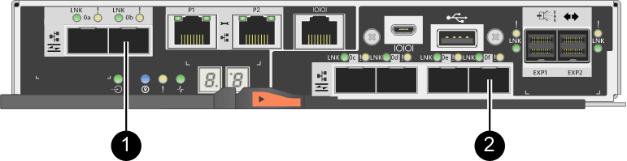

= Requisiti per modificare il protocollo della porta host - E2800
:allow-uri-read: 
:icons: font
:imagesdir: ../media/

[role="lead"]
Prima di convertire il protocollo host per un array E2800, esaminare i requisiti.

== Porte host modificabili

NOTE: Solo le porte HICS FC da 16 GB/iSCSI da 10 GB e le porte di base ottiche su un controller E2800 possono essere convertite.

La figura seguente mostra il retro di un controller E2800 dotato di due porte host SFP+ (ottiche) per scheda base *(1)* e quattro porte HIC SFP+ (ottiche) *(2)*.

image::../media/28_dwg_e2800_optical_base_quad_sfp_hic.gif[Porte host e HIC su un controller E2800"]

NOTE: È disponibile anche un HIC a due porte.

Il controller E2800 o i controller nell'array di storage potrebbero avere diversi tipi di porte host per scheda base e diversi tipi di porte HIC. La tabella mostra quali porte host possono essere modificate con un Feature Pack.

|===
| Se si dispone di queste porte host baseboard... | E hai queste porte HIC... | È possibile modificare... 

 a| 
Due porte SFP+ (ottiche)
 a| 
Nessuno
 a| 
Solo le porte host della scheda base

 a| 
Due porte SFP+ (ottiche)
 a| 
Quattro porte SFP+ (ottiche)
 a| 
Tutte le porte

 a| 
Due porte SFP+ (ottiche)
 a| 
Due porte SFP+ (ottiche)
 a| 
Tutte le porte

 a| 
Due porte SFP+ (ottiche)
 a| 
Due o quattro porte SAS
 a| 
Solo le porte host della scheda base

 a| 
Due porte SFP+ (ottiche)
 a| 
Due porte RJ-45 (base-T)
 a| 
Solo le porte host della scheda base

 a| 
Due porte RJ-45 (base-T)
 a| 
Nessuno
 a| 
Nessuna porta

 a| 
Due porte RJ-45 (base-T)
 a| 
Due porte RJ-45 (base-T)
 a| 
Nessuna porta

|===
Le porte host della scheda base e le porte HIC possono utilizzare lo stesso protocollo host o protocolli host diversi.

== Requisiti per la modifica del protocollo host

* È necessario pianificare una finestra di manutenzione dei tempi di inattività per questa procedura.
* Quando si esegue la conversione, è necessario interrompere le operazioni di i/o dell'host e non sarà possibile accedere ai dati sull'array di storage fino a quando la conversione non sarà stata completata correttamente.
* È necessario utilizzare la gestione out-of-band. Non è possibile utilizzare la gestione in-band per completare questa procedura.
* Hai ottenuto l'hardware necessario per la conversione. Il tuo rappresentante commerciale NetApp può aiutarti a determinare l'hardware di cui hai bisogno e a ordinare le parti corrette.
* Se si tenta di modificare le porte host della scheda base dell'array di storage e attualmente si utilizzano ricetrasmettitori SFP a doppio protocollo (denominati anche _unificati_) acquistati da NetApp, non è necessario cambiare i ricetrasmettitori SFP.
* Assicurarsi che i ricetrasmettitori SFP a doppio protocollo supportino sia FC (a 4 Gbps, 16 Gbps) che iSCSI (a 10 Gbps), ma non supportano iSCSI a 1 Gbps. Vedere link:../maintenance-e2800/hpp-change-host-protocol-task.html["Fase 1: Determinare se si dispone di SFP a doppio protocollo"] Per determinare il tipo di ricetrasmettitori SFP installati.

== Considerazioni per la modifica del protocollo host

Le considerazioni per la modifica del protocollo host dipendono dai protocolli iniziali e finali delle porte host della scheda base e delle porte HIC.

Se si utilizza una funzione di mirroring o la funzione Data Assurance (da), è necessario comprendere cosa accade a queste funzioni quando si modifica il protocollo della porta host come descritto di seguito.

NOTE: Le seguenti considerazioni si applicano solo se si sta convertendo un array di storage già in uso. Queste considerazioni non si applicano se si sta convertendo un nuovo array di storage che non ha ancora host e volumi definiti.

=== Conversione da FC a iSCSI

* Se la configurazione contiene host DI avvio SAN collegati alle porte della scheda base FC, controllare https://mysupport.netapp.com/NOW/products/interoperability["Matrice di interoperabilità NetApp"^] Per garantire che la configurazione sia supportata su iSCSI. In caso contrario, non è possibile convertire il protocollo host in iSCSI.
* La funzione da non è supportata per iSCSI.
+
** Se si utilizza da e si desidera convertire le porte host FC in iSCSI, è necessario disattivare da su tutti i volumi.
** Se non si disattiva da prima della conversione in iSCSI, l'array di storage non sarà conforme dopo la conversione.

* La funzione di mirroring sincrono non è supportata per iSCSI.
+
** Se si utilizzano attualmente relazioni di mirroring sincrono e si desidera convertire le porte host FC in iSCSI, è necessario disattivare il mirroring sincrono.
** Fare riferimento alla guida in linea di Gestore di sistema di SANtricity per rimuovere tutte le coppie di mirroring sincrono, che rimuove le relazioni di mirroring sull'array di storage locale e sull'array di storage remoto. Inoltre, seguire le istruzioni della guida in linea per disattivare Synchronous Mirroring.
+

CAUTION: Se non si disattivano le relazioni di mirroring sincrono prima della conversione in iSCSI, il sistema perde l'accesso ai dati e potrebbe verificarsi una perdita di dati.

* Il mirroring asincrono richiede che sia lo storage array locale che quello remoto utilizzino lo stesso protocollo.
+
** Se si utilizza attualmente il mirroring asincrono e si desidera convertire tutte le porte host da FC a iSCSI, è necessario disattivare il mirroring asincrono prima di applicare il Feature Pack.
** Fare riferimento alla guida in linea di Gestore di sistema di SANtricity per eliminare tutti i gruppi di coerenza dei mirror e rimuovere tutte le coppie mirrorate dagli array di storage locali e remoti. Inoltre, seguire le istruzioni della guida in linea per disattivare il mirroring asincrono.

=== Conversione da iSCSI a FC

* Il mirroring asincrono richiede che sia lo storage array locale che quello remoto utilizzino lo stesso protocollo. Se si utilizza attualmente il mirroring asincrono con le porte della scheda base, è necessario disattivare il mirroring asincrono prima di modificare il protocollo.
* Fare riferimento alla guida in linea di Gestore di sistema di SANtricity per eliminare tutti i gruppi di coerenza dei mirror e rimuovere tutte le coppie mirrorate dagli array di storage locali e remoti. Inoltre, seguire le istruzioni della guida in linea per disattivare il mirroring asincrono.

=== Conversione da FC a FC/iSCSI

Considerazioni sul mirroring:

* Il mirroring sincrono non è supportato per iSCSI.
* Se un array di storage utilizzato per il mirroring dispone attualmente solo di porte FC e si desidera convertirne alcune in iSCSI, è necessario determinare quali porte utilizzare per il mirroring.
* Non è necessario convertire le porte dell'array di storage locale e dell'array di storage remoto nello stesso protocollo, purché entrambi gli array di storage dispongano di almeno una porta FC attiva dopo la conversione.
* Se si prevede di convertire le porte utilizzate per le relazioni mirrorate, è necessario disattivare qualsiasi relazione mirror sincrona o asincrona prima di applicare il Feature Pack.
* Se si prevede di convertire le porte utilizzate per il mirroring, le operazioni di mirroring asincrono non verranno influenzate.
* Prima di applicare il Feature Pack, verificare che tutti i gruppi di coerenza mirror siano sincronizzati. Dopo aver applicato il Feature Pack, è necessario verificare la comunicazione tra lo storage array locale e lo storage array remoto.

Considerazioni su Data Assurance:

* La funzione Data Assurance (da) non è supportata per iSCSI.
+
Per garantire che l'accesso ai dati rimanga ininterrotto, potrebbe essere necessario rimappare o rimuovere i volumi da dai cluster host prima di applicare il Feature Pack.

+

NOTE: La funzione Data Assurance per iSCSI è supportata su SANtricity versione 11.40 e successive.

+
|===
| Se hai... | Devi... 

 a| 
Volumi DA nel cluster predefinito
 a| 
Rimappare tutti i volumi da nel cluster predefinito.

** Se non si desidera condividere volumi da tra host, attenersi alla seguente procedura:
+
... Creare una partizione host per ciascun set di porte host FC (a meno che non sia già stato fatto).
... Rimappare i volumi da alle porte host appropriate.

** Se si desidera condividere volumi da tra host, attenersi alla seguente procedura:
+
... Creare una partizione host per ciascun set di porte host FC (a meno che non sia già stato fatto).
... Creare un cluster host che includa le porte host appropriate.
... Rimappare i volumi da nel nuovo cluster host.
+

NOTE: Questo approccio elimina l'accesso ai volumi che rimangono nel cluster predefinito.

 a| 
Volumi DA in un cluster host che contiene host solo FC e si desidera aggiungere host solo iSCSI
 a| 
Rimuovere tutti i volumi da appartenenti al cluster, utilizzando una di queste opzioni.

NOTE: I volumi DA non possono essere condivisi in questo scenario.

** Se non si desidera condividere volumi da tra host, rimappare tutti i volumi da a singoli host FC all'interno del cluster.
** Separare gli host solo iSCSI nel proprio cluster host e mantenere il cluster host FC così com'è (con volumi da condivisi).
** Aggiungere un HBA FC agli host solo iSCSI per consentire la condivisione di volumi da e non da.

 a| 
Volumi DA in un cluster host che contiene host solo FC o volumi da mappati a una singola partizione host FC
 a| 
Prima di applicare il Feature Pack, non è necessaria alcuna azione. I volumi DA rimarranno mappati al rispettivo host FC.

 a| 
Nessuna partizione definita
 a| 
Non è necessaria alcuna azione prima di applicare il Feature Pack, in quanto non sono attualmente mappati volumi. Dopo aver convertito il protocollo host, seguire la procedura appropriata per creare partizioni host e, se si desidera, cluster host.

|===

=== Conversione da iSCSI a FC/iSCSI

* Se si intende convertire una porta utilizzata per il mirroring, è necessario spostare le relazioni di mirroring in una porta che rimarrà iSCSI dopo la conversione.
+
In caso contrario, il collegamento di comunicazione potrebbe essere inattivo dopo la conversione a causa di una mancata corrispondenza del protocollo tra la nuova porta FC sull'array locale e la porta iSCSI esistente sull'array remoto.

* Se si prevede di convertire le porte non utilizzate per il mirroring, le operazioni di mirroring asincrono non verranno influenzate.
+
Prima di applicare il Feature Pack, verificare che tutti i gruppi di coerenza mirror siano sincronizzati. Dopo aver applicato il Feature Pack, è necessario verificare la comunicazione tra lo storage array locale e lo storage array remoto.

=== Conversione da FC/iSCSI a FC

* Quando si convertono tutte le porte host in FC, tenere presente che il mirroring asincrono su FC deve avvenire sulla porta FC con il numero più alto.
* Se si prevede di convertire le porte utilizzate per le relazioni mirrorate, è necessario disattivare queste relazioni prima di applicare il Feature Pack.
+

CAUTION: *Possibile perdita di dati* -- se non si eliminano le relazioni di mirroring asincrono che si sono verificate su iSCSI prima di convertire le porte in FC, i controller potrebbero bloccarsi e si potrebbero perdere i dati.

* Se lo storage array dispone attualmente di porte per scheda base iSCSI e porte FC HIC, le operazioni di mirroring asincrono non verranno influenzate.
+
Prima e dopo la conversione, il mirroring viene eseguito sulla porta FC con il numero più alto, che rimane la porta HIC contrassegnata con *2* nella figura. Prima di applicare il Feature Pack, verificare che tutti i gruppi di coerenza mirror siano sincronizzati. Dopo aver applicato il Feature Pack, è necessario verificare la comunicazione tra lo storage array locale e lo storage array remoto.

* Se lo storage array dispone attualmente di porte FC per scheda base e porte iSCSI HIC, è necessario eliminare le relazioni di mirroring che si verificano su FC prima di applicare il Feature Pack.
+
Quando si applica il Feature Pack, il supporto del mirroring passa dalla porta host della scheda base con il numero più alto (contrassegnata con *1* nella figura) alla porta HIC con il numero più alto (contrassegnata con *2* nella figura).

+

+
|===
3+| Prima della conversione 3+| Dopo la conversione .2+| Passaggi richiesti 

| Porte baseboard | Porte HIC | Porta utilizzata per il mirroring | Porte baseboard | Porte HIC | Porta utilizzata per il mirroring 

 a| 
ISCSI
 a| 
FC
 a| 
*(2)*
 a| 
FC
 a| 
FC
 a| 
*(2)*
 a| 
Sincronizzare i gruppi di coerenza mirror prima e testare le comunicazioni dopo

 a| 
FC
 a| 
ISCSI
 a| 
*(1)*
 a| 
FC
 a| 
FC
 a| 
*(2)*
 a| 
Eliminare le relazioni di mirroring prima e ristabilire il mirroring dopo

|===

=== Conversione da FC/iSCSI a iSCSI

* Il mirroring sincrono non è supportato per iSCSI.
* Se si intende convertire le porte utilizzate per le relazioni mirrorate, è necessario disattivare le relazioni di mirroring prima di applicare il Feature Pack.
+

CAUTION: *Possibile perdita di dati* -- se non si eliminano le relazioni di mirroring che si sono verificate su FC prima di convertire le porte in iSCSI, i controller potrebbero bloccarsi e si potrebbero perdere i dati.

* Se non si prevede di convertire le porte utilizzate per il mirroring, le operazioni di mirroring non verranno influenzate.
* Prima di applicare il Feature Pack, verificare che tutti i gruppi di coerenza mirror siano sincronizzati.
* Dopo aver applicato il Feature Pack, è necessario verificare la comunicazione tra lo storage array locale e lo storage array remoto.

=== Stesso protocollo host e operazioni di mirroring

Le operazioni di mirroring non vengono influenzate se le porte host utilizzate per il mirroring mantengono lo stesso protocollo dopo l'applicazione del Feature Pack. Tuttavia, prima di applicare il Feature Pack, è necessario verificare che tutti i gruppi di coerenza mirror siano sincronizzati.

Dopo aver applicato il Feature Pack, è necessario verificare la comunicazione tra lo storage array locale e lo storage array remoto. In caso di domande su come eseguire questa operazione, consultare la guida in linea di Gestore di sistema di SANtricity.
