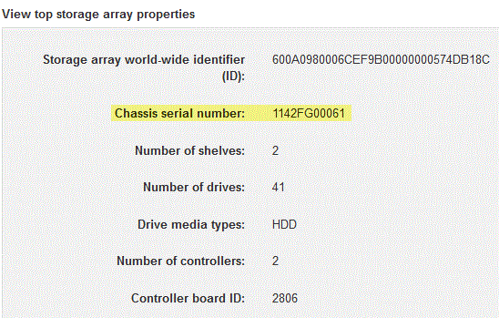

= Modificare il protocollo host E5700
:allow-uri-read: 
:experimental: 
:icons: font
:imagesdir: ../media/

[role="lead"]
Per un array di storage E5700, è possibile convertire le porte host della scheda base come segue:

* Da Fibre Channel (FC) a iSCSI
* Da iSCSI a FC
* Da IB a InfiniBand
* Da SRP a IB
* Da NVMe a IB
* Da NVMe a RoCE

== Fase 1: Determinare se si dispone di SFP a doppio protocollo

Utilizzare Gestore di sistema SANtricity per determinare il tipo di ricetrasmettitori SFP in uso. Poiché questi SFP possono essere utilizzati con protocolli FC e iSCSI, vengono definiti come _dual-Protocol_ o _Unified_ SFP.

Se gli SFP attuali supportano velocità di trasferimento dati di 16 Gbps e 10 Gbps, è possibile continuare a utilizzarli dopo la conversione del protocollo della porta host.

.Fasi
. Da Gestore di sistema di SANtricity, selezionare *supporto*.
. Selezionare il riquadro *Support Center*.
. Nella scheda Support Resources (risorse di supporto), individuare e selezionare il collegamento *Storage Array Profile* (Profilo array di storage).
. Digitare *SFP* nella casella di testo e fare clic su *Find* (trova).
. Per ogni SFP elencato nel profilo dell'array di storage, individuare la voce *velocità dati supportata*.
+
image::../media/sam1130_ss_e2800_unified_spf_maint-e5700.gif[sam1130 ss e2800 unified spf maintent e5700]

. Fare riferimento alla tabella per determinare se è possibile riutilizzare gli SFP, come indicato di seguito:
+
|===
| Velocità di trasferimento dati supportata | Tipo di SFP | Protocollo supportato 

 a| 
16 Gbps, 10 Gbps, 4 Gbps
 a| 
Protocollo doppio
 a| 
** *FC:* 16 Gbps, 4 Gbps
** **ISCSI:**10 Gbps

 a| 
10 Gbps
 a| 
10 Gbps
 a| 
Solo iSCSI

 a| 
16 Gbps, 8 Gbps, 4 Gbps
 a| 
16 Gbps
 a| 
Solo FC

|===
+
** Se si dispone di SFP a doppio protocollo, è possibile continuare a utilizzarli dopo aver convertito il protocollo.
+

NOTE: Gli SFP a doppio protocollo non supportano iSCSI da 1 GB. Se si stanno convertendo le porte host in iSCSI, tenere presente che gli SFP a doppio protocollo supportano solo un collegamento da 10 GB alla porta connessa.

** Se si utilizzano SFP a 16 Gbps e si stanno convertendo le porte host in iSCSI, è necessario rimuovere gli SFP e sostituirli con SFP a doppio protocollo o a 10 Gbps dopo la conversione del protocollo. In base alle esigenze, è anche possibile utilizzare il rame iSCSI a 10 Gbps utilizzando uno speciale cavo Twin-Ax con SFP.
+

NOTE: Gli SFP FC a 8 Gbps NON sono supportati nei controller E28xx o E57xx. Sono supportati SOLO SFP FC a 16 Gbps e 32 Gbps.

** Se si utilizzano SFP a 10 Gbps e si stanno convertendo le porte host in FC, è necessario rimuovere gli SFP da queste porte e sostituirli con SFP a doppio protocollo o a 16 Gbps dopo aver convertito il protocollo.

== Fase 2: Ottenere il Feature Pack

Per ottenere il Feature Pack, è necessario il numero di serie dallo shelf del controller, un codice di attivazione delle funzioni e l'identificatore di abilitazione delle funzioni per lo storage array.

.Fasi
. Individuare il numero di serie.
+
.. Da Gestore di sistema di SANtricity, selezionare menu:supporto[Centro di supporto].
.. Con la scheda *Support Resources* (risorse di supporto) selezionata, scorrere fino alla sezione *View top storage array properties* (Visualizza proprietà principali storage array).
.. Individuare *chassis Serial Number* (numero di serie chassis) e copiare questo valore in un file di testo.
+

. Individuare l'ID del sottomodello *Feature Pack*.
+
.. In Gestione sistema di SANtricity, selezionare *supporto*.
.. Selezionare il riquadro *Support Center*.
.. Nella scheda Support Resources (risorse di supporto), individuare e selezionare il collegamento *Storage Array Profile* (Profilo array di storage).
.. Digitare *Feature Pack submodel ID* nella casella di testo e fare clic su *Find* (trova).
+

NOTE: Il "modello secondario" può anche essere scritto come "modello secondario".

.. Individuare l'ID del sottomodello del Feature Pack per la configurazione iniziale.
+
image::../media/storage_array_profile2_maint-e5700.gif[profilo array storage 2 mainte5700]

. Utilizzando l'ID del sottomodello del Feature Pack, individuare l'ID del sottomodello del controller corrispondente per la configurazione iniziale e individuare il codice di attivazione della funzione per la configurazione finale desiderata all'interno della tabella riportata di seguito. Quindi, copiare il codice di attivazione della funzione in un file di testo.
+

NOTE: Le porte della scheda base sono disattivate quando si esegue un protocollo NVMe sull'HIC.

+

NOTE: Se non si utilizza IB HIC, è possibile ignorare la colonna _HIC Ports_ nelle seguenti tabelle:

+
|===
5+| Codici di attivazione delle funzioni compatibili con la crittografia (conversioni solo porta baseboard) 

2+| Avvio della configurazione 3+| Fine della configurazione 

| ID del sottomodello del controller | Porte da convertire | ID del sottomodello del controller | Porte convertite in | Codice di attivazione della funzione 

 a| 
360
 a| 
Porte per scheda base FC
 a| 
362
 a| 
Porte per scheda base iSCSI
 a| 
SGL-2SB-ZEX13

 a| 
362
 a| 
Porte per scheda base iSCSI
 a| 
360
 a| 
Porte per scheda base FC
 a| 
5GI-4 TB-ZW3HL

|===
+
|===
7+| Codici di attivazione delle funzioni compatibili con la crittografia 

3+| Avvio della configurazione 4+| Fine della configurazione 

| ID del sottomodello del controller | Porte della scheda base | Porte HIC | ID del sottomodello del controller | Porte della scheda base | Porte HIC | Codice di attivazione della funzione 

 a| 
360
 a| 
FC
 a| 
Er
 a| 
361
 a| 
FC
 a| 
SRP
 a| 
UTG-XSB-ZCZKU

 a| 
362
 a| 
ISCSI
 a| 
Er
 a| 
SGL-2SB-ZEX13

 a| 
363
 a| 
ISCSI
 a| 
SRP
 a| 
VGN-LTB-ZGFCT

 a| 
382
 a| 
Non disponibile
 a| 
NVMe/IB
 a| 
KGI-ISB-ZDHQF

 a| 
403
 a| 
Non disponibile
 a| 
NVMe/RoCE o NVMe/FC
 a| 
YGH-BHK-Z8EKB

 a| 
361
 a| 
FC
 a| 
SRP
 a| 
360
 a| 
FC
 a| 
Er
 a| 
JGS-0TB-ZID1V

 a| 
362
 a| 
ISCSI
 a| 
Er
 a| 
UGX-RTB-ZLBPV

 a| 
363
 a| 
ISCSI
 a| 
SRP
 a| 
2G1-BTB-ZMRYN

 a| 
382
 a| 
Non disponibile
 a| 
NVMe/IB
 a| 
TGV-8TB-ZKTH6

 a| 
403
 a| 
Non disponibile
 a| 
NVMe/RoCE o NVMe/FC
 a| 
JGM-EIK-ZAC6Q

 a| 
362
 a| 
ISCSI
 a| 
Er
 a| 
360
 a| 
FC
 a| 
Er
 a| 
5GI-4 TB-ZW3HL

 a| 
361
 a| 
FC
 a| 
SRP
 a| 
EGL-NTB-ZXKQ4

 a| 
363
 a| 
ISCSI
 a| 
SRP
 a| 
HGP-QUB-Z1ICJ

 a| 
383
 a| 
Non disponibile
 a| 
NVMe/IB
 a| 
BGS-AUB-Z2YNG

 a| 
403
 a| 
Non disponibile
 a| 
NVMe/RoCE o NVMe/FC
 a| 
1 GW-LIK-ZG9HN

 a| 
363
 a| 
ISCSI
 a| 
SRP
 a| 
360
 a| 
FC
 a| 
Er
 a| 
SGU-VASCA-Z3G2U

 a| 
361
 a| 
FC
 a| 
SRP
 a| 
FGX-DUB-Z5WF7

 a| 
362
 a| 
ISCSI
 a| 
SRP
 a| 
LG3-GUB-Z7V17

 a| 
383
 a| 
Non disponibile
 a| 
NVMe/IB
 a| 
NG5-ZUB-Z8C8J

 a| 
403
 a| 
Non disponibile
 a| 
NVMe/RoCE o NVMe/FC
 a| 
WG2-0IK-ZI75U

 a| 
382
 a| 
Non disponibile
 a| 
NVMe/IB
 a| 
360
 a| 
FC
 a| 
Er
 a| 
QG6-ETB-ZPPPT

 a| 
361
 a| 
FC
 a| 
SRP
 a| 
XG8-XTB-ZQ7XS

 a| 
362
 a| 
ISCSI
 a| 
Er
 a| 
SGB-HTB-ZS0AH

 a| 
363
 a| 
ISCSI
 a| 
SRP
 a| 
TGD-1TB-ZT5TL

 a| 
403
 a| 
Non disponibile
 a| 
NVMe/RoCE o NVMe/FC
 a| 
IGR-IIK-ZDBRB

 a| 
383
 a| 
Non disponibile
 a| 
NVMe/IB
 a| 
360
 a| 
FC
 a| 
Er
 a| 
LG8-JUB-ZATLD

 a| 
361
 a| 
FC
 a| 
SRP
 a| 
LGA-3UB-ZBAX1

 a| 
362
 a| 
ISCSI
 a| 
Er
 a| 
NGF-7UB-ZE8KX

 a| 
363
 a| 
ISCSI
 a| 
SRP
 a| 
3GI-QUB-ZFP1Y

 a| 
403
 a| 
Non disponibile
 a| 
NVMe/RoCE o NVMe/FC
 a| 
5G7-RIK-ZL5PE

 a| 
403
 a| 
Non disponibile
 a| 
NVMe/RoCE o NVMe/FC
 a| 
360
 a| 
FC
 a| 
Er
 a| 
BGC-UIK-Z03GR

 a| 
361
 a| 
FC
 a| 
SRP
 a| 
LGF-EIK-ZPJRX

 a| 
362
 a| 
ISCSI
 a| 
Er
 a| 
PGJ-HIK-ZSIDZ

 a| 
363
 a| 
ISCSI
 a| 
SRP
 a| 
1GM-1JK-ZTYQX

 a| 
382
 a| 
Non disponibile
 a| 
NVMe/IB
 a| 
JGH-XIK-ZQ142

|===
+
|===
5+| Codici di attivazione delle funzioni non di crittografia (conversioni solo porta baseboard) 

2+| Avvio della configurazione 3+| Fine della configurazione 

| ID del sottomodello del controller | Porte da convertire | ID del sottomodello del controller | Porte convertite in | Codice di attivazione della funzione 

 a| 
365
 a| 
Porte per scheda base FC
 a| 
367
 a| 
Porte per scheda base iSCSI
 a| 
BGU-GVB-ZM3KW

 a| 
367
 a| 
Porte per scheda base iSCSI
 a| 
366
 a| 
Porte per scheda base FC
 a| 
9GU-2WB-Z503D

|===
+
|===
7+| Codici di attivazione delle funzioni non di crittografia 

3+| Avvio della configurazione 4+| Fine della configurazione 

| ID del sottomodello del controller | Porte baseboard | Porte HIC | ID del sottomodello del controller | Porte baseboard | Porte HIC | Codice di attivazione della funzione 

 a| 
365
 a| 
FC
 a| 
Er
 a| 
366
 a| 
FC
 a| 
SRP
 a| 
BGP-DVB-ZJ4YC

 a| 
367
 a| 
ISCSI
 a| 
Er
 a| 
BGU-GVB-ZM3KW

 a| 
368
 a| 
ISCSI
 a| 
SRP
 a| 
4GX-ZVB-ZNJVD

 a| 
384
 a| 
Non disponibile
 a| 
NVMe/IB
 a| 
TGS-WVB-ZKL9T

 a| 
405
 a| 
Non disponibile
 a| 
NVMe/RoCE o NVMe/FC
 a| 
WGC-GJK-Z7PU2

 a| 
366
 a| 
FC
 a| 
SRP
 a| 
365
 a| 
FC
 a| 
Er
 a| 
WG2-3VB-ZQHLF

 a| 
367
 a| 
ISCSI
 a| 
Er
 a| 
QG7-6VB-ZSF8M

 a| 
368
 a| 
ISCSI
 a| 
SRP
 a| 
PGA-PVB-ZUWMX

 a| 
384
 a| 
Non disponibile
 a| 
NVMe/IB
 a| 
CG5-MVB-ZRYW1

 a| 
405
 a| 
Non disponibile
 a| 
NVMe/RoCE o NVMe/FC
 a| 
3GH-JJK-ZANJQ

 a| 
367
 a| 
ISCSI
 a| 
Er
 a| 
365
 a| 
FC
 a| 
Er
 a| 
PGR-IWB-Z48PC

 a| 
366
 a| 
FC
 a| 
SRP
 a| 
9GU-2WB-Z503D

 a| 
368
 a| 
ISCSI
 a| 
SRP
 a| 
SGJ-IWB-ZJFE4

 a| 
385
 a| 
Non disponibile
 a| 
NVMe/IB
 a| 
UGM-2XB-ZKV0B

 a| 
405
 a| 
Non disponibile
 a| 
NVMe/RoCE o NVMe/FC
 a| 
8GR-QKK-ZFJTP

 a| 
368
 a| 
ISCSI
 a| 
SRP
 a| 
365
 a| 
FC
 a| 
Er
 a| 
YG0-LXB-ZLD26

 a| 
366
 a| 
FC
 a| 
SRP
 a| 
SGR-5XB-ZNTFB

 a| 
367
 a| 
ISCSI
 a| 
SRP
 a| 
PGZ-5WB-Z8M0N

 a| 
385
 a| 
Non disponibile
 a| 
NVMe/IB
 a| 
KG2-0WB-Z9477

 a| 
405
 a| 
Non disponibile
 a| 
NVMe/RoCE o NVMe/FC
 a| 
2GV-TKK-ZIHI6

 a| 
384
 a| 
Non disponibile
 a| 
NVMe/IB
 a| 
365
 a| 
FC
 a| 
Er
 a| 
SGF-SVB-ZWU9M

 a| 
366
 a| 
FC
 a| 
SRP
 a| 
7GH-CVB-ZYBGV

 a| 
367
 a| 
ISCSI
 a| 
Er
 a| 
6GK-VVB-ZSRN

 a| 
368
 a| 
ISCSI
 a| 
SRP
 a| 
RGM-FWB-Z195H

 a| 
405
 a| 
Non disponibile
 a| 
NVMe/RoCE o NVMe/FC
 a| 
VGM-NKK-ZDLDK

 a| 
385
 a| 
Non disponibile
 a| 
NVMe/IB
 a| 
365
 a| 
FC
 a| 
Er
 a| 
GG5-8WB-ZBKEM

 a| 
366
 a| 
FC
 a| 
SRP
 a| 
KG7-RWB-ZC2RZ

 a| 
367
 a| 
ISCSI
 a| 
Er
 a| 
NGC-VWB-ZFZEN

 a| 
368
 a| 
ISCSI
 a| 
SRP
 a| 
4GE-FWB-ZGGQJ

 a| 
405
 a| 
Non disponibile
 a| 
NVMe/RoCE o NVMe/FC
 a| 
NG1-WKK-ZLFAI

 a| 
405
 a| 
Non disponibile
 a| 
NVMe/RoCE o NVMe/FC
 a| 
365
 a| 
FC
 a| 
Er
 a| 
MG6-ZKK-ZNDVC

 a| 
366
 a| 
FC
 a| 
SRP
 a| 
WG9-JKK-ZPUAR

 a| 
367
 a| 
ISCSI
 a| 
Er
 a| 
NGE-MKK-ZRSW9

 a| 
368
 a| 
ISCSI
 a| 
SRP
 a| 
TGG-6KK-ZT9BU

 a| 
384
 a| 
Non disponibile
 a| 
NVMe/IB
 a| 
AGB-3KK-ZQBLR

|===
+

NOTE: Se l'ID del sottomodello del controller non è presente nell'elenco, contattare http://mysupport.netapp.com["Supporto NetApp"^].

. In System Manager, individuare Feature Enable Identifier.
+
.. Accedere al menu:Impostazioni[sistema].
.. Scorrere verso il basso fino a *componenti aggiuntivi*.
.. In *Change Feature Pack*, individuare *Feature Enable Identifier*.
.. Copiare e incollare questo numero di 32 cifre in un file di testo.
+
image::../media/sam1130_ss_e2800_change_feature_pack_feature_enable_identifier_copy_maint-e5700.gif[sam1130 ss e2800 change feature pack enable identifier copy maintain e5700]

. Passare a. http://partnerspfk.netapp.com["Attivazione della licenza NetApp: Attivazione della funzionalità Premium dello storage Array"^]e immettere le informazioni necessarie per ottenere il feature pack.
+
** Numero di serie dello chassis
** Codice di attivazione della funzione
** Identificatore di abilitazione della funzione
+

NOTE: Il sito Web di attivazione delle funzionalità Premium include un collegamento a "`istruzioni di attivazione delle funzioni Premium`". Non tentare di seguire queste istruzioni per questa procedura.

. Scegliere se ricevere il file delle chiavi per il Feature Pack in un'e-mail o scaricarlo direttamente dal sito.

== Fase 3: Arrestare l'i/o host

Interrompere tutte le operazioni di i/o dall'host prima di convertire il protocollo delle porte host. Non è possibile accedere ai dati sull'array di storage fino a quando la conversione non viene completata correttamente.

Questa attività si applica solo se si sta convertendo un array di storage già in uso.

.Fasi
. Assicurarsi che non si verifichino operazioni di i/o tra lo storage array e tutti gli host connessi. Ad esempio, è possibile eseguire le seguenti operazioni:
+
** Arrestare tutti i processi che coinvolgono le LUN mappate dallo storage agli host.
** Assicurarsi che nessuna applicazione stia scrivendo dati su tutte le LUN mappate dallo storage agli host.
** Smontare tutti i file system associati ai volumi sull'array.
+

NOTE: I passaggi esatti per interrompere le operazioni di i/o dell'host dipendono dal sistema operativo dell'host e dalla configurazione, che esulano dall'ambito di queste istruzioni. Se non si è sicuri di come interrompere le operazioni di i/o host nell'ambiente, è consigliabile arrestare l'host.

+

CAUTION: *Possibile perdita di dati* -- se si continua questa procedura mentre si verificano le operazioni di i/o, l'applicazione host potrebbe perdere i dati perché lo storage array non sarà accessibile.

. Se l'array di storage partecipa a una relazione di mirroring, interrompere tutte le operazioni di i/o dell'host sull'array di storage secondario.
. Attendere che i dati presenti nella memoria cache vengano scritti sui dischi.
+
Il LED verde cache Active (cache attiva) *(1)* sul retro di ciascun controller è acceso quando i dati memorizzati nella cache devono essere scritti sui dischi. Attendere che il LED si spenga.image:../media/e5700_ib_hic_w_cache_led_callouts_maint-e5700.gif[""]

. Dalla home page di Gestione sistema SANtricity, selezionare *Visualizza operazioni in corso*.
. Attendere il completamento di tutte le operazioni prima di passare alla fase successiva.

== Fase 4: Modificare il Feature Pack

Modificare il Feature Pack per convertire il protocollo host delle porte host della scheda base, delle porte IB HIC o di entrambi i tipi di porte.

.Fasi
. Da Gestore di sistema di SANtricity, selezionare menu:Impostazioni[sistema].
. In *componenti aggiuntivi*, selezionare *Cambia Feature Pack*.
+
image::../media/sam1130_ss_system_change_feature_pack_maint-e5700.gif[sam1130 ss system change feature pack maintain e5700]

. Fare clic su *Sfoglia*, quindi selezionare il Feature Pack che si desidera applicare.
. Digitare *CHANGE* nel campo.
. Fare clic su *Cambia*.
+
Viene avviata la migrazione dei Feature Pack. Entrambi i controller si riavviano automaticamente due volte per rendere effettivo il nuovo Feature Pack. Una volta completato il riavvio, lo storage array torna allo stato di risposta.

. Verificare che le porte host dispongano del protocollo previsto.
+
.. Da Gestione sistema di SANtricity, selezionare *hardware*.
.. Fare clic su *Mostra retro dello shelf*.
.. Selezionare l'immagine per Controller A o Controller B.
.. Selezionare *Visualizza impostazioni* dal menu di scelta rapida.
.. Selezionare la scheda *interfacce host*.
.. Fare clic su *Mostra altre impostazioni*.
.. Esaminare i dettagli mostrati per le porte della scheda base e le porte HIC (etichettate "`slotto 1`") e verificare che ciascun tipo di porta disponga del protocollo previsto.

.Quali sono le prossime novità?
Passare a. link:hpp-complete-protocol-conversion-task.html["Completa la conversione del protocollo host"].
