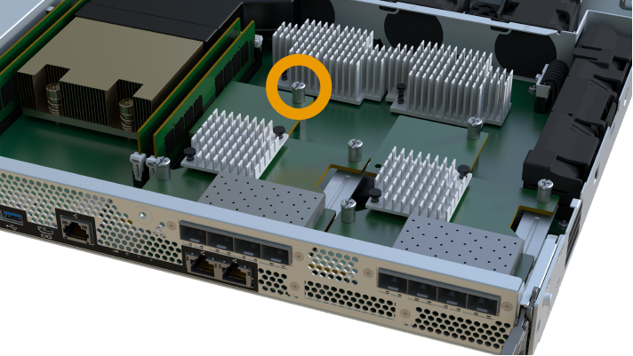
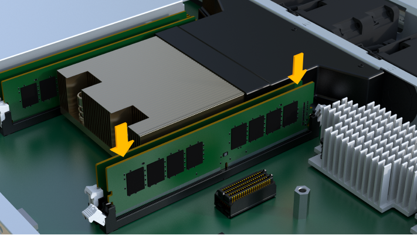

= Sostituire la centralina - EF300 e EF600
:allow-uri-read: 
:experimental: 
:icons: font
:imagesdir: ../media/

[role="lead"]
Puoi sostituire un controller singolo in uno shelf di controller EF300, EF600, EF300C o EF600C.

.A proposito di questa attività
Quando si sostituisce un contenitore del controller guasto, è necessario rimuovere la batteria, l'alimentatore, i moduli DIMM, le ventole e la scheda di interfaccia host (HIC) dal contenitore del controller originale, quindi installarli nel contenitore del controller sostitutivo.

.Prima di iniziare
* Revisione link:controllers-overview-supertask-concept.html["Requisiti per la sostituzione del controller EF300 o EF600"].
* Determinare se il contenitore del controller è guasto in due modi:
+
** Il guru del ripristino in Gestione di sistema di SANtricity richiede la sostituzione del contenitore del controller.
** Il LED di attenzione ambra sul contenitore del controller è acceso, a indicare che il controller è guasto.
+
[]
====

NOTE: Il LED di attenzione color ambra del controller si spegne ogni volta che si verificano le seguenti condizioni di sostituzione:

*** Errore alimentatore Alt
*** Percorso unità Alt non riuscito
*** Cassetto aperto/mancante
*** Ventola guasta/mancante
*** Alimentatore mancante

====

* Assicurarsi di disporre di quanto segue:
+
** Un contenitore del controller sostitutivo con lo stesso numero di parte del contenitore del controller che si sta sostituendo.
** Un braccialetto antistatico o sono state adottate altre precauzioni antistatiche.
** Un'area di lavoro piana e priva di elettricità statica.
** Un cacciavite Phillips n. 1
** Etichette per identificare ciascun cavo collegato al contenitore del controller.
** Stazione di gestione con un browser che può accedere a Gestione di sistema SANtricity per il controller. Per aprire l'interfaccia di System Manager, puntare il browser sul nome di dominio o sull'indirizzo IP del controller.

== Fase 1: Preparazione alla sostituzione del controller

Preparare la sostituzione di un contenitore del controller guasto verificando che il contenitore del controller sostitutivo disponga del codice FRU corretto, eseguendo il backup della configurazione e raccogliendo i dati di supporto.

.Fasi
. Disimballare il nuovo contenitore del controller e riutilizzarlo su una superficie piana e priva di elettricità statica.
+
Conservare il materiale di imballaggio da utilizzare per la spedizione del contenitore del controller guasto.

. Individuare le etichette dell'indirizzo MAC e del numero di parte della FRU sul retro del contenitore del controller.
. Da Gestore di sistema di SANtricity, individuare il numero di parte di ricambio del contenitore del controller che si sta sostituendo.
+
Quando un controller presenta un guasto e deve essere sostituito, il codice del ricambio viene visualizzato nell'area Details (Dettagli) del Recovery Guru. Se è necessario trovare questo numero manualmente, attenersi alla seguente procedura:

+
.. Selezionare *hardware*.
.. Individuare lo shelf del controller, contrassegnato dall'icona del controller image:../media/sam1130_ss_hardware_controller_icon_maint-ef600.gif[""].
.. Fare clic sull'icona del controller.
.. Selezionare il controller e fare clic su *Avanti*.
.. Nella scheda *base*, annotare il *numero di parte di ricambio* del controller.

. Verificare che il numero di parte sostitutivo del controller guasto sia lo stesso del numero di parte FRU del controller sostitutivo.
+

CAUTION: *Possibile perdita di accesso ai dati* -- se i numeri di due parti non sono gli stessi, non tentare questa procedura. Inoltre, se il contenitore del controller guasto include una scheda di interfaccia host (HIC), è necessario installare tale HIC nel nuovo contenitore del controller. La presenza di controller non corrispondenti o HICS causa il blocco del nuovo controller quando lo si porta online.

. Eseguire il backup del database di configurazione dello storage array utilizzando Gestione di sistema di SANtricity.
+
Se si verifica un problema durante la rimozione di un controller, è possibile utilizzare il file salvato per ripristinare la configurazione. Il sistema salva lo stato corrente del database di configurazione RAID, che include tutti i dati per i gruppi di volumi e i pool di dischi sul controller.

+
** Da System Manager:
+
... Selezionare menu:Support[Support Center > Diagnostics] (supporto tecnico > Diagnostica).
... Selezionare *Collect Configuration Data* (raccolta dati di configurazione).
... Fare clic su *Collect*.
+
Il file viene salvato nella cartella Download del browser con il nome *configurationData-<arrayName>-<dateTime>.7z*.

. Se il controller non è già offline, portalo offline usando Gestione di sistema di SANtricity.
+
.. Selezionare *hardware*.
.. Se la figura mostra i dischi, selezionare *Mostra retro dello shelf* per visualizzare i controller.
.. Selezionare il controller che si desidera mettere offline.
.. Dal menu di scelta rapida, selezionare *posiziona offline* e confermare che si desidera eseguire l'operazione.

+

NOTE: Se si accede a Gestore di sistema di SANtricity utilizzando il controller che si sta tentando di mettere offline, viene visualizzato il messaggio Gestione di sistema di SANtricity non disponibile. Selezionare *connessione a una connessione di rete alternativa* per accedere automaticamente a Gestione di sistema SANtricity utilizzando l'altro controller.

. Attendere che Gestore di sistema di SANtricity aggiorni lo stato del controller su offline.
+

CAUTION: Non iniziare altre operazioni fino a quando lo stato non è stato aggiornato.

. Selezionare *ricontrollare* dal Recovery Guru e confermare che nel campo *OK per rimuovere* nell'area Dettagli sia visualizzato *Sì*, a indicare che è possibile rimuovere questo componente in tutta sicurezza.

== Fase 2: Rimuovere il controller guasto

Rimuovere un contenitore del controller per sostituire il contenitore guasto con uno nuovo.

Si tratta di una procedura in più fasi che richiede la rimozione dei seguenti componenti: Batteria, scheda di interfaccia host, alimentatore, DIMM e ventole.

=== Fase 2a: Rimuovere il contenitore del controller

Rimuovere il contenitore del controller guasto in modo da poterlo sostituire con uno nuovo.

.Fasi
. Indossare un braccialetto ESD o adottare altre precauzioni antistatiche.
. Etichettare ciascun cavo collegato al contenitore del controller.
. Scollegare tutti i cavi dal contenitore del controller.
+

CAUTION: Per evitare prestazioni degradate, non attorcigliare, piegare, pizzicare o salire sui cavi.

. Se il contenitore del controller dispone di un HIC che utilizza ricetrasmettitori SFP+, rimuovere gli SFP.
+
Poiché è necessario rimuovere l'HIC dal contenitore del controller guasto, è necessario rimuovere eventuali SFP dalle porte HIC. Quando si ricollegano i cavi, è possibile spostare questi SFP nel nuovo contenitore del controller.

. Premere le maniglie su entrambi i lati del controller e tirare indietro fino a quando non si sgancia dallo shelf.
+
image::../media/remove_controller_5.png[Premere le maniglie per rimuovere il controller]

. Utilizzando due mani e le maniglie, estrarre il contenitore del controller dallo scaffale. Quando la parte anteriore del controller è libera dal contenitore, estrarlo completamente con due mani.
+

CAUTION: Utilizzare sempre due mani per sostenere il peso di un contenitore del controller.

+
image::../media/remove_controller_6.png[Utilizzare due mani per sostenere il peso del controller durante la rimozione]

. Posizionare il contenitore del controller su una superficie piana e priva di elettricità statica.

=== Fase 2b: Rimuovere la batteria

Rimuovere la batteria dal contenitore del controller guasto in modo da poterla installare nel nuovo contenitore del controller.

.Fasi
. Rimuovere il coperchio del contenitore del controller svitando la singola vite a testa zigrinata e sollevando il coperchio.
. Individuare la scheda 'PRESS' sul lato del controller.
. Sganciare la batteria premendo la linguetta e premendo l'alloggiamento della batteria.
+
image::../media/batt_3.png["Premere la linguetta per sbloccare la batteria]

. Premere delicatamente il connettore che ospita il cablaggio della batteria. Tirare verso l'alto, scollegando la batteria dalla scheda.image:../media/batt_2.png["Rimuovere il connettore che ospita il cablaggio della batteria"]
. Estrarre la batteria dal controller e posizionarla su una superficie piana e priva di elettricità statica.image:../media/batt_4.png["Estrarre la batteria dalla centralina"]

=== Fase 2c: Rimuovere l'HIC

Se il contenitore del controller include un HIC, è necessario rimuovere l'HIC dal contenitore del controller originale. In caso contrario, è possibile saltare questo passaggio.

.Fasi
. Utilizzando un cacciavite Phillips, rimuovere le due viti che fissano la mascherina HIC al contenitore del controller.
+
image::../media/hic_2.png[Rimuovere la piastra anteriore dell'HIC]

+

NOTE: L'immagine riportata sopra è un esempio, l'aspetto dell'HIC potrebbe differire.

. Rimuovere la piastra anteriore dell'HIC.
. Utilizzando le dita o un cacciavite Phillips, allentare la singola vite a testa zigrinata che fissa l'HIC alla scheda del controller.
+

+

NOTE: L'HIC viene fornito con tre posizioni delle viti sulla parte superiore, ma è fissato con una sola.

. Scollegare con cautela l'HIC dalla scheda del controller sollevando la scheda e sollevandola dal controller.
+

CAUTION: Fare attenzione a non graffiare o urtare i componenti sul fondo dell'HIC o sulla parte superiore della scheda del controller.

+
image::../media/hic_4.png[Rimuovere l'HIC dalla scheda del controller]

. Posizionare l'HIC su una superficie piana e priva di scariche elettrostatiche.

=== Fase 2d: Rimuovere l'alimentatore

Rimuovere l'alimentatore per installarlo nel nuovo controller.

.Fasi
. Scollegare i cavi di alimentazione:
+
.. Aprire il fermo del cavo di alimentazione, quindi scollegare il cavo di alimentazione dall'alimentatore.
.. Scollegare il cavo di alimentazione dalla presa di corrente.

. Individuare la linguetta a destra dell'alimentatore e spingerla verso l'alimentatore.
+
image::../media/psup_2.png[Premere la linguetta accanto all'alimentatore]

. Individuare la maniglia sulla parte anteriore dell'alimentatore.
. Utilizzare la maniglia per estrarre l'alimentatore dal sistema.
+
image::../media/psup_3.png[Estrarre l'alimentatore]

+

CAUTION: Quando si rimuove un alimentatore, utilizzare sempre due mani per sostenerne il peso.

=== Fase 2e: Rimuovere i DIMM

Rimuovere i DIMM in modo da poterli installare nel nuovo controller.

.Fasi
. Individuare i DIMM sul controller.
. Prendere nota dell'orientamento del DIMM nello zoccolo in modo da poter inserire il DIMM sostitutivo nell'orientamento corretto.
+

NOTE: Una tacca nella parte inferiore del DIMM consente di allineare il DIMM durante l'installazione.

. Spingere lentamente verso l'esterno le due linguette di espulsione dei moduli DIMM su entrambi i lati del modulo DIMM per estrarlo dal relativo slot, quindi farlo scorrere verso l'esterno.
+

NOTE: Tenere il modulo DIMM per i bordi in modo da evitare di esercitare pressione sui componenti della scheda a circuiti stampati del modulo DIMM.

+
image::../media/dimm_2.png[Premere la linguetta dell'estrattore verso il basso sull'alloggiamento DIMM]

+
image::../media/dimim_3.png[Rimuovere la scheda DIMM]

=== Fase 2f: Rimuovere le ventole

Rimuovere le ventole in modo da poterle installare nel nuovo controller.

.Fasi
. Sollevare delicatamente la ventola dal controller.
+
image::../media/fan_2.png[Rimuovere la ventola]

. Ripetere l'operazione fino a rimuovere tutte le ventole.

== Fase 3: Installare un nuovo controller

Installare un nuovo elemento filtrante del controller per sostituire quello guasto.

Si tratta di una procedura in più fasi che richiede l'installazione dei seguenti componenti dal controller originale: Batteria, scheda di interfaccia host, alimentatore, DIMM e ventole.

=== Fase 3a: Installare la batteria

Installare la batteria nel contenitore del controller di ricambio.

.Fasi
. Assicurarsi di disporre di:
+
** La batteria dal contenitore del controller originale o una nuova batteria ordinata.
** Il contenitore del controller di ricambio.

. Inserire la batteria nel controller allineando l'alloggiamento della batteria con i fermi metallici sul lato del controller.
+
image::../media/batt_5.png[Installare la batteria]

+
La batteria scatta in posizione.

. Ricollegare il connettore della batteria alla scheda.

=== Fase 3b: Installare l'HIC

Se è stato rimosso un HIC dal contenitore del controller originale, è necessario installarlo nel nuovo contenitore del controller. In caso contrario, è possibile saltare questo passaggio.

.Fasi
. Utilizzando un cacciavite Phillips n. 1, rimuovere le due viti che fissano la mascherina vuota al contenitore del controller sostitutivo, quindi rimuovere la piastra frontale.
. Allineare la singola vite a testa zigrinata sull'HIC con il foro corrispondente sul controller e allineare il connettore sulla parte inferiore dell'HIC con il connettore di interfaccia HIC sulla scheda del controller.
+
Fare attenzione a non graffiare o urtare i componenti sul fondo dell'HIC o sulla parte superiore della scheda del controller.

+
image::../media/hic_7.png[Installare HIC]

+

NOTE: L'immagine riportata sopra è un esempio; l'aspetto dell'HIC potrebbe differire.

. Abbassare con cautela l'HIC in posizione e inserire il connettore HIC premendo delicatamente sull'HIC.
+

CAUTION: *Possibili danni alle apparecchiature* -- fare molta attenzione a non stringere il connettore a nastro dorato dei LED del controller tra l'HIC e la vite a testa zigrinata.

. Serrare manualmente la vite a testa zigrinata HIC.
+
Non utilizzare un cacciavite per evitare di serrare eccessivamente la vite.

+

+

NOTE: L'immagine riportata sopra è un esempio; l'aspetto dell'HIC potrebbe differire.

. Utilizzando un cacciavite Phillips n. 1, fissare la piastra anteriore HIC rimossa dal contenitore del controller originale al nuovo contenitore del controller con le due viti.

=== Fase 3c: Installare l'alimentatore

Installare l'alimentatore nel contenitore del controller sostitutivo.

.Fasi
. Con entrambe le mani, sostenere e allineare i bordi dell'alimentatore con l'apertura nello chassis del sistema, quindi spingere delicatamente l'alimentatore nello chassis utilizzando la maniglia della camma.
+
Gli alimentatori sono dotati di chiavi e possono essere installati in un solo modo.

+

CAUTION: Non esercitare una forza eccessiva quando si inserisce l'alimentatore nel sistema, poiché si potrebbe danneggiare il connettore.

+
image::../media/psup_4.png[Installare l'alimentatore nel controller]

=== Fase 3d: Installare i DIMM

Installare i DIMM nel nuovo contenitore del controller.

.Fasi
. Tenere il modulo DIMM per gli angoli e allinearlo allo slot.
+
La tacca tra i pin del DIMM deve allinearsi con la linguetta dello zoccolo.

. Inserire il DIMM nello slot.
+

+
Il DIMM si inserisce saldamente nello slot, ma dovrebbe essere inserito facilmente. In caso contrario, riallineare il DIMM con lo slot e reinserirlo.

+

NOTE: Esaminare visivamente il DIMM per verificare che sia allineato in modo uniforme e inserito completamente nello slot.

. Spingere con cautela, ma con decisione, sul bordo superiore del DIMM fino a quando i fermi non scattano in posizione sulle tacche alle estremità del DIMM.
+

NOTE: I DIMM si inseriscono saldamente. Potrebbe essere necessario premere delicatamente su un lato alla volta e fissare ciascuna linguetta singolarmente.

+
image::../media/dimm_5.png[Premere i fermi sull'alloggiamento DIMM per fissarlo]

=== Fase 3e: Installare le ventole

Installare le ventole nel contenitore del controller sostitutivo.

.Fasi
. Far scorrere la ventola fino in fondo nel controller sostitutivo.
+
image::../media/fan_3.png[Montare la ventola nella centralina]

+
image::../media/fan_3_a.png[Montare la ventola nella centralina]

. Ripetere l'operazione fino a installare tutte le ventole.

=== Fase 3f: Installare il nuovo contenitore del controller

Infine, installare il nuovo contenitore del controller nello shelf del controller.

.Fasi
. Abbassare il coperchio sul contenitore del controller e fissare la vite a testa zigrinata.
. Mentre si stringono le maniglie del controller, far scorrere delicatamente il contenitore del controller fino in fondo nello shelf del controller.
+

NOTE: Il controller scatta in maniera udibile quando viene installato correttamente nello shelf.

+
image::../media/remove_controller_7.png[Installare il controller nello shelf]

. Installare gli SFP dal controller originale nelle porte host del nuovo controller, se installati nel controller originale, e ricollegare tutti i cavi.
+
Se si utilizzano più protocolli host, assicurarsi di installare gli SFP nelle porte host corrette.

. Se il controller originale utilizzava DHCP per l'indirizzo IP, individuare l'indirizzo MAC sull'etichetta sul retro del controller sostitutivo. Chiedere all'amministratore di rete di associare il DNS/rete e l'indirizzo IP del controller rimosso con l'indirizzo MAC del controller sostitutivo.
+

NOTE: Se il controller originale non ha utilizzato DHCP per l'indirizzo IP, il nuovo controller adotta l'indirizzo IP del controller rimosso.

== Fase 4: Sostituzione completa del controller

Posizionare il controller online, raccogliere i dati di supporto e riprendere le operazioni.

.Fasi
. Posizionare il controller online.
+
.. In System Manager, accedere alla pagina hardware.
.. Selezionare *Mostra retro del controller*.
.. Selezionare il controller sostituito.
.. Selezionare *Place online* dall'elenco a discesa.

. All'avvio del controller, controllare i LED del controller.
+
Quando la comunicazione con l'altro controller viene ristabilita:

+
** Il LED di attenzione di colore ambra rimane acceso.
** I LED del collegamento host potrebbero essere accesi, lampeggianti o spenti, a seconda dell'interfaccia host.

. Quando il controller è di nuovo in linea, controllare se in Recovery Guru viene segnalata una mancata corrispondenza NVSRAM.
+
.. Se viene rilevata una mancata corrispondenza NVSRAM, aggiornare NVSRAM utilizzando il seguente comando SMcli:
+
[listing]
----
SMcli <controller A IP> <controller B IP> -u admin -p <password> -k -c "download storageArray NVSRAM file=\"C:\Users\testuser\Downloads\NVSRAM .dlp file>\" forceDownload=TRUE;"
----
+
Il `-k` il parametro è necessario se l'array non è protetto da https.

+

NOTE: Se il comando SMcli non può essere completato, contattare https://www.netapp.com/company/contact-us/support/["Assistenza tecnica NetApp"^] oppure accedere al https://mysupport.netapp.com["Sito di supporto NetApp"^] per creare un caso.

. Verificare che lo stato del sistema sia ottimale e controllare i LED di attenzione del ripiano del controller.
+
Se lo stato non è ottimale o se uno dei LED attenzione è acceso, verificare che tutti i cavi siano inseriti correttamente e che il contenitore del controller sia installato correttamente. Se necessario, rimuovere e reinstallare il contenitore del controller.

+

NOTE: Se non si riesce a risolvere il problema, contattare il supporto tecnico.

. Fare clic su menu:hardware[supporto > Centro di aggiornamento] per assicurarsi che le versioni del firmware e NVSRAM sul sistema siano ai livelli desiderati.
+
Se necessario, installare la versione più recente.

. Verificare che tutti i volumi siano stati restituiti al proprietario preferito.
+
.. Selezionare menu:Storage[Volumes] (Storage[volumi]). Dalla pagina *tutti i volumi*, verificare che i volumi siano distribuiti ai proprietari preferiti. Selezionare menu:More[Change ownership] (Altro[Cambia proprietà]) per visualizzare i proprietari dei volumi.
.. Se tutti i volumi sono di proprietà del proprietario preferito, passare alla fase 6.
.. Se nessuno dei volumi viene restituito, è necessario restituire manualmente i volumi. Vai al menu:More[redistribuisci volumi].
.. Se solo alcuni dei volumi vengono restituiti ai proprietari preferiti dopo la distribuzione automatica o manuale, è necessario controllare il Recovery Guru per verificare la presenza di problemi di connettività host.
.. Se non è presente un Recovery Guru o se si seguono le fasi del guru del recovery, i volumi non vengono ancora restituiti ai proprietari preferiti, contattare il supporto.

. Raccogliere i dati di supporto per lo storage array utilizzando Gestione di sistema di SANtricity.
+
.. Selezionare menu:Support[Support Center > Diagnostics] (supporto tecnico > Diagnostica).
.. Selezionare *Collect Support Data*.
.. Fare clic su *Collect*.
+
Il file viene salvato nella cartella Download del browser con il nome *support-data.7z*.

.Quali sono le prossime novità?
La sostituzione del controller è completata. È possibile riprendere le normali operazioni.
