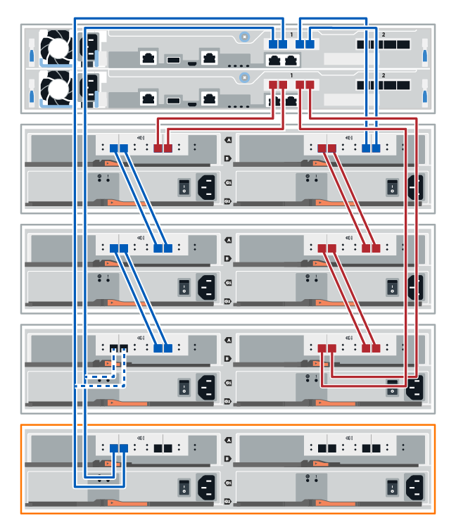

= Aggiunta a caldo di uno shelf di dischi
:allow-uri-read: 
:icons: font
:imagesdir: ../media/

[role="lead"]
È possibile aggiungere un nuovo shelf di dischi mentre gli altri componenti del sistema di storage sono ancora in funzione. È possibile configurare, riconfigurare, aggiungere o spostare la capacità del sistema storage senza interrompere l'accesso degli utenti ai dati.

.Prima di iniziare
A causa della complessità di questa procedura, si consiglia quanto segue:

* Leggere tutti i passaggi prima di iniziare la procedura.
* Assicurarsi che l'aggiunta a caldo di uno shelf di dischi sia la procedura necessaria.

.A proposito di questa attività
Questa procedura si applica all'aggiunta a caldo di uno shelf di dischi DE212C, DE224C o DE460C a E2800, E2800, EF280, E5700, E5700B, Shelf di controller EF570, EF300 o EF600.

Questa procedura si applica agli shelf di dischi IOM12 e IOM12B.

NOTE: I moduli IOM12B sono supportati solo da SANtricity OS 11.70.2 in poi. Assicurarsi che il firmware del controller sia stato aggiornato prima di installare o eseguire l'aggiornamento a IOM12B.

NOTE: Questa procedura si applica a sostituzioni o sostituzioni IOM di shelf simili. Ciò significa che è possibile sostituire solo un modulo IOM12 con un altro modulo IOM12 o un modulo IOM12B con un altro modulo IOM12B. (Lo shelf può avere due moduli IOM12 o due moduli IOM12B).

Se si sta cablando uno shelf di controller meno recente a DE212C, DE224C o DE460, vedere https://mysupport.netapp.com/ecm/ecm_download_file/ECMLP2859057["Aggiunta di shelf di dischi IOM a uno shelf di controller E27XX, E56XX o EF560 esistente"^].

NOTE: Per mantenere l'integrità del sistema, seguire la procedura esattamente nell'ordine suggerito.

== Fase 1: Preparazione all'aggiunta dello shelf di dischi

Per prepararsi all'aggiunta a caldo di uno shelf di dischi, è necessario verificare la presenza di eventi critici e lo stato degli IOM.

.Prima di iniziare
* La fonte di alimentazione del sistema storage deve essere in grado di soddisfare i requisiti di alimentazione del nuovo shelf di dischi. Per le specifiche di alimentazione dello shelf di dischi, consultare https://hwu.netapp.com/Controller/Index?platformTypeId=2357027["Hardware Universe"^].
* Lo schema di cablaggio per il sistema storage esistente deve corrispondere a uno degli schemi applicabili illustrati in questa procedura.

.Fasi
. In Gestore di sistema di SANtricity, selezionare *supporto* > *Centro di supporto* > *Diagnostica*.
. Selezionare *Collect Support Data*.
+
Viene visualizzata la finestra di dialogo Collect Support Data (raccolta dati di supporto).

. Fare clic su *Collect*.
+
Il file viene salvato nella cartella Download del browser con il nome support-data.7z. I dati non vengono inviati automaticamente al supporto tecnico.

. Selezionare *supporto* > *Registro eventi*.
+
La pagina Registro eventi visualizza i dati dell'evento.

. Selezionare l'intestazione della colonna *priorità* per ordinare gli eventi critici all'inizio dell'elenco.
. Esaminare gli eventi critici di sistema per gli eventi che si sono verificati nelle ultime due o tre settimane e verificare che gli eventi critici recenti siano stati risolti o altrimenti risolti.
+

NOTE: Se si sono verificati eventi critici non risolti nelle due o tre settimane precedenti, interrompere la procedura e contattare il supporto tecnico. Continuare la procedura solo dopo aver risolto il problema.

. Selezionare *hardware*.
. Selezionare l'icona *IOM (ESM)*.
+
image::../media/sam1130_ss_hardware_iom_icon.gif[sam1130 ss icona iom hardware]

+
Viene visualizzata la finestra di dialogo Shelf Component Settings (Impostazioni componenti shelf) con la scheda *IOM (ESM)* selezionata.

. Assicurarsi che lo stato visualizzato per ogni IOM/ESM sia _ottimale_.
. Fare clic su *Mostra altre impostazioni*.
. Verificare che sussistano le seguenti condizioni:
+
** Il numero di ESM/IOM rilevati corrisponde al numero di ESM/IOM installati nel sistema e a quello di ogni shelf di dischi.
** Entrambi gli ESM/IOM mostrano che la comunicazione è corretta.
** La velocità di trasferimento dati è di 12 GB/s per gli shelf di dischi DE212C, DE224C e DE460C o di 6 GB/s per gli altri tray di dischi.

== Fase 2: Installare lo shelf di dischi e alimentare

Si installa un nuovo shelf di dischi o uno shelf di dischi precedentemente installato, si accende l'alimentazione e si verifica la presenza di eventuali LED che richiedono attenzione.

.Fasi
. Se si sta installando uno shelf di dischi precedentemente installato in un sistema storage, rimuovere i dischi. I dischi devono essere installati uno alla volta più avanti in questa procedura.
+
Se la cronologia di installazione dello shelf di dischi che si sta installando non è nota, si deve presumere che sia stato precedentemente installato in un sistema storage.

. Installare lo shelf di dischi nel rack che contiene i componenti del sistema di storage.
+

NOTE: Consultare le istruzioni di installazione del modello in uso per la procedura completa per l'installazione fisica e il cablaggio di alimentazione. Le istruzioni di installazione del modello in uso includono note e avvisi da tenere in considerazione per installare in sicurezza uno shelf di dischi.

. Accendere il nuovo shelf di dischi e verificare che sullo shelf non siano accesi LED di attenzione color ambra. Se possibile, risolvere eventuali condizioni di guasto prima di continuare con questa procedura.

== Fase 3: Collegare il sistema via cavo

Selezionare una delle seguenti opzioni:

* <<Opzione 1: Collegamento dello shelf di dischi per E2800 o E5700>>
* <<Opzione 2: Collegare lo shelf di dischi per EF300 o EF600>>

Se si sta cablando uno shelf di controller meno recente a DE212C, DE224C o DE460, vedere https://mysupport.netapp.com/ecm/ecm_download_file/ECMLP2859057["Aggiunta di shelf di dischi IOM a uno shelf di controller E27XX, E56XX o EF560 esistente"^].

=== Opzione 1: Collegamento dello shelf di dischi per E2800 o E5700

Collegare lo shelf di dischi al controller A, confermare lo stato IOM, quindi collegare lo shelf di dischi al controller B.

.Fasi
. Collegare lo shelf di dischi al controller A.
+
La figura seguente mostra un esempio di connessione tra un ulteriore shelf di dischi e il controller A. Per individuare le porte sul modello in uso, consultare la https://hwu.netapp.com/Controller/Index?platformTypeId=2357027["Hardware Universe"^].

+
image::../media/hot_e5700_0.png[e5700 a caldo 0]

+
image::../media/hot_e5700_1.png[e5700 caldo 1]

. In Gestione sistema di SANtricity, fare clic su *hardware*.
+

NOTE: A questo punto della procedura, si dispone di un solo percorso attivo per lo shelf del controller.

. Scorrere verso il basso, se necessario, per visualizzare tutti gli shelf di dischi nel nuovo sistema storage. Se il nuovo shelf di dischi non viene visualizzato, risolvere il problema di connessione.
. Selezionare l'icona *ESM/IOM* per il nuovo shelf di dischi.
+
image::../media/sam1130_ss_hardware_iom_icon.gif[sam1130 ss icona iom hardware]

+
Viene visualizzata la finestra di dialogo *Shelf Component Settings* (Impostazioni componenti shelf).

. Selezionare la scheda *ESM/IOM* nella finestra di dialogo *Shelf Component Settings* (Impostazioni componenti shelf).
. Selezionare *Mostra altre opzioni* e verificare quanto segue:
+
** IOM/ESM A è elencato.
** La velocità attuale dei dati è di 12 Gbps per uno shelf di dischi SAS-3.
** Le comunicazioni con la scheda sono corrette.

. Scollegare tutti i cavi di espansione dal controller B.
. Collegare lo shelf di dischi al controller B.
+
La figura seguente mostra un esempio di connessione tra un ulteriore shelf di dischi e il controller B. Per individuare le porte sul modello in uso, consultare la https://hwu.netapp.com/Controller/Index?platformTypeId=2357027["Hardware Universe"^].

+
image::../media/hot_e5700_2.png[e5700 hot 2]

. Se non è già selezionata, selezionare la scheda *ESM/IOM* nella finestra di dialogo *Shelf Component Settings*, quindi selezionare *Mostra altre opzioni*. Verificare che la scheda di comunicazione sia *sì*.
+

NOTE: Lo stato ottimale indica che l'errore di perdita di ridondanza associato al nuovo shelf di dischi è stato risolto e che il sistema di storage è stabilizzato.

=== Opzione 2: Collegare lo shelf di dischi per EF300 o EF600

Collegare lo shelf di dischi al controller A, confermare lo stato IOM, quindi collegare lo shelf di dischi al controller B.

.Prima di iniziare
* Il firmware è stato aggiornato alla versione più recente. Per aggiornare il firmware, seguire le istruzioni in link:../upgrade-santricity/index.html["Aggiornamento del sistema operativo SANtricity"].

.Fasi
. Scollegare entrambi i cavi del controller Lato A dalle porte IOM12 una e due dell'ultimo shelf precedente dello stack, quindi collegarli alle porte IOM12 del nuovo shelf una e due.
+
image::../media/de224c_sides.png[de224c lati]

. Collegare i cavi alle porte IOM12 lato A tre e quattro dal nuovo shelf alle porte IOM12 dell'ultimo shelf precedenti una e due.
+
La figura seguente mostra un esempio di connessione per un lato tra un ulteriore shelf di dischi e l'ultimo shelf precedente. Per individuare le porte sul modello in uso, consultare la https://hwu.netapp.com/Controller/Index?platformTypeId=2357027["Hardware Universe"^].

+

+
image::../media/hot_ef_1.png[ef a caldo 1]

. In Gestione sistema di SANtricity, fare clic su *hardware*.
+

NOTE: A questo punto della procedura, si dispone di un solo percorso attivo per lo shelf del controller.

. Scorrere verso il basso, se necessario, per visualizzare tutti gli shelf di dischi nel nuovo sistema storage. Se il nuovo shelf di dischi non viene visualizzato, risolvere il problema di connessione.
. Selezionare l'icona *ESM/IOM* per il nuovo shelf di dischi.
+
image::../media/sam1130_ss_hardware_iom_icon.gif[sam1130 ss icona iom hardware]

+
Viene visualizzata la finestra di dialogo *Shelf Component Settings* (Impostazioni componenti shelf).

. Selezionare la scheda *ESM/IOM* nella finestra di dialogo *Shelf Component Settings* (Impostazioni componenti shelf).
. Selezionare *Mostra altre opzioni* e verificare quanto segue:
+
** IOM/ESM A è elencato.
** La velocità attuale dei dati è di 12 Gbps per uno shelf di dischi SAS-3.
** Le comunicazioni con la scheda sono corrette.

. Scollegare entrambi i cavi del controller lato B dalle porte IOM12 una e due dell'ultimo shelf precedente dello stack, quindi collegarli alle porte IOM12 del nuovo shelf una e due.
. Collegare i cavi alle porte IOM12 lato B tre e quattro dal nuovo shelf alle porte IOM12 dell'ultimo shelf precedenti una e due.
+
La figura seguente mostra un esempio di collegamento per il lato B tra un ulteriore shelf di dischi e l'ultimo shelf precedente. Per individuare le porte sul modello in uso, consultare la https://hwu.netapp.com/Controller/Index?platformTypeId=2357027["Hardware Universe"^].

+
image::../media/hot_ef_2.png[ef 2 a caldo]

. Se non è già selezionata, selezionare la scheda *ESM/IOM* nella finestra di dialogo *Shelf Component Settings*, quindi selezionare *Mostra altre opzioni*. Verificare che la scheda di comunicazione sia *sì*.
+

NOTE: Lo stato ottimale indica che l'errore di perdita di ridondanza associato al nuovo shelf di dischi è stato risolto e che il sistema di storage è stabilizzato.

== Fase 4: Completare l'aggiunta a caldo

Per completare l'aggiunta a caldo, verificare la presenza di eventuali errori e confermare che lo shelf di dischi appena aggiunto utilizzi il firmware più recente.

.Fasi
. In Gestore di sistema di SANtricity, fare clic su *Home*.
. Se il collegamento *Recover from Problems* (Ripristina da problemi) viene visualizzato al centro della pagina, fare clic sul collegamento e risolvere eventuali problemi indicati nel Recovery Guru.
. In Gestione sistema di SANtricity, fare clic su *hardware* e scorrere verso il basso, se necessario, per visualizzare lo shelf di dischi appena aggiunto.
. Per i dischi precedentemente installati in un sistema storage diverso, aggiungere un disco alla volta allo shelf di dischi appena installato. Attendere che ogni disco venga riconosciuto prima di inserire il disco successivo.
+
Quando un disco viene riconosciuto dal sistema di storage, la rappresentazione dello slot nella pagina *hardware* viene visualizzata come un rettangolo blu.

. Selezionare la scheda *Support* > *Support Center* > *Support Resources*.
. Fare clic sul collegamento *Software and firmware Inventory* (inventario software e firmware) e verificare quali versioni del firmware IOM/ESM e del firmware del disco sono installate sul nuovo shelf di dischi.
+

NOTE: Potrebbe essere necessario scorrere la pagina verso il basso per individuare questo collegamento.

. Se necessario, aggiornare il firmware del disco.
+
Il firmware IOM/ESM viene aggiornato automaticamente alla versione più recente, a meno che non sia stata disattivata la funzione di aggiornamento.

La procedura di aggiunta a caldo è stata completata. È possibile riprendere le normali operazioni.
