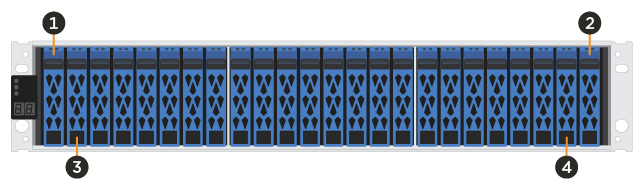

= Requisiti per la sostituzione del disco EF300 o EF600
:allow-uri-read: 
:icons: font
:imagesdir: ../media/

[role="lead"]
Prima di sostituire un'unità in un array EF300, EF600, EF300C o EF600C, esaminare i requisiti e le considerazioni.

CAUTION: Tenere presente che i dischi dell'array di storage sono fragili; una gestione errata dei dischi è la causa principale del guasto dei dischi.

== Requisiti per la sostituzione del disco

Attenersi alle seguenti regole per evitare di danneggiare le unità dello storage array:

* Prevenzione delle scariche elettrostatiche (ESD):
+
** Tenere l'unità nella busta ESD fino a quando non si è pronti per l'installazione.
** Aprire il sacchetto ESD manualmente o tagliare la parte superiore con un paio di forbici. Non inserire utensili metallici o coltelli nel sacchetto ESD.
** Conservare il sacchetto ESD e il materiale di imballaggio nel caso in cui sia necessario restituire un'unità in un secondo momento.
** Indossare sempre un braccialetto antistatico collegato a terra su una superficie non verniciata dello chassis dell'enclosure di storage. Se non è disponibile un braccialetto, toccare una superficie non verniciata sullo chassis del cabinet di storage prima di maneggiare il disco.

* Gestire i dischi con attenzione:
+
** Utilizzare sempre due mani per rimuovere, installare o trasportare un disco.
** Non forzare mai un'unità in uno shelf e esercitare una pressione leggera e decisa per inserire completamente il dispositivo di chiusura dell'unità.
** Posizionare i dischi su superfici imbottite e non impilare mai i dischi uno sopra l'altro.
** Non urtare i dischi contro altre superfici.
** Prima di rimuovere un'unità da uno shelf, sganciare la maniglia e attendere 60 secondi affinché l'unità si spenda.
** Utilizzare sempre imballaggi approvati per la spedizione delle unità.

* Evitare i campi magnetici. Tenere le unità lontano da dispositivi magnetici.
+
I campi magnetici possono distruggere tutti i dati presenti sul disco e causare danni irreparabili ai circuiti del disco.

== Unità sbalorditive nello shelf di controller da 24 dischi

Gli shelf standard da 24 dischi richiedono uno scaglionamento delle unità. La figura seguente mostra come i dischi sono numerati in ogni shelf (il pannello anteriore dello shelf è stato rimosso).

image::../media/ef600_drives_numbered.png[Numerazione dei dischi in uno shelf da 24 dischi]

Quando si inseriscono meno di 24 dischi in un controller EF300 o EF600, è necessario alternare le due metà del controller. Partendo dall'estrema sinistra e spostandosi verso destra, posizionare i dischi in uno alla volta.

La figura seguente mostra come eseguire lo sfalsamento dei dischi tra le due metà.

