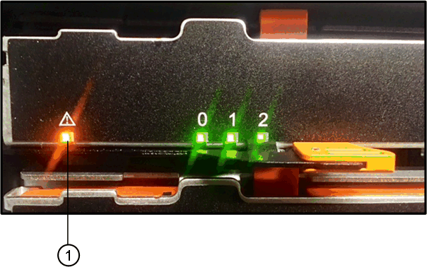
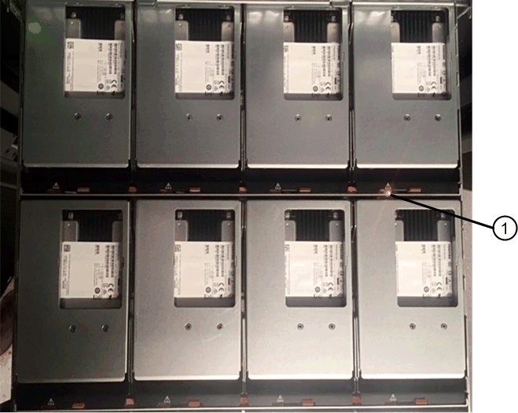

= Sostituire il disco in un array EF300
:allow-uri-read: 
:icons: font
:imagesdir: ../media/

[role="lead"]
È possibile sostituire un disco in un array EF300.

EF300 supporta l'espansione SAS con shelf da 24 e 60 dischi. La procedura da seguire dipende dal fatto che si disponga di uno shelf da 24 dischi o di uno shelf da 60 dischi:

* <<Sostituire l'unità in un EF300 (shelf da 24 dischi)>>
* <<Sostituire l'unità in un EF300 (shelf da 60 dischi)>>

== Sostituire l'unità in un EF300 (shelf da 24 dischi)

Seguire questa procedura per sostituire un disco in uno shelf da 24 dischi.

.A proposito di questa attività
Il guru del ripristino in Gestione di sistema di SANtricity monitora i dischi nell'array di storage e può notificare un guasto imminente del disco o un guasto effettivo del disco. In caso di guasto di un disco, il LED di attenzione di colore ambra si accende. È possibile sostituire a caldo un disco guasto mentre lo storage array riceve i/O.

.Prima di iniziare
* Esaminare i requisiti di gestione dei dischi in link:drives-overview-supertask-concept.html["Requisiti per la sostituzione del disco EF300 o EF600"].

.Di cosa hai bisogno
* Un'unità sostitutiva supportata da NetApp per lo shelf di controller o lo shelf di dischi.
* Un braccialetto antistatico o sono state adottate altre precauzioni antistatiche.
* Una superficie di lavoro piana e priva di elettricità statica.
* Stazione di gestione con un browser che può accedere a Gestione di sistema SANtricity per il controller. Per aprire l'interfaccia di System Manager, puntare il browser sul nome di dominio o sull'indirizzo IP del controller.

=== Fase 1: Preparazione alla sostituzione del disco (24 dischi)

Preparare la sostituzione di un disco controllando il guru del ripristino in Gestore di sistema di SANtricity e completando i passaggi necessari. Quindi, individuare il componente guasto.

.Fasi
. Se il guru del ripristino in Gestione sistema di SANtricity ha notificato un _imminente guasto al disco_, ma il disco non è ancora guasto, seguire le istruzioni nel guru del ripristino per eseguire il guasto al disco.
. Se necessario, utilizzare Gestione di sistema di SANtricity per verificare di disporre di un'unità sostitutiva adatta.
+
.. Selezionare *hardware*.
.. Selezionare il disco guasto sul grafico dello shelf.
.. Fare clic sull'unità per visualizzarne il menu di scelta rapida, quindi selezionare *Visualizza impostazioni*.
.. Verificare che l'unità sostitutiva abbia una capacità uguale o superiore a quella dell'unità che si sta sostituendo e che disponga delle funzioni previste.
+
Ad esempio, non tentare di sostituire un disco rigido (HDD) con un disco a stato solido (SSD). Allo stesso modo, se si sta sostituendo un disco sicuro, assicurarsi che anche il disco sostitutivo sia sicuro.

. Se necessario, utilizzare Gestore di sistema SANtricity per individuare l'unità all'interno dell'array di storage: Dal menu di scelta rapida dell'unità, selezionare *attiva indicatore localizzatore*.
+
Il LED di attenzione del disco (ambra) lampeggia per identificare il disco da sostituire.

+

NOTE: Se si sostituisce un'unità in uno shelf dotato di pannello, rimuovere il pannello per visualizzare i LED dell'unità.

=== Fase 2: Rimozione del disco guasto (24 dischi)

Rimuovere un disco guasto per sostituirlo con uno nuovo.

.Fasi
. Disimballare l'unità sostitutiva e conservarla su una superficie piana e priva di elettricità statica vicino allo shelf.
+
Conservare tutti i materiali di imballaggio.

. Premere il pulsante di rilascio sul disco guasto.
+
image::../media/drw_drive_latch_maint-e5700.gif[disco drw latch maot e5700]

+
** Per i dischi negli shelf di controller E5724 o negli shelf di dischi DE224C, il pulsante di rilascio si trova nella parte superiore dell'unità. La maniglia della camma sulle molle del disco si apre parzialmente e il disco si disinnesta dalla scheda intermedia.

. Aprire la maniglia della camma ed estrarre leggermente l'unità.
. Attendere 30 secondi.
. Rimuovere l'unità dallo shelf con entrambe le mani.
. Posizionare l'unità su una superficie antistatica e imbottita, lontano dai campi magnetici.
. Attendere 30 secondi affinché il software riconosca che l'unità è stata rimossa.
+

NOTE: Se si rimuove accidentalmente un disco attivo, attendere almeno 30 secondi, quindi reinstallarlo. Per la procedura di ripristino, fare riferimento al software di gestione dello storage.

=== Fase 3: Installazione di un nuovo disco (24 dischi)

Viene installata una nuova unità per sostituire quella guasta. Installare l'unità sostitutiva il prima possibile dopo aver rimosso l'unità guasta. In caso contrario, l'apparecchiatura potrebbe surriscaldarsi.

.Fasi
. Aprire la maniglia della camma.
. Con due mani, inserire l'unità sostitutiva nell'alloggiamento aperto, spingendo con decisione fino a quando non si arresta.
. Chiudere lentamente la maniglia della camma fino a quando l'unità non è completamente inserita nel piano intermedio e la maniglia non scatta in posizione.
+
Il LED verde sull'unità si accende quando l'unità è inserita correttamente.

+

NOTE: A seconda della configurazione, il controller potrebbe ricostruire automaticamente i dati nel nuovo disco. Se lo shelf utilizza dischi hot spare, il controller potrebbe dover eseguire una ricostruzione completa sull'hot spare prima di poter copiare i dati sull'unità sostituita. Questo processo di ricostruzione aumenta il tempo necessario per completare questa procedura.

=== Fase 4: Sostituzione completa del disco (24 dischi)

Verificare che il nuovo disco funzioni correttamente.

.Fasi
. Controllare il LED di alimentazione e il LED di attenzione sull'unità sostituita.
+
Quando si inserisce un disco per la prima volta, il LED attenzione potrebbe essere acceso. Tuttavia, il LED dovrebbe spegnersi entro un minuto.

+
** Il LED di alimentazione è acceso o lampeggia e il LED attenzione è spento: Indica che il nuovo disco funziona correttamente.
** LED di alimentazione spento: Indica che l'unità potrebbe non essere installata correttamente. Rimuovere l'unità, attendere 30 secondi, quindi reinstallarla.
** LED attenzione acceso: Indica che il nuovo disco potrebbe essere difettoso. Sostituirlo con un altro disco nuovo.

. Se il guru del ripristino in Gestione sistema di SANtricity continua a mostrare un problema, selezionare *ricontrollare* per assicurarsi che il problema sia stato risolto.
. Se il Recovery Guru indica che la ricostruzione del disco non è stata avviata automaticamente, avviare la ricostruzione manualmente, come segue:
+

NOTE: Eseguire questa operazione solo se richiesto dal supporto tecnico o dal Recovery Guru.

+
.. Selezionare *hardware*.
.. Fare clic sull'unità sostituita.
.. Dal menu di scelta rapida del disco, selezionare *Reconstruct* (ricostruzione).
.. Confermare che si desidera eseguire questa operazione.
+
Al termine della ricostruzione del disco, il gruppo di volumi si trova in uno stato ottimale.

. Se necessario, reinstallare il pannello.
. Restituire la parte guasta a NetApp, come descritto nelle istruzioni RMA fornite con il kit.

.Quali sono le prossime novità?
La sostituzione del disco è completata. È possibile riprendere le normali operazioni.

== Sostituire l'unità in un EF300 (shelf da 60 dischi)

Seguire questa procedura per sostituire un disco in uno shelf da 60 dischi.

.A proposito di questa attività
Il guru del ripristino in Gestione di sistema di SANtricity monitora i dischi nell'array di storage e può notificare un guasto imminente del disco o un guasto effettivo del disco. In caso di guasto di un disco, il LED di attenzione di colore ambra si accende. È possibile sostituire a caldo un disco guasto mentre lo storage array sta ricevendo le operazioni di i/O.

.Prima di iniziare
* Esaminare i requisiti di gestione dei dischi in link:drives-overview-supertask-concept.html["Requisiti per la sostituzione del disco EF300 o EF600"].

.Di cosa hai bisogno
* Un'unità sostitutiva supportata da NetApp per lo shelf di controller o lo shelf di dischi.
* Un braccialetto antistatico o sono state adottate altre precauzioni antistatiche.
* Stazione di gestione con un browser che può accedere a Gestione di sistema SANtricity per il controller. Per aprire l'interfaccia di System Manager, puntare il browser sul nome di dominio o sull'indirizzo IP del controller.

=== Fase 1: Preparazione alla sostituzione del disco (60 dischi)

Preparare la sostituzione di un disco controllando il guru del ripristino in Gestore di sistema di SANtricity e completando i passaggi necessari. Quindi, individuare il componente guasto.

.Fasi
. Se il guru del ripristino in Gestione sistema di SANtricity ha notificato un _imminente guasto al disco_, ma il disco non è ancora guasto, seguire le istruzioni nel guru del ripristino per eseguire il guasto al disco.
. Se necessario, utilizzare Gestione di sistema di SANtricity per verificare di disporre di un'unità sostitutiva adatta.
+
.. Selezionare *hardware*.
.. Selezionare il disco guasto sul grafico dello shelf.
.. Fare clic sull'unità per visualizzarne il menu di scelta rapida, quindi selezionare *Visualizza impostazioni*.
.. Verificare che l'unità sostitutiva abbia una capacità uguale o superiore a quella dell'unità che si sta sostituendo e che disponga delle funzioni previste.
+
Ad esempio, non tentare di sostituire un disco rigido (HDD) con un disco a stato solido (SSD). Allo stesso modo, se si sta sostituendo un disco sicuro, assicurarsi che anche il disco sostitutivo sia sicuro.

. Se necessario, utilizzare Gestore di sistema di SANtricity per individuare il disco all'interno dello storage array.
+
.. Se lo shelf è dotato di una cornice, rimuovetela per vedere i LED.
.. Dal menu di scelta rapida del disco, selezionare *attiva indicatore di posizione*.
+
Il LED di attenzione del cassetto dell'unità (ambra) lampeggia per consentire l'apertura del cassetto dell'unità corretto e identificare l'unità da sostituire.

+

+
*(1)* _LED attenzione_

.. Sganciare il cassetto dell'unità tirando entrambe le leve.
.. Utilizzando le leve estese, estrarre con cautela il cassetto dell'unità fino a quando non si arresta.
.. Controllare la parte superiore del cassetto dell'unità per individuare il LED di attenzione davanti a ciascun disco.
+

+
*(1)* _LED attenzione acceso per l'unità in alto a destra_

+
I LED attenzione cassetto unità si trovano sul lato sinistro davanti a ciascun disco, con un'icona di attenzione sulla maniglia del disco appena dietro il LED.

+
image::../media/28_dwg_e2860_de460c_attention_led_drive_maint-e5700.gif[28 dwg e2860 de460c manutenzione dei dischi e5700]

+
*(1)* _icona attenzione_

+
*(2)* _LED attenzione_

=== Fase 2: Rimozione del disco guasto (60 dischi)

Rimuovere un disco guasto per sostituirlo con uno nuovo.

.Fasi
. Disimballare l'unità sostitutiva e conservarla su una superficie piana e priva di elettricità statica vicino allo shelf.
+
Conservare tutti i materiali di imballaggio per la prossima volta che sarà necessario restituire un disco.

. Rilasciare le leve del cassetto dell'unità dal centro del cassetto dell'unità appropriato, tirandole verso i lati del cassetto.
. Tirare con cautela le leve del cassetto dell'unità esteso per estrarre il cassetto dell'unità fino alla sua estensione completa senza rimuoverlo dal contenitore.
. Tirare delicatamente indietro il dispositivo di chiusura arancione che si trova davanti all'unità che si desidera rimuovere.
+
La maniglia della camma sulle molle di azionamento si apre parzialmente e l'unità viene rilasciata dal cassetto.

+
image::../media/trafford_drive_rel_button_maint-e5700.gif[pulsante di comando trafford e5700]

+
*(1)* _dispositivo di chiusura arancione_

. Aprire la maniglia della camma ed estrarre leggermente l'unità.
. Attendere 30 secondi.
. Utilizzare la maniglia della camma per sollevare l'unità dallo scaffale.
+
image::../media/92_dwg_de6600_install_or_remove_drive_maint-e5700.gif[92 dwg de6600 installare o rimuovere il disco principale e5700]

. Posizionare l'unità su una superficie antistatica e imbottita, lontano dai campi magnetici.
. Attendere 30 secondi affinché il software riconosca che l'unità è stata rimossa.
+

NOTE: Se si rimuove accidentalmente un disco attivo, attendere almeno 30 secondi, quindi reinstallarlo. Per la procedura di ripristino, fare riferimento al software di gestione dello storage.

=== Fase 3: Installazione di un nuovo disco (60 dischi)

Installare un nuovo disco per sostituire quello guasto.

CAUTION: *Possibile perdita di accesso ai dati* -- quando si reinserisce il cassetto del disco nel contenitore, non chiudere mai il cassetto. Spingere lentamente il cassetto per evitare di strattonare il cassetto e danneggiare lo storage array.

.Fasi
. Sollevare la maniglia della camma sul nuovo disco in verticale.
. Allineare i due pulsanti rialzati su ciascun lato del supporto dell'unità con lo spazio corrispondente nel canale dell'unità sul cassetto dell'unità.
+
image::../media/28_dwg_e2860_de460c_drive_cru_maint-e5700.gif[28 disco dwg e2860 de460c principale e5700]

+
*(1)* _pulsante sollevato sul lato destro del supporto del disco_

. Abbassare l'unità, quindi ruotare la maniglia della camma verso il basso fino a quando non scatta in posizione sotto il dispositivo di chiusura arancione.
. Spingere con cautela il cassetto dell'unità all'interno del contenitore. Spingere lentamente il cassetto per evitare di strattonare il cassetto e danneggiare lo storage array.
. Chiudere il cassetto dell'unità spingendo entrambe le leve verso il centro.
+
Il LED di attività verde per l'unità sostituita nella parte anteriore del cassetto si accende quando l'unità è inserita correttamente.

+
A seconda della configurazione, il controller potrebbe ricostruire automaticamente i dati nel nuovo disco. Se lo shelf utilizza dischi hot spare, il controller potrebbe dover eseguire una ricostruzione completa sull'hot spare prima di poter copiare i dati sull'unità sostituita. Questo processo di ricostruzione aumenta il tempo necessario per completare questa procedura.

=== Fase 4: Sostituzione completa del disco (60 dischi)

Verificare che il nuovo disco funzioni correttamente.

.Fasi
. Controllare il LED di alimentazione e il LED di attenzione sull'unità sostituita. (Quando si inserisce un disco per la prima volta, il LED attenzione potrebbe essere acceso. Tuttavia, il LED dovrebbe spegnersi entro un minuto.
+
** Il LED di alimentazione è acceso o lampeggia e il LED attenzione è spento: Indica che il nuovo disco funziona correttamente.
** LED di alimentazione spento: Indica che l'unità potrebbe non essere installata correttamente. Rimuovere l'unità, attendere 30 secondi, quindi reinstallarla.
** LED attenzione acceso: Indica che il nuovo disco potrebbe essere difettoso. Sostituirlo con un altro disco nuovo.

. Se il guru del ripristino in Gestione sistema di SANtricity continua a mostrare un problema, selezionare *ricontrollare* per assicurarsi che il problema sia stato risolto.
. Se il Recovery Guru indica che la ricostruzione del disco non è stata avviata automaticamente, avviare la ricostruzione manualmente, come segue:
+

NOTE: Eseguire questa operazione solo se richiesto dal supporto tecnico o dal Recovery Guru.

+
.. Selezionare *hardware*.
.. Fare clic sull'unità sostituita.
.. Dal menu di scelta rapida del disco, selezionare *Reconstruct* (ricostruzione).
.. Confermare che si desidera eseguire questa operazione.
+
Al termine della ricostruzione del disco, il gruppo di volumi si trova in uno stato ottimale.

. Se necessario, reinstallare il pannello.
. Restituire la parte guasta a NetApp, come descritto nelle istruzioni RMA fornite con il kit.

.Quali sono le prossime novità?
La sostituzione del disco è completata. È possibile riprendere le normali operazioni.
