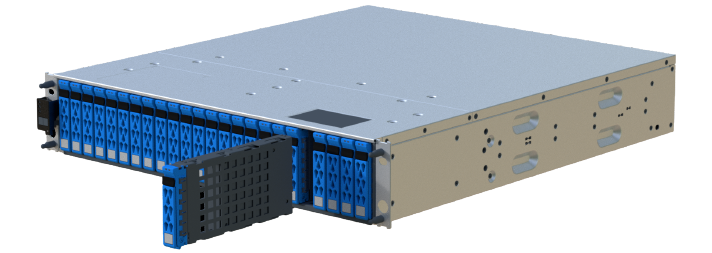

= Sostituire il disco in un array EF600
:allow-uri-read: 
:icons: font
:imagesdir: ../media/

[role="lead"]
È possibile sostituire un disco in un array EF600.

.A proposito di questa attività
Il guru del ripristino in Gestione di sistema di SANtricity monitora i dischi nell'array di storage e può notificare un guasto imminente del disco o un guasto effettivo del disco. In caso di guasto di un disco, il LED di attenzione di colore ambra si accende. È possibile sostituire a caldo un disco guasto mentre lo storage array riceve i/O.

.Prima di iniziare
* Revisione link:drives-overview-supertask-concept.html["Requisiti per la sostituzione del disco EF300 o EF600"].
* Assicurarsi di disporre di quanto segue:
+
** Un'unità sostitutiva supportata da NetApp per lo shelf di controller o lo shelf di dischi.
** Un braccialetto antistatico o sono state adottate altre precauzioni antistatiche.
** Una superficie di lavoro piana e priva di elettricità statica.
** Stazione di gestione con un browser che può accedere a Gestione di sistema SANtricity per il controller. Per aprire l'interfaccia di System Manager, puntare il browser sul nome di dominio o sull'indirizzo IP del controller.

== Fase 1: Preparazione alla sostituzione del disco

Preparare la sostituzione del disco controllando il guru del ripristino in Gestione sistema di SANtricity e completando i passaggi necessari. Quindi, individuare il componente guasto.

.Fasi
. Se il guru del ripristino in Gestione sistema di SANtricity ha notificato un _imminente guasto al disco_, ma il disco non è ancora guasto, seguire le istruzioni nel guru del ripristino per eseguire il guasto al disco.
. Se necessario, utilizzare Gestione di sistema di SANtricity per verificare di disporre di un'unità sostitutiva adatta.
+
.. Selezionare *hardware*.
.. Selezionare il disco guasto sul grafico dello shelf.
.. Fare clic sull'unità per visualizzarne il menu di scelta rapida, quindi selezionare *Visualizza impostazioni*.
.. Verificare che l'unità sostitutiva abbia una capacità uguale o superiore a quella dell'unità che si sta sostituendo e che disponga delle funzioni previste.
+
Ad esempio, non tentare di sostituire un disco rigido (HDD) con un disco a stato solido (SSD). Allo stesso modo, se si sta sostituendo un disco sicuro, assicurarsi che anche il disco sostitutivo sia sicuro.

. Se necessario, utilizzare Gestore di sistema SANtricity per individuare l'unità all'interno dell'array di storage: Dal menu di scelta rapida dell'unità, selezionare *attiva indicatore localizzatore*.
+
Il LED di attenzione del disco (ambra) lampeggia per identificare il disco da sostituire.

+

NOTE: Se si sostituisce un'unità in uno shelf dotato di pannello, rimuovere il pannello per visualizzare i LED dell'unità.

== Fase 2: Rimuovere l'unità

Rimuovere un disco guasto per sostituirlo con uno nuovo.

.Fasi
. Disimballare l'unità sostitutiva e conservarla su una superficie piana e priva di elettricità statica vicino allo shelf.
+
Conservare tutti i materiali di imballaggio.

. Premere il pulsante di rilascio nero sul disco guasto.
+
Il fermo sulle molle dell'unità si apre parzialmente, quindi l'unità si sgancia dal controller.

. Aprire la maniglia della camma ed estrarre leggermente l'unità.
. Attendere 60 secondi.
. Rimuovere l'unità dallo shelf con entrambe le mani.
+

. Posizionare l'unità su una superficie antistatica e imbottita, lontano dai campi magnetici.
. Attendere 60 secondi affinché il software riconosca che l'unità è stata rimossa.
+

NOTE: Se si rimuove accidentalmente un disco attivo, attendere almeno 60 secondi, quindi reinstallarlo. Per la procedura di ripristino, fare riferimento al software di gestione dello storage.

== Fase 3: Installare un nuovo disco

Installare un nuovo disco per sostituire quello guasto. Installare l'unità sostitutiva il prima possibile dopo aver rimosso l'unità guasta.

.Fasi
. Aprire la maniglia della camma.
. Con due mani, inserire l'unità sostitutiva nell'alloggiamento aperto, spingendo con decisione fino a quando non si arresta.
. Chiudere lentamente la maniglia della camma fino a quando l'unità non è completamente inserita nel piano intermedio e la maniglia non scatta in posizione.
+
Il LED verde sull'unità si accende quando l'unità è inserita correttamente.

+

NOTE: A seconda della configurazione, il controller potrebbe ricostruire automaticamente i dati nel nuovo disco. Se lo shelf utilizza dischi hot spare, il controller potrebbe dover eseguire una ricostruzione completa sull'hot spare prima di poter copiare i dati sull'unità sostituita. Questo processo di ricostruzione aumenta il tempo necessario per completare questa procedura.

== Fase 4: Sostituzione completa del disco

Completare la sostituzione del disco per verificare che il nuovo disco funzioni correttamente.

.Fasi
. Controllare il LED di alimentazione e il LED di attenzione sull'unità sostituita. (Quando si inserisce un disco per la prima volta, il LED attenzione potrebbe essere acceso. Tuttavia, il LED dovrebbe spegnersi entro un minuto.
+
** Il LED di alimentazione è acceso o lampeggia e il LED attenzione è spento: Indica che il nuovo disco funziona correttamente.
** LED di alimentazione spento: Indica che l'unità potrebbe non essere installata correttamente. Rimuovere l'unità, attendere 60 secondi, quindi reinstallarla.
** LED attenzione acceso: Indica che il nuovo disco potrebbe essere difettoso. Sostituirlo con un altro disco nuovo.

. Se il guru del ripristino in Gestione sistema di SANtricity continua a mostrare un problema, selezionare *ricontrollare* per assicurarsi che il problema sia stato risolto.
. Se il Recovery Guru indica che la ricostruzione del disco non è stata avviata automaticamente, avviare la ricostruzione manualmente, come segue:
+

NOTE: Eseguire questa operazione solo se richiesto dal supporto tecnico o dal Recovery Guru.

+
.. Selezionare *hardware*.
.. Fare clic sull'unità sostituita.
.. Dal menu di scelta rapida del disco, selezionare *Reconstruct* (ricostruzione).
.. Confermare che si desidera eseguire questa operazione.
+
Al termine della ricostruzione del disco, il gruppo di volumi si trova in uno stato ottimale.

. Se necessario, reinstallare il pannello.
. Restituire la parte guasta a NetApp, come descritto nelle istruzioni RMA fornite con il kit.

.Quali sono le prossime novità?
La sostituzione del disco è completata. È possibile riprendere le normali operazioni.
