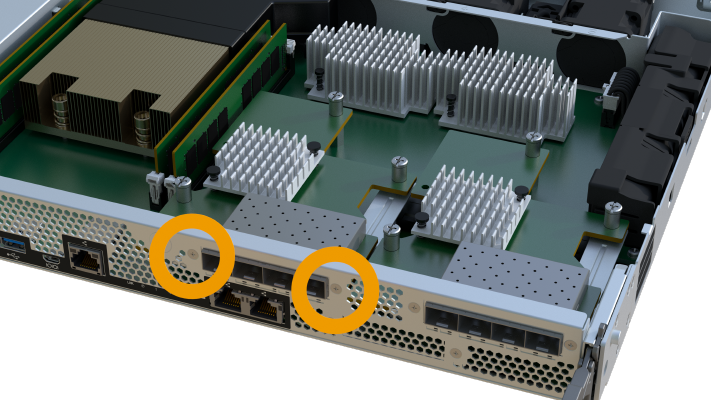
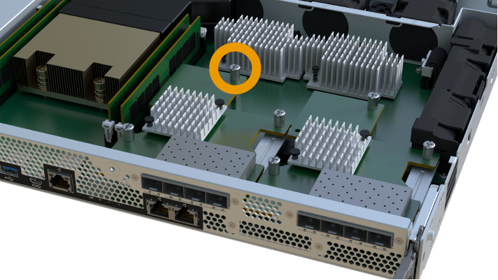

= Upgrade della scheda di interfaccia host (HIC) EF300 o EF600
:allow-uri-read: 
:experimental: 
:icons: font
:imagesdir: ../media/

[role="lead"]
È possibile aggiornare le schede di interfaccia host (HICS) per aumentare il numero di porte host o modificare i protocolli host.

.A proposito di questa attività
* Quando si aggiorna HICS, è necessario spegnere lo storage array, aggiornare l'HICS e riapplicare l'alimentazione.
* Quando si aggiorna HICS in un controller EF300 o EF600, ripetere tutti i passaggi per rimuovere il secondo controller, aggiornare l'HICS del secondo controller e reinstallare il secondo controller prima di riapplicare l'alimentazione allo shelf del controller.

.Prima di iniziare
* Revisione link:hics-overview-supertask-concept.html["Requisiti per gli aggiornamenti HIC EF300 o EF600"].
* Pianificare una finestra di manutenzione dei tempi di inattività per questa procedura. Non è possibile accedere ai dati sull'array di storage fino a quando la procedura non è stata completata correttamente. Poiché entrambi i controller devono avere la stessa configurazione HIC quando sono accesi, l'alimentazione deve essere disattivata quando si installa HICS.

.Di cosa hai bisogno
* Due HICS compatibili con i controller.
* Un braccialetto antistatico o sono state adottate altre precauzioni antistatiche.
* Un'area di lavoro piana e priva di elettricità statica.
* Etichette per identificare ciascun cavo collegato al contenitore del controller.
* Un cacciavite Phillips n. 1.
* Stazione di gestione con un browser che può accedere a Gestione di sistema SANtricity per il controller. Per aprire l'interfaccia di System Manager, puntare il browser sul nome di dominio o sull'indirizzo IP del controller.

CAUTION: *Possibile perdita di accesso ai dati* -- non installare mai un HIC in un contenitore di controller EF300 o EF600 se tale HIC è stato progettato per un altro controller e-Series. Inoltre, entrambi i controller e gli HICS devono essere identici. La presenza di HICS incompatibili o non corrispondenti causa il blocco dei controller quando si applica l'alimentazione.

== Fase 1: Posizionare lo shelf del controller offline

Posiziona lo shelf del controller offline in modo da poter aggiornare l'HICS in tutta sicurezza.

.Fasi
. Dalla home page di Gestore di sistema SANtricity, verificare che lo stato dello storage array sia ottimale.
+
Se lo stato non è ottimale, utilizzare Recovery Guru o contattare il supporto tecnico per risolvere il problema. Non continuare con questa procedura.

. Eseguire il backup del database di configurazione dello storage array utilizzando Gestione di sistema di SANtricity.
+
Se si verifica un problema durante la rimozione di un controller, è possibile utilizzare il file salvato per ripristinare la configurazione. Il sistema salva lo stato corrente del database di configurazione RAID, che include tutti i dati per i gruppi di volumi e i pool di dischi sul controller.

+
** Da System Manager:
+
... Selezionare menu:Support[Support Center > Diagnostics] (supporto tecnico > Diagnostica).
... Selezionare *Collect Configuration Data* (raccolta dati di configurazione).
... Fare clic su *Collect*.
+
Il file viene salvato nella cartella Download del browser con il nome *configurationData-<arrayName>-<dateTime>.7z*.

. Assicurarsi che non si verifichino operazioni di i/o tra lo storage array e tutti gli host connessi. Ad esempio, è possibile eseguire le seguenti operazioni:
+
** Arrestare tutti i processi che coinvolgono le LUN mappate dallo storage agli host.
** Assicurarsi che nessuna applicazione stia scrivendo dati su tutte le LUN mappate dallo storage agli host.
** Smontare tutti i file system associati ai volumi sull'array.
+

NOTE: I passaggi esatti per interrompere le operazioni di i/o dell'host dipendono dal sistema operativo dell'host e dalla configurazione, che esulano dall'ambito di queste istruzioni. Se non si è sicuri di come interrompere le operazioni di i/o host nell'ambiente, è consigliabile arrestare l'host.

+

CAUTION: *Possibile perdita di dati* -- se si continua questa procedura mentre si verificano le operazioni di i/o, l'applicazione host potrebbe perdere l'accesso ai dati perché lo storage non è accessibile.

. Attendere che i dati presenti nella memoria cache vengano scritti sui dischi.
+
Il LED verde cache Active (cache attiva) sul retro di ciascun controller è acceso quando i dati memorizzati nella cache devono essere scritti sui dischi. Attendere che il LED si spenga.

. Dalla home page di Gestione sistema SANtricity, selezionare *Visualizza operazioni in corso*. Attendere il completamento di tutte le operazioni prima di passare alla fase successiva.
. Spegnere lo shelf del controller.
+
.. Etichettare e scollegare entrambi i cavi di alimentazione dallo shelf del controller.
.. Attendere che tutti i LED sullo shelf del controller si spenga.

== Fase 2: Rimuovere il contenitore del controller

Rimuovere il contenitore del controller per aggiornare il nuovo HIC.

.Fasi
. Etichettare ciascun cavo collegato al contenitore del controller.
. Scollegare tutti i cavi dal contenitore del controller.
+

CAUTION: Per evitare prestazioni degradate, non attorcigliare, piegare, pizzicare o salire sui cavi.

. Se le porte HIC utilizzano ricetrasmettitori SFP+, rimuoverli.
+
A seconda del tipo di HIC a cui si esegue l'aggiornamento, potrebbe essere possibile riutilizzare questi SFP.

. Verificare che il LED cache Active (cache attiva) sul retro del controller sia spento.
. Premere le maniglie su entrambi i lati del controller e tirare indietro fino a quando non si sgancia dallo shelf.
+
image::../media/remove_controller_5.png[rimuovere il controller 5]

. Utilizzando due mani e le maniglie, estrarre il contenitore del controller dallo scaffale. Quando la parte anteriore del controller è libera dal contenitore, estrarlo completamente con due mani.
+

CAUTION: Utilizzare sempre due mani per sostenere il peso di un contenitore del controller.

+
image::../media/remove_controller_6.png[rimuovere il controller 6]

. Posizionare il contenitore del controller su una superficie piana e priva di elettricità statica.

== Fase 3: Rimuovere l'HIC

Rimuovere l'HIC originale in modo da poterlo sostituire con uno aggiornato.

.Fasi
. Rimuovere il coperchio del contenitore del controller svitando la singola vite a testa zigrinata e sollevando il coperchio.
. Verificare che il LED verde all'interno del controller sia spento.
+
Se questo LED verde è acceso, il controller sta ancora utilizzando l'alimentazione a batteria. Prima di rimuovere qualsiasi componente, è necessario attendere che il LED si spenga.

. Utilizzando un cacciavite Phillips, rimuovere le due viti che fissano la mascherina HIC al contenitore del controller.
+

+

NOTE: L'immagine riportata sopra è un esempio, l'aspetto dell'HIC potrebbe differire.

. Rimuovere la piastra anteriore dell'HIC.
. Utilizzando le dita o un cacciavite Phillips, allentare la singola vite a testa zigrinata che fissa l'HIC alla scheda del controller.
+

+

NOTE: L'HIC viene fornito con tre posizioni delle viti sulla parte superiore, ma è fissato con una sola.

+

NOTE: L'immagine riportata sopra è un esempio, l'aspetto dell'HIC potrebbe differire.

. Scollegare con cautela l'HIC dalla scheda del controller sollevando la scheda e sollevandola dal controller.
+

CAUTION: Fare attenzione a non graffiare o urtare i componenti sul fondo dell'HIC o sulla parte superiore della scheda del controller.

+
image::../media/hic_4.png[hic 4]

+

NOTE: L'immagine riportata sopra è un esempio, l'aspetto dell'HIC potrebbe differire.

. Posizionare l'HIC su una superficie piana e priva di scariche elettrostatiche.

== Fase 4: Aggiornare l'HIC

Dopo aver rimosso il vecchio HIC, installare il nuovo HIC.

CAUTION: *Possibile perdita di accesso ai dati* -- non installare mai un HIC in un contenitore di controller EF300 o EF600 se tale HIC è stato progettato per un altro controller e-Series. Inoltre, entrambi i controller e gli HICS devono essere identici. La presenza di HICS incompatibili o non corrispondenti causa il blocco dei controller quando si applica l'alimentazione.

.Fasi
. Disimballare il nuovo HIC e la nuova mascherina HIC.
. Allineare la singola vite a testa zigrinata sull'HIC con i fori corrispondenti sul controller e allineare il connettore sulla parte inferiore dell'HIC con il connettore di interfaccia HIC sulla scheda del controller.
+
Fare attenzione a non graffiare o urtare i componenti sul fondo dell'HIC o sulla parte superiore della scheda del controller.

+
image::../media/hic_7.png[hic 7]

+

NOTE: L'immagine riportata sopra è un esempio, l'aspetto dell'HIC potrebbe differire.

. Abbassare con cautela l'HIC in posizione e inserire il connettore HIC premendo delicatamente sull'HIC.
+

CAUTION: *Possibili danni alle apparecchiature* -- fare molta attenzione a non stringere il connettore a nastro dorato dei LED del controller tra l'HIC e la vite a testa zigrinata.

. Serrare manualmente la vite a testa zigrinata HIC.
+

+

NOTE: L'immagine riportata sopra è un esempio; l'aspetto dell'HIC potrebbe differire.

+

NOTE: Non utilizzare un cacciavite per evitare di serrare eccessivamente le viti.

. Utilizzando un cacciavite Phillips n. 1, fissare la piastra anteriore HIC rimossa dall'HIC originale con le tre viti.

== Fase 5: Reinstallare il contenitore del controller

Dopo aver aggiornato l'HIC, reinstallare il contenitore del controller nello shelf del controller.

.Fasi
. Abbassare il coperchio sul contenitore del controller e fissare la vite a testa zigrinata.
. Mentre si stringono le maniglie del controller, far scorrere delicatamente il contenitore del controller fino in fondo nello shelf del controller.
+

NOTE: Il controller scatta in maniera udibile quando viene installato correttamente nello shelf.

+
image::../media/remove_controller_7.png[rimuovere il controller 7]

. Se rimossi, installare gli SFP nel nuovo HIC e ricollegare tutti i cavi. Se si utilizzano più protocolli host, assicurarsi di installare gli SFP nelle porte host corrette.
+
Se si utilizzano più protocolli host, assicurarsi di installare gli SFP nelle porte host corrette.

== Fase 6: Completare l'aggiornamento HIC

Posizionare il controller online, raccogliere i dati di supporto e riprendere le operazioni.

.Fasi
. Posizionare il controller online.
+
.. Collegare i cavi di alimentazione.

. All'avvio del controller, controllare i LED del controller.
+
** Il LED di attenzione di colore ambra rimane acceso.
** I LED del collegamento host potrebbero essere accesi, lampeggianti o spenti, a seconda dell'interfaccia host.

. Quando il controller torna in linea, verificare che lo stato sia ottimale e controllare i LED di attenzione dello shelf di controller.
+
Se lo stato non è ottimale o se uno dei LED attenzione è acceso, verificare che tutti i cavi siano inseriti correttamente e che il contenitore del controller sia installato correttamente. Se necessario, rimuovere e reinstallare il contenitore del controller.

+

NOTE: Se non si riesce a risolvere il problema, contattare il supporto tecnico.

. Fare clic su menu:hardware[supporto > Centro aggiornamenti] per verificare che sia installata la versione più recente di SANtricity OS.
+
Se necessario, installare la versione più recente.

. Verificare che tutti i volumi siano stati restituiti al proprietario preferito.
+
.. Selezionare menu:Storage[Volumes] (Storage[volumi]). Dalla pagina *tutti i volumi*, verificare che i volumi siano distribuiti ai proprietari preferiti. Selezionare menu:More[Change ownership] (Altro[Cambia proprietà]) per visualizzare i proprietari dei volumi.
.. Se tutti i volumi sono di proprietà del proprietario preferito, passare alla fase 6.
.. Se nessuno dei volumi viene restituito, è necessario restituire manualmente i volumi. Vai al menu:More[redistribuisci volumi].
.. Se solo alcuni dei volumi vengono restituiti ai proprietari preferiti dopo la distribuzione automatica o manuale, è necessario controllare il Recovery Guru per verificare la presenza di problemi di connettività host.
.. Se non è presente un Recovery Guru o se si seguono le fasi del guru del recovery, i volumi non vengono ancora restituiti ai proprietari preferiti, contattare il supporto.

. Raccogliere i dati di supporto per lo storage array utilizzando Gestione di sistema di SANtricity.
+
.. Selezionare menu:Support[Support Center > Diagnostics] (supporto tecnico > Diagnostica).
.. Selezionare *Collect Support Data*.
.. Fare clic su *Collect*.
+
Il file viene salvato nella cartella Download del browser con il nome *support-data.7z*.

.Quali sono le prossime novità?
Il processo di aggiornamento di una scheda di interfaccia host nell'array di storage è completo. È possibile riprendere le normali operazioni.
