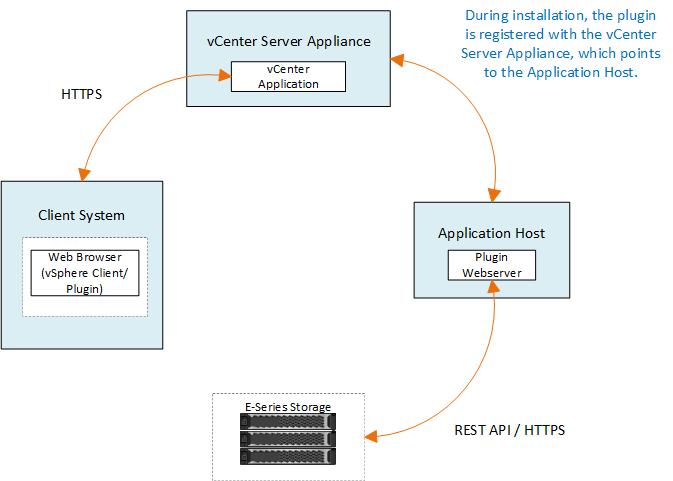

= Panoramica dello Storage Plugin per vCenter
:hardbreaks:
:allow-uri-read: 
:nofooter: 
:icons: font
:linkattrs: 
:imagesdir: ../media/

[role="lead"]
Il plug-in di storage SANtricity per vCenter offre una gestione integrata degli array di storage e-Series dall'interno di una sessione del client VMware vSphere.

== Attività disponibili

È possibile utilizzare il plug-in per eseguire le seguenti operazioni:

* Visualizzare e gestire gli array di storage rilevati in rete.
* Eseguire operazioni batch su gruppi di più array di storage.
* Eseguire gli aggiornamenti sul sistema operativo del software.
* Importare le impostazioni da uno storage array a un altro.
* Configurare volumi, cache SSD, host, cluster di host, pool, e gruppi di volumi.
* Avviare l'interfaccia di System Manager per ulteriori attività di gestione su un array.

NOTE: Il plug-in non sostituisce direttamente l'interfaccia di System Manager, integrata in ciascun controller per uno storage array. System Manager offre funzionalità di gestione aggiuntive; se lo si desidera, è possibile aprire System Manager selezionando un array di storage nella vista principale del plug-in e facendo clic su *Launch*.

Il plug-in richiede un'appliance VMware vCenter Server implementata nell'ambiente VMware e un host dell'applicazione per installare ed eseguire il webserver plug-in.

Fare riferimento alla figura seguente per ulteriori informazioni sulle comunicazioni nell'ambiente vCenter.

== Panoramica dell'interfaccia

Quando si accede al plug-in, la pagina principale si apre su *Manage - All* (Gestisci - tutto). Da questa pagina è possibile visualizzare e gestire tutti gli array di storage rilevati nella rete.

=== Barra laterale di navigazione

La barra laterale di navigazione visualizza quanto segue:

* *Gestisci* -- rileva gli array di storage nella tua rete, avvia System Manager per un array, importa le impostazioni da un array a più array, gestisci i gruppi di array, aggiorna il sistema operativo SANtricity ed esegui il provisioning dello storage.
* *Certificate Management* -- Gestione dei certificati per l'autenticazione tra browser e client.
* *Operations* -- consente di visualizzare l'avanzamento delle operazioni batch, ad esempio l'importazione di impostazioni da un array a un altro.

NOTE: Alcune operazioni non sono disponibili quando uno storage array ha uno stato non ottimale.

* *Supporto* -- Visualizza le opzioni di supporto tecnico, le risorse e i contatti.

=== Browser supportati

È possibile accedere allo Storage Plugin per vCenter da diversi tipi di browser. Sono supportati i seguenti browser e versioni.

* Google Chrome 89 o versione successiva
* Mozilla Firefox 80 o versione successiva
* Microsoft Edge 90 o versione successiva

=== Ruoli e autorizzazioni degli utenti

Per accedere alle attività nel plug-in di storage per vCenter, l'utente deve disporre dei permessi di lettura/scrittura. Per impostazione predefinita, tutti gli ID utente VMware vCenter definiti non dispongono di autorizzazioni per eseguire le attività nel plug-in.

== Panoramica della configurazione

La configurazione prevede i seguenti passaggi:

. link:san-spvc-ic-installation.html["Installare e registrare il plug-in"].
. link:san-spvc-ic-user-access.html["Configurare i permessi di accesso al plug-in"].
. link:san-spvc-ic-login-and-navigation.html["Accedere all'interfaccia del plug-in"].
. link:san-spvc-ic-storage-array-discovery.html["Scopri gli array di storage"].
. link:san-spvc-ic-storage-provisioning.html["Eseguire il provisioning dello storage"].

== Trova ulteriori informazioni

Per ulteriori informazioni sulla gestione dei datastore nel client vSphere, vedere https://docs.vmware.com/en/VMware-vSphere/index.html["Documentazione VMware vSphere"^].
